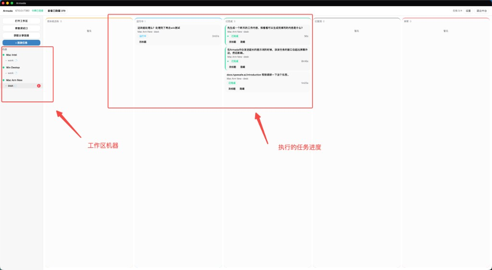
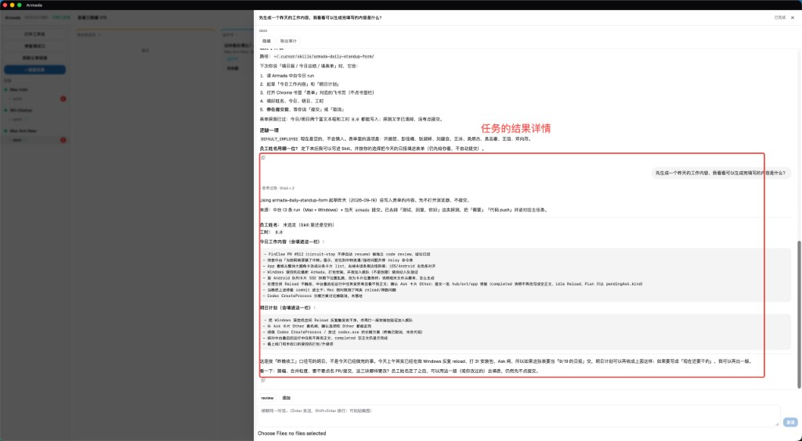
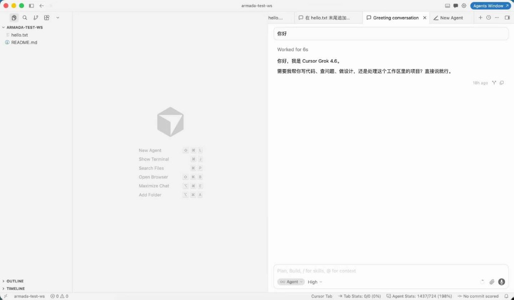
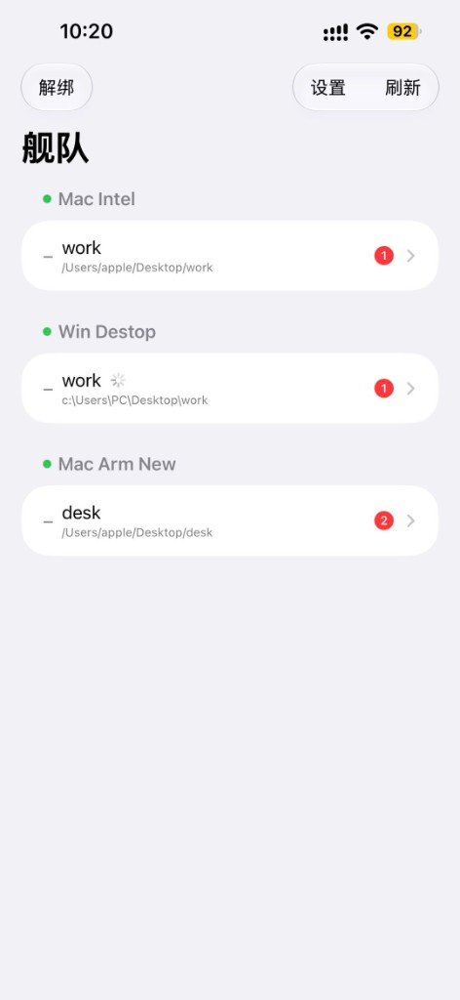
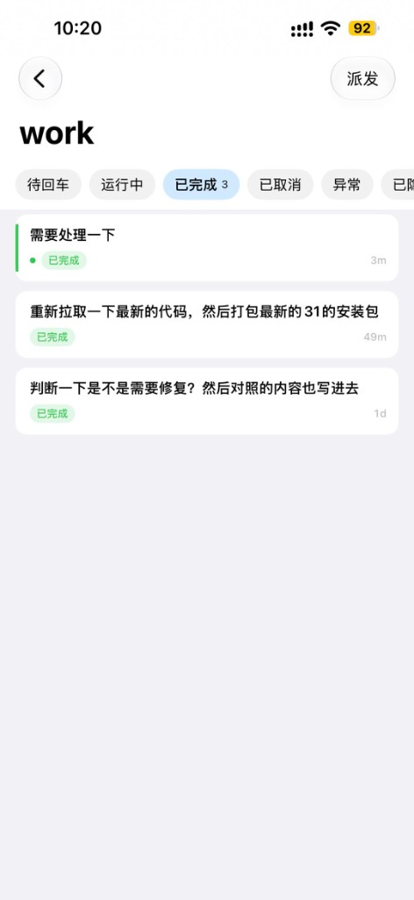
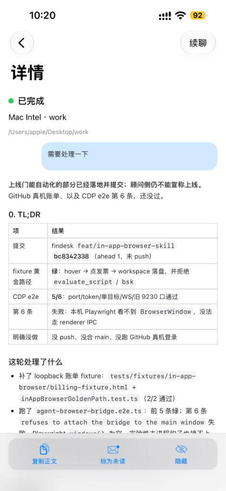

# Armada

局域网 Cursor **舰队指挥台**：一台中台调度多台被控 Cursor 窗口的派发、监控与取消。任务在被控机真实 IDE 对话里跑，用该机自己的 Cursor 登录态，不是绕过 IDE 打模型 API。

日常用法走 **桌面应用**（创建/加入舰队、代装扩展、CDP 打开工作区）。开发联调仍可用浏览器打开看板。不在局域网时，可自建 **中转**，用 iOS / Android App 遥控同一套中台（中台 `7380` 不暴露到公网）。

发送默认 **CDP 全自动**。桌面「打开工作区」会用启动器带调试口拉起 Cursor；若窗口不是这样开的，派发会降级为剪贴板预填 + 本机回车。

### 当前版本（2026-09-20）

| 面 | 当前发版 | 权威文件 |
| --- | --- | --- |
| 桌面 Armada.app | **0.1.0** | `desktop/src-tauri/tauri.conf.json` |
| 扩展 armada-agent | **0.4.33** | `extension/package.json` |
| iOS ArmadaRemote | **0.1.0** · TestFlight **22** | `mobile/ios` `MARKETING_VERSION` / `CURRENT_PROJECT_VERSION` |
| Android | **0.1.9**（versionCode 10） | `mobile/android/app/build.gradle.kts` |

每面发版都记进 [CHANGELOG.md](CHANGELOG.md)。能力下限（例如「续聊须 ≥ 0.4.19」）和当前发版号不是一回事：装包请用上表。

### 桌面中台

左侧是在线、可派发的**工作区机器**；中间五列是**任务进度**（待本机回车 / 运行中 / 已完成 / 已取消 / 异常）。点开卡片看这一轮真实会话。

<p>
  
  
</p>



### 手机遥控器

舰队页按 **机器 → 工作区**；点仓看五列任务；详情里看终态正文，可续聊、复制、标未读、隐藏。

<p>
  
  
  
</p>

## 它能做什么

已具备：桌面创建/加入舰队、局域网发现、代装扩展、CDP 打开工作区、五列看板、图文派发、并行任务、中台续聊与答选择题、完成通知；可选自建中转 + iOS / Android App 远程选仓、派发（可附图 PNG/JPEG）、续聊、答选择题、隐藏任务；锁屏 Ask / 终态走中转代发 APNs / FCM（需密钥）。

### 舰队看板

一台中台看全网机器。左侧是当前**在线、可派发**的工作区（关掉窗口或机器掉线后侧栏立刻拿掉，不挂灰点历史）。五列看板对应任务生命周期：

| 列 | 含义 |
| --- | --- |
| **待本机回车** | 已派发 / 绑定中 / 排队。CDP 未就绪时停在「已预填,待本机回车」 |
| **运行中** | 真实 Composer 会话在跑；Agent 弹出选择题时卡片会标「待处理」 |
| **已完成** | 该轮对话结束 |
| **已取消** | 中台取消，或本机中止 |
| **异常** | 绑定失败、贴图失败、超时等 |

侧栏与顶栏还会：

- **打开工作区**（仅桌面）：本机选文件夹，用 CDP 启动器打开 Cursor，扩展上报后即可派发
- **获取分享链接**：复制 `armada://join?hub=…&token=…`，给同网其它 Armada 加入
- **+ 派发任务**：对当前选中的在线工作区发 prompt（可只附图）
- 机器可改显示名；工作区有任务在跑时转圈，终态未读显示红点
- 顶栏 **在线 x/y**、明亮/黑夜、查看已隐藏卡片、退出中台

### 任务详情

点开卡片进入右侧对话抽屉，对齐被控 Cursor 里那一轮真实会话：

- 思考过程、工具调用、子代理、已编辑文件、Markdown 回复
- **续聊同一对话**（Enter 发送，Shift+Enter 换行），可再附 PNG/JPEG
- Agent 的 **AskQuestion** 可在中台选选项后点 Continue / Skip，不必跑到那台电脑
- 取消、隐藏/取消隐藏、异常卡「人工关闭」、导出审计
- 标题可改；抽屉可拖宽度；往上滚可「加载更早对话」

派发/续聊最多 **4** 个附件（PNG/JPEG 走图片芯片；pdf/txt/md/json/csv 等白名单文件落到工作区 `.armada/inbox/<runId>/` 再 `@` 引用。每件 ≤ 8 MiB，合计 ≤ 24 MiB）。图片失败**不会**改成 `@路径`。贴图必须走 CDP。可用 `armada.imagePaste`（默认 true）关掉**图片**路径；纯文件不受该开关影响。

### 真实 IDE 会话

被控侧看到的就是普通 Cursor 窗口：文件树、Agent 对话、该机自己的账号与模型选择。派发沿用该窗口当前选中的模型。

同一机器可并行多条任务（默认每机 8、每工作区 4）；整机同时只有 1 条处于派发/绑定（CDP 注入串行）。超出限额 → `429 RUN_LIMIT`。同工作区相同 prompt → `409 PROMPT_COLLISION`。关着的工作区不能派（`400 WORKSPACE_NOT_OPEN`）。扩展需 ≥ 0.4.0 才能同一窗口并行第二条；收口与续聊请用 **armada-agent ≥ 0.4.19**；**文件附件请用 ≥ 0.4.22**（Windows `@` 菜单会等 typeahead）。**当前请装 0.4.33**（Windows 脏标题选窗 + sessionId 盖章；带图失败透传 WINDOW_TARGET_*）。

完成、失败、需要处理选择题时，桌面会弹系统通知，浏览器会闪标题；点通知可回到那张卡。

## 架构

```text
┌─────────────┐  创建/加入 / iframe   ┌──────────────────┐
│   desktop   │◄────────────────────►│   armada-hub     │
│  Tauri 壳   │   REST / SSE         │  (Hono + SQLite) │
└──────┬──────┘                     └────────┬─────────┘
       │ 打开工作区（CDP 启动器）                 │ WS /ws?token=
       ▼                                         ▼
┌─────────────┐   armada-agent        ┌──────────────┐
│ Cursor IDE  │◄───────────────────────│  extension   │
└──────┬──────┘                       └──────┬───────┘
       │ hook 事件                             │ spool JSON
       ▼                                       ▼
┌─────────────┐                       ┌──────────────┐
│    hooks    │  ~/.cursor/hooks       │   hub/web    │
│ .sh / .exe  │                       │  看板前端    │
└─────────────┘                       └──────────────┘

可选远程（不改受控机、不映射 7380）：

┌─────────────┐  armada-relay://op     ┌──────────────┐  pair / 出站 WSS
│  iOS App    │◄───────────────────────►│    relay     │◄──────────── hub
│ ArmadaRemote│  HTTPS 轮询 / 派发     │  自建 HTTPS  │
└─────────────┘                       └──────────────┘
```

| 组件 | 路径 | 职责 |
| --- | --- | --- |
| **desktop** | `desktop/` | 创建/加入舰队、局域网 mDNS 发现、代装 vsix/hooks/设置、CDP 打开工作区、系统通知 |
| **desktop-core** | `desktop-core/` | 加入 URI、发现解析、与壳共享的纯逻辑 |
| **hub** | `hub/` | 鉴权、机器注册、run 状态机、事件 ingest、审计、静态托管看板 |
| **relay** | `relay/` | 自建中转：签发 pair/op 邀请、缓存仓与 run 快照、把 App 命令转给已连接的中台 |
| **mobile** | `mobile/ios/`、`mobile/android/` | iOS / Android 遥控器：绑 op、按机器选仓、派发/续聊/答 Ask（不直连 7380） |
| **extension** | `extension/` | Cursor 侧 WS 客户端：注册/心跳、注入 prompt、绑定 conversation、上报事件 |
| **hooks** | `hooks/` | 把 Cursor hook 事件落盘到 spool，供扩展轮询上报 |
| **web** | `hub/web/` | 看板 UI：机器树、五列看板、详情抽屉、SSE 刷新 |

全网只跑 **一套 hub**。**创建舰队仅 macOS**；受控端 **macOS + Windows**。不要在 Windows 上另起一份 hub。中台机也可以同时当受控（本机 Cursor 窗口会注册上来）。

## 推荐：桌面应用

两种入口，同一份看板：

| 怎么开 | 做什么 |
| --- | --- |
| **创建舰队**（macOS） | 本机启动或接入 7380 上的 hub，默认勾选「开放到局域网」，随后全屏进看板 |
| **加入舰队**（macOS / Windows） | 加入页列出同网开放舰队，点一下即加入；也可粘贴 `armada://join?…` |

创建/加入时桌面会 `--force` 把当前 `armada-agent` 装进 Cursor、合并 hooks、写入 `armada.hubUrl` / `armada.token`。若 Cursor 当时已经开着，请 **Reload Window**。

### 创建（macOS）

1. 打开 Armada.app，选 **创建舰队**。
2. 默认勾选 **开放到局域网**：同 Wi-Fi 上其它 Armada 的加入页会看到这支舰队。不勾选则不广播，仍可点看板「获取分享链接」。
3. 组播（UDP 5353）被拦时发现列表为空，粘贴链接仍可用。
4. 成功后进入看板。右上角 **退出中台** 回到创建/加入页（只停本 App 拉起的 hub；附着别人已经在跑的 7380 不杀）。

### 加入（macOS / Windows）

Windows 请走 **加入舰队**，不要创建。同一 Wi-Fi、中台已开放时，列表里点主机名即可。否则向中台要分享链接：

```text
armada://join?hub=192.168.1.10:7380&token=<中台令牌>
```

加入**不会**在本机再起一份 hub。令牌以中台 `~/.armada/token` 为准，不要在受控端重新生成。

### 威胁模型（局域网）

产品默认是 **可信局域网舰队**（家里 / 办公室 Wi-Fi），不是公网多租户。

| 路径 | 凭证 | 含义 |
| --- | --- | --- |
| 粘贴 `armada://join?hub=&token=` | 长期操作员 token | 等于把中台钥匙交给对方；不要发到群聊 |
| mDNS 开放广播 | 30 分钟 `jt_…` ticket，兑成长期 token | TXT **不再**带长期 token；关掉开放或过期后，旧抓包不能加入 |
| pair URI | 一次性 `code`（24h） | 兑成 `hub_secret` 后作废；截图不能长期冒充中台 |
| CDP `9222` | 只绑 `127.0.0.1` | 启动器带 `--remote-debugging-address=127.0.0.1` |
| iOS op token | Keychain | 不再写 UserDefaults |

不可信 Wi-Fi（咖啡厅、访客网）上勾选「开放到局域网」，同网的人仍可在 ticket 有效期内加入并拿到长期 token。那种场景不要开放广播，只用当面粘贴链接。

### 打开工作区并派发

1. 看板左侧 **打开工作区** → 选绝对路径文件夹。
2. 若本机已有「没带调试口」的 Cursor，会提示先完全退出（macOS `Cmd+Q`，Windows 托盘 Exit），再让 Armada 打开。
3. 左侧出现该机绿点和工作区后，点 **+ 派发任务**。
4. CDP 正常时无需人在受控端回车；详情里看思考 / 工具 / 回复，并可续聊、答选择题、取消。

约束：只能派到 **已经打开且扩展已上报** 的窗口；路径用绝对路径（不要 `~/proj`）；推理走 Cursor 云，受控端要能上网。

开发时：仓库根目录 `bun run dev:desktop`（会先按 `extension/package.json` 打 vsix）。Web 联调用 `bun run dev:web`，看板在 http://127.0.0.1:7380，**不**创建舰队、不起第二份 hub；7380 已被占用时只重建看板、复用现有 hub。细节见 [`desktop/README.md`](desktop/README.md)。

## 远程：自建中转 + iOS App

局域网舰队 **不依赖** 中转。不配中转，桌面创建/加入、看板派发、受控 Cursor 都与现在一样。中转只解决「人不在同一局域网时，手机不要直连 7380」。

```text
App  --HTTPS-->  中转  <--出站 WSS--  中台  <--局域网--  受控 Cursor
```

中转不签发中台身份，也不知道中台 IP。它只开一个远程槽（`fleet`），同时给出两条邀请：

| 邀请 | 给谁 | 令牌 |
| --- | --- | --- |
| `armada-relay://pair?relay=…&fleet=…&code=…` | 中台 | 一次性 `code`（24h / 用过即废），兑成 `hub_secret` 后写出 `relay.json` |
| `armada-relay://op?relay=…&fleet=…&token=…` | iOS / Android App | `token`，调 `/mobile/*` |

两条令牌不能互换。App **只绑中转**，看不到中台局域网 token。谁拿着已兑换的 `hub_secret` 连上，中转就认谁是这支远程舰队的中台（同一 `fleet` 同时只留一条中台连接）。pair 链接里的 `code` 只能兑一次，截图过期后不能冒充中台。公网 `relay` 必须是 **https**（模拟器可用 `http://127.0.0.1`）。不要把 `7380` 用 frp/Funnel 映射到公网。

### 起中转并签发邀请

```bash
bun run dev:relay
# 另开终端，创建远程舰队（沿用已有 ~/.armada-relay 时不要再加 --create-fleet）
bun run relay/src/index.ts --create-fleet
```

JSON 里的 `pairUri` / `opUri` 各给中台和手机。中转公网地址来自 `RELAY_PUBLIC_BASE`（默认 `http://127.0.0.1:8780`）；生产请换成 `https://你的域名`，前面用 Caddy 等终结 TLS。

也可用管理接口（`X-Relay-Admin`）：`POST /admin/fleets`。

### 中台贴 pair

把 **pair URI** 交给中台机兑换（一次性），或直接写 `~/.armada/relay.json`（`0600`）。JSON 管理接口仍返回长期 `hubSecret`，但 **不要把 `hubSecret` 写进可转发的 URI**。

```bash
ARMADA_PAIR_URI='armada-relay://pair?relay=https%3A%2F%2Frelay.example.com&fleet=fleet-…&code=…' bun run dev:relay-attach
```

手工文件：

```json
{ "relay": "https://relay.example.com", "fleet": "fleet-…", "secret": "<hub_secret>" }
```

源码启动的 hub 会读这份文件并出站。包装版 **Armada.app 0.1.0** 还不会自己拨中转：不要杀它占用的 `:7380`，另开：

```bash
bun run dev:relay-attach
```

对接脚本用局域网 `~/.armada/token` 轮询本机 hub，再推到中转。没有 `relay.json` 时中台照常跑，只是手机显示「中台离线」。

看板里暂时 **没有**「配置中转」粘贴框。

### 手机绑 op

1. **iOS：** Xcode 打开 `mobile/ios/ArmadaRemote.xcodeproj`，模拟器或真机跑 **ArmadaRemote**（Bundle ID `app.armada.remote`）。
2. **Android：** `mobile/android` 打 debug APK（见 [`mobile/android/README.md`](mobile/android/README.md)）；模拟器中转填 `http://10.0.2.2:8780`。
3. 粘贴 **op** 邀请（不要贴 pair）。
4. 舰队页按 **机器 → 工作区**；点仓看五列任务；仓顶栏 **派发** 新开对话（可从相册选最多 4 张 PNG/JPEG），详情 **续聊** 同一对话（运行中只能发文字）。绑定后会申请通知权限；锁屏 Ask / 完成 / 失败由中转代发 APNs（iOS）或 FCM（Android）（点通知进详情强制 GET）。
5. Agent 选择题在详情里 Continue / Skip。终态正文是这一轮助手回复，不是整段 Cursor 会话。

一部手机目前只绑一条 op（一台在线中台）。多台受控机只要登记在这台中台上，选不同仓即可分别派。多部手机可贴同一条 op，共用操作者令牌。

锁屏通知要响，中转机还需 **APNs Auth Key**（`.p8` 不进仓库）。本机已约定放 `~/.armada-relay/`：

```bash
# $RELAY_HOME/env（进程里没设时自动读入）
RELAY_APNS_KEY_PATH=/Users/you/.armada-relay/AuthKey_XXXXXX.p8
RELAY_APNS_KEY_ID=<Key ID>
RELAY_APNS_TEAM_ID=LW2A4J4KKG
```

也可以直接 `export` 上述变量。缺任一项时中转打 `APNS_DISABLED`，锁屏无推送；前台仍走 SSE（失败才轮询）。App ID 打开 Push Notifications 即可，**不要**再配 Push SSL 证书（token 认证用 `.p8`）。打 TestFlight 必须走 `mobile/ios/scripts/archive-testflight.sh`：未签名归档要先 ad-hoc 签上 `aps-environment=production`，否则云签名会打出没有 Push 的包。模拟器没有 device token。**公网中转**（App 连的那台）也要放同一份文件并重启，只放开发机不会给手机推。

Android 锁屏走 **FCM**。中转机另配服务账号 JSON：

```bash
RELAY_FCM_SERVICE_ACCOUNT_PATH=/Users/you/.armada-relay/fcm-sa.json
```

缺文件时打 `FCM_DISABLED`，不影响 APNs。客户端 `POST /mobile/push-token` 带 `platform=fcm`。旧 iOS 包不带 `platform` 仍登记为 APNs。

### 不要做

- 不配中转却指望 App 连上局域网看板
- 用 `http://公网IP` 当 `relay`（明文会被拒绝）
- 在受控机另起一份 hub 给中转对接
- `--create-fleet` 反复执行导致 pair/op 和已写入的 `relay.json` 对不上

## 中台端 vs 受控端

| | **中台端**（调度） | **受控端**（干活） |
| --- | --- | --- |
| 桌面 App | 创建舰队 | 加入舰队 |
| 仓库 / Bun | 源码开发或打包时要 | 不必（桌面会代装）；手工接入才 clone |
| 启动 hub | 创建舰队时自动，或 `bun run hub/src/index.ts --lan` | **禁止**再起一份 |
| 令牌 | 权威在 `~/.armada/token` | **抄中台这份** |
| 入站端口 | 放行 **TCP 7380** | 不需要入站；只要能出站连中台 |
| Cursor | 本机也受控才要 | **必须**已安装并登录（用这台机自己的账号） |
| 扩展 + hooks | 本机当受控时由桌面代装 | **必须**（桌面加入时代装） |
| 日常 | 看板里派发 / 取消 / 续聊 / 答选择题 | 保持目标工作区窗口开着；CDP 失败时回车 |

**中台端不要做：** 把 `hubUrl` 配成受控机 IP；在受控端另起 hub。  
**受控端不要做：** `bun run hub/src/index.ts`；`hubUrl` 填 `127.0.0.1` 或加 `http://`；用图标点开 Cursor 还指望全自动提交。

下面命令里的 `192.168.1.10` 请换成中台机局域网 IP（`ipconfig getifaddr en0`）。

## 从源码跑中台（不走桌面壳）

只做一次（或改完 launchd 后重启一次）。

1. **装依赖并构建控制台**

```bash
cd /path/to/armada
bun install
cd hub/web && bun run build && cd ../..
```

2. **对局域网启动 hub**（绑 `127.0.0.1` 时受控端连不上）

```bash
bun run hub/src/index.ts --lan
# 日志: armada-hub listening on http://0.0.0.0:7380
```

若用 launchd（`~/Library/LaunchAgents/com.armada.hub.plist`），在 `ProgramArguments` 末尾加 `<string>--lan</string>`，然后：

```bash
launchctl kickstart -k gui/$(id -u)/com.armada.hub
lsof -nP -iTCP:7380 -sTCP:LISTEN    # 必须是 *:7380 或 0.0.0.0，不能是 127.0.0.1
```

3. **防火墙**允许本机 **入站 TCP 7380**（系统设置 → 网络 → 防火墙 → 允许 bun / 终端）。

4. **记下 IP 与令牌**（发给受控端；令牌不要换行、不要在受控端重造）

```bash
ipconfig getifaddr en0
cat ~/.armada/token
```

5. **扩展包**（桌面创建/加入会代装；手工接入才需要）

```bash
cd extension
npx tsup
npx vsce package --no-dependencies    # 没有 vsce：npm i -g @vscode/vsce
```

受控端也可 clone 后自己打包。当前包名 `armada-agent-0.4.33.vsix`。

6. **日常：打开控制台**（任意电脑浏览器均可，同一令牌）

- 打开 `http://<中台IP>:7380`，粘贴中台令牌。
- 浏览器联调**没有**「打开工作区 / 获取分享链接」，这两项只在桌面壳里。
- 左侧应出现受控端主机名（绿点）和已开工作区，然后按上文派发。

## 受控端手工接入

可以 **clone 本仓**，不必拷零散文件。Clone 之后 **不要启动 hub**。已装桌面应用并成功加入时，可跳过本节。

```bash
git clone https://github.com/kaka926078890-tech/Armada.git
cd Armada
```

### macOS

1. **先探活中台**（失败先修网络，再装扩展）

```bash
curl -sS http://192.168.1.10:7380/api/health
# 期望: {"ok":true,"name":"armada-hub"}
```

2. **Cursor 已登录**（这台电脑自己的账号；中台不代登）。

3. **安装 hooks**（merge 进 `~/.cursor/hooks.json`，不覆盖别人的条目）

```bash
sh hooks/install.sh
```

4. **安装扩展** `armada-agent` **0.4.33**（能力下限 ≥ 0.4.19）  
   Cursor → 扩展 → **Install from VSIX** → `extension/armada-agent-*.vsix`  
   （没有现成 vsix 且这台有 Node 时：`cd extension && npx tsup && npx vsce package --no-dependencies`）

5. **指向中台**（`Cmd+Shift+P` → **Armada: Configure Hub Connection**）

| 项 | 填 | 不要填 |
| --- | --- | --- |
| hub | `192.168.1.10:7380` | `http://`、`https://`、`127.0.0.1` |
| token | **中台端** `~/.armada/token` 原文 | 在受控端跑 hub 新生成的 |

保存后必须 **Reload Window**。输出面板选 **Armada**，应看到 `config loaded, hub=192.168.1.10:7380`。

6. **用启动器打开要派发的工作区**（否则任务停在「待本机回车」）

```bash
# 先 Cmd+Q 完全退出 Cursor（所有窗口、对话框）
chmod +x scripts/armada-cursor.sh
./scripts/armada-cursor.sh /绝对路径/你的工作区
```

### Windows（第一次安装 + 每天怎么开）

中台仍跑在 Mac（或已有 hub 那台机）。这台 Windows **只当受控**：不要 `bun run hub`，不要在本机生成新 token。优先用桌面 **加入舰队**；下面是不用桌面时的手工步骤。

**先拿到这三样，再往下敲命令：**

| 要带上 Windows 的 | 从哪来 | 说明 |
| --- | --- | --- |
| 本仓库 | `git clone` 本仓，或把整个 `Armada` 文件夹拷过去 | 用来跑 `hooks\install.ps1` 和启动器 |
| `armada-agent-0.4.33.vsix` | 中台 `extension\armada-agent-0.4.33.vsix`，或 Windows 自己 `npm install && npx tsup && npx --yes @vscode/vsce package --no-dependencies`（当前 **0.4.33**，能力下限 ≥ 0.4.19） | 0.4.11 Reload 会把 `ext_seq` 重数到已占用号段，hub 丢掉 `stop`。0.4.16 续聊 fromEnd 会清掉 hub 签发的 `generation_id`。**0.4.17 只在 Windows 合成 stop**；**0.4.18 起全平台合成**。请不要用更旧的 vsix。 |
| 中台 IP + token | 中台 `ipconfig getifaddr en0` 和 `~/.armada/token` | token 不要换行；不要在 Windows 上新生成 |

下面把 `192.168.1.10` 换成你的中台局域网 IP。所有命令都在 **PowerShell** 里执行，先 `cd` 到仓库根目录（里面能看到 `hooks` 和 `scripts` 文件夹）。

#### 第一次安装（做完一次即可）

**1. 探活中台**（失败先修网络，再装东西）

```powershell
curl.exe -sS http://192.168.1.10:7380/api/health
# 期望打印: {"ok":true,"name":"armada-hub"}
```

不通：中台是否 `--lan`、Mac 防火墙是否放行 7380、是否同一 Wi-Fi。Windows **不需要**入站端口。

**2. 确认 Cursor 已安装并已登录**（用这台 Windows 自己的账号；中台不代登）。

**3. 卸掉旧 Armada hooks**（写入 `%USERPROFILE%\.cursor\hooks.json`，只删 `armada-spool*`，不覆盖别人的条目）

```powershell
powershell -NoProfile -ExecutionPolicy Bypass -File hooks\install.ps1
# 期望打印: stripped N Armada hook command(s)...
# 0.4.7 起 Windows 绑定不再走 hook（Cursor 每次新拉 PowerShell，5s 内完不成）
```

**4. 安装扩展**

1. 先用图标正常打开一次 Cursor（这次还不用启动器）。
2. 左侧扩展 → `...` → **Install from VSIX** → 选中 `armada-agent-0.4.33.vsix`。
3. 装完先不要关。

**5. 指向中台**（`Ctrl+Shift+P` → 输入 **Armada: Configure Hub Connection**）

| 项 | 填这个 | 不要填 |
| --- | --- | --- |
| hub | `192.168.1.10:7380` | `http://`、`https://`、`127.0.0.1`、本机 IP |
| token | 中台 `~/.armada/token` **原文** | 在 Windows 上跑 hub 新生成的 |

保存后：**Developer: Reload Window**。  
`View` → **Output** → 下拉选 **Armada**，应看到 `config loaded, hub=192.168.1.10:7380`。没有这行 = 没配上，不要继续。

#### 每天派发前：必须用启动器开 Cursor

图标/开始菜单打开的 Cursor **没有**调试端口，中台派发会停在「待本机回车」。桌面「打开工作区」等同于走启动器。

1. **完全退出** Cursor：右下角托盘（^ 里）找到 Cursor 图标 → 右键 **Exit / 退出**。任务栏和托盘都不要还留着。
2. 用启动器打开**要派发的工作区**（路径必须是 Windows 绝对路径，例如 `C:\Users\me\proj`，不要 `~\proj`）：

```powershell
cd <你的 Armada 仓库根目录>
powershell -NoProfile -ExecutionPolicy Bypass -File scripts\armada-cursor.ps1 C:\绝对路径\你的工作区
```

成功时会打印 Cursor 路径、CDP 端口、工作区。若提示「正在运行」，按上面第 1 步再退一次。

3. 等扩展连上（约 15 秒）。中台控制台左侧应出现这台 Windows 主机名（绿点）和刚才那个工作区路径。之后即可派发。

**不要做：** 启动器开起来之后，再双击图标开第二个 Cursor（单实例会把 CDP 参数吞掉）。换工作区 = 再退干净，再用启动器带新路径启动。

## 两端一起验收

- [ ] 受控端 `curl` health 成功（或桌面已加入并看到看板）
- [ ] 中台控制台看到该机在线 + 目标工作区
- [ ] 派发后 30s 内进入运行中或已完成，详情不是别的窗口的对话
- [ ] 受控端 IDE 里出现对应新对话，文件按 prompt 改了

## 接入故障

| 现象 | 先查哪一端 |
| --- | --- |
| health 都 curl 不通 | **中台**：是否 `--lan`、防火墙、是否同网段 |
| 控制台没有这台机器 | **受控**：是否 Reload；`hubUrl` 是否写成 `127.0.0.1`；输出面板 Armada |
| 加入页发现列表为空 | 中台是否勾了「开放到局域网」；组播是否被拦。改为粘贴分享链接 |
| `WORKSPACE_NOT_OPEN` | **受控**：桌面「打开工作区」或启动器打开该路径；等心跳约 15s |
| `RUN_LIMIT` | **中台**：该机或该工作区已达并行上限，等一条结束或取消排队 |
| `PROMPT_COLLISION` | **中台**：同工作区已有相同 prompt 在跑或排队，改文案后再派 |
| `CONVERSATION_BUSY` | **中台**：该对话仍在排队/绑定，或有未回答的选择题。运行中可对同一张卡续发 |
| `INJECT_SLOT_BUSY` | **中台**：正在向该机注入另一条任务，稍后再续聊 |
| `OUTBOUND_LIMIT` | **中台**：该卡待消化续发已达 8 条 |
| `OUTBOUND_TEXT_ONLY` | **中台**：运行中续发暂只支持纯文本 |
| `WINDOW_BUSY` | **中台**：扩展 < 0.4.0 或关了同窗并行时，该窗口已有占用项；等它结束或升级扩展。同区另有 running **不拦**旧卡续聊 |
| 一直「待本机回车」但黄字是「绑定中」，超时后进异常 | **受控**：须装 **armada-agent ≥ 0.4.19**（当前 **0.4.33**）并 Reload。0.4.10 扫描窗 20s 会 BIND_TIMEOUT。Windows 无 hook，绑定等 jsonl，约 **3 分钟**；macOS 约 **1 分钟** |
| 本机对话已结束，看板仍「运行中」 | **受控**：须 ≥ 0.4.18。日志：`stop synthesized` / `adopt r-…`。Hub 须把 `status: success` 收成 completed |
| 一直「待本机回车」且蓝字是「已预填,待本机回车」 | **受控**：Cursor 不是启动器/桌面打开的（Windows：托盘未退干净就又点了图标） |
| 详情串了别的对话 | **受控**：扩展 ≥ 0.4.3，不要用旧 vsix |
| 贴图后变异常 `IMAGE_PASTE_FAILED` | **受控**：必须 CDP；不要指望剪贴板降级。查 `armada.imagePaste` |
| Windows 启动器报「正在运行」 | **受控**：托盘 `^` 里 Cursor 右键退出，不是只关窗口 |
| App「中台离线或没有打开的仓」 | **中台**：是否写入 `~/.armada/relay.json` 且中转在线；包装版是否另跑了 `bun run dev:relay-attach` |
| App 提示「这是中台链接」 | 贴的是 pair，应贴 `armada-relay://op` |
| 邀请「中转必须是 https」 | 公网必须 `https://`；仅模拟器允许 `http://127.0.0.1` |

## 发送通道

| 动作 | 中台端 | 受控端 |
| --- | --- | --- |
| 新任务 | `run.start` → 新对话 + CDP 注入并模拟 Enter | 桌面打开工作区，或 `armada-cursor.sh` / `.ps1`。CDP 失败则变剪贴板，需 **回车**（纯图任务失败则直接异常） |
| 取消 | `run.cancel`，看板立即进已取消；扩展尝试 `cancelChat` | Windows 停会话后常报 `User aborted`，中台仍记已取消。若 IDE 里还在跑，点一下停止 |
| 续聊 | `POST /api/runs/:id/followup` 注入同一对话 | CDP 失败时文本同样要回车 |
| 答选择题 | `POST /api/runs/:id/answer-ask` | 也可在本机点 Continue / Skip |

## 配置项

| 项 | 位置 | 说明 |
| --- | --- | --- |
| `ARMADA_HUB_HOME` | 环境变量 | hub 数据目录；默认 `~/.armada`（含 `token`、SQLite、blobs） |
| 端口 | hub 启动参数 | 默认 `7380`；E2E/测试可用 `port: 0` |
| `--lan` | CLI | 监听 `0.0.0.0`，否则 `127.0.0.1` |
| 令牌文件 | `$ARMADA_HUB_HOME/token` | 首次启动自动生成 64 位 hex；`chmod 600` |
| `armada.hubUrl` | Cursor 设置 / 配置命令 | 形如 `192.168.1.10:7380`（无协议前缀） |
| `armada.token` | Cursor 设置 / 配置命令 | 与 hub 令牌一致 |
| `armada.cdpPort` | Cursor 设置 | 默认 `9222`，须与启动器 / 桌面打开工作区一致 |
| `armada.autoSubmit` | Cursor 设置 | 默认 `true`；`false` 则只预填、等人回车 |
| `armada.imagePaste` | Cursor 设置 | 默认 `true`；`false` 时带附件的任务会被拒绝 |
| `ARMADA_HUB_URL` / `ARMADA_HUB_TOKEN` | 环境变量（扩展） | 仅当对应 Cursor 设置项为空时回退；设置项非空优先 |
| `ARMADA_MAX_RUNS_PER_MACHINE` | 环境变量 | 每机占用中任务上限，默认 8（含 queued） |
| `ARMADA_MAX_RUNS_PER_WORKSPACE` | 环境变量 | 每工作区上限，默认 4 |
| `ARMADA_MULTI_RUN_PER_WINDOW` | 环境变量 | `0` 关闭同窗并行（U1 探针失败时用） |
| `~/.armada/relay.json` | 中台数据目录 | 可选；`{ relay, fleet, secret }`。没有则不拨中转 |
| `RELAY_HOME` | 环境变量 | 中转数据目录，默认 `~/.armada-relay` |
| `RELAY_HOST` / `RELAY_PORT` | 环境变量 | 中转监听，默认 `127.0.0.1:8780` |
| `RELAY_PUBLIC_BASE` | 环境变量 | 写进邀请的 origin；生产用 `https://域名` |
| `RELAY_ADMIN_TOKEN` | 环境变量 | `POST /admin/fleets`；未设时进程启动会打印临时值 |
| `RELAY_APNS_KEY_PATH` | 环境变量或 `$RELAY_HOME/env` | APNs Auth Key `.p8` 路径（不要进仓库）；缺则 `APNS_DISABLED` |
| `RELAY_APNS_KEY_ID` | 环境变量 | APNs Key ID |
| `RELAY_APNS_TEAM_ID` | 环境变量 | `LW2A4J4KKG` |
| `RELAY_APNS_BUNDLE_ID` | 环境变量 | 默认 `app.armada.remote` |

看板主题、选中工作区、已读、详情宽度存在 hub 的 UI prefs，同一令牌下多端会同步。

## 协议摘要

### WebSocket（`/ws?token=...`）

Token **仅** query 鉴权；消息体不再带 token。连上后 10s 内必须 `register`。

| 方向 | `type` | 说明 |
| --- | --- | --- |
| Ext → Hub | `register` | 机器/窗口/工作区 |
| Hub → Ext | `registered` | 注册成功 |
| Ext → Hub | `heartbeat` | 刷新 `last_seen` / 工作区 |
| Hub → Ext | `run.start` / `run.followup` | 派发 / 续聊 |
| Ext → Hub | `run.ack` | accepted / rejected |
| Ext → Hub | `run.bound` | conversationId + promptMatch |
| Ext → Hub | `run.event` | hook / transcript 事件（带 `seq`） |
| Hub → Ext | `event.ack` | `{ machineId, lastSeq }` |
| Hub → Ext | `run.cancel` | 取消请求 |
| Ext → Hub | `run.note` / `hooks.status` | 备注 / hooks 健康 |

### REST（均需 `Authorization: Bearer <token>` 或 `?token=`）

| 方法 | 路径 | 说明 |
| --- | --- | --- |
| GET | `/api/health` | 健康检查（无需令牌） |
| GET | `/api/machines` | 机器列表 |
| PATCH | `/api/machines/:id` | 改显示名 |
| POST | `/api/blobs` | 上传 PNG/JPEG 或白名单文件（pdf/txt/md/json/csv 等） |
| GET | `/api/blobs/:id` | 取附件字节 |
| POST | `/api/runs` | 派发新 run（可带 `attachmentIds`） |
| GET | `/api/runs` | 列表（`status` / `machineId` / `archived`） |
| GET | `/api/runs/:id` | 详情 |
| PATCH | `/api/runs/:id` | 改标题 |
| POST | `/api/runs/:id/cancel` | 请求取消 |
| POST | `/api/runs/:id/followup` | 续聊 |
| POST | `/api/runs/:id/answer-ask` | 回答 Agent 选择题 |
| POST | `/api/runs/:id/close` | 关闭 `error`/`unknown` → `cancelled` |
| POST | `/api/runs/:id/archive` | 从看板隐藏（数据保留） |
| POST | `/api/runs/:id/unarchive` | 取消隐藏 |
| GET | `/api/runs/:id/events` | 事件（`afterSeq` / `beforeSeq` / `fromEnd` / `limit`） |
| GET | `/api/runs/:id/stream` | 单 run SSE |
| GET | `/api/events` | 全局 SSE |
| GET / PUT | `/api/ui-prefs` | 看板偏好 |
| GET | `/api/audit/export` | 审计 JSONL |

中转（App 用 **operator token**，不要用 hub `secret`）：

| 方法 | 路径 | 说明 |
| --- | --- | --- |
| GET | `/health` | 中转健康检查（无需令牌） |
| GET | `/mobile/workspaces` | 已打开的仓；`hubOffline` 时列表为空 |
| GET | `/mobile/runs` | 快照列表（默认非隐藏；`?view=hidden` 仅已隐藏；`?archived=1` 仍兼容；列表不含 `finalText`） |
| GET | `/mobile/runs/:id` | 含 `finalText`、`pendingAsk`；已隐藏仍返回 |
| POST | `/mobile/runs` | 新派发 |
| POST | `/mobile/runs/:id/followup` | 续聊同一对话 |
| POST | `/mobile/runs/:id/answer` | 回答 Ask |
| POST | `/mobile/runs/:id/cancel` | 取消 |
| POST | `/mobile/runs/:id/archive` | 从列表隐藏（数据保留） |
| POST | `/mobile/runs/:id/unarchive` | 取消隐藏 |
| POST | `/mobile/push-token` | 登记推送 token。缺 `platform` 视为 `apns`（64 hex）；`platform=fcm` 为 FCM 注册串 → 204 |
| DELETE | `/mobile/push-token` | 解绑该 token；不存在也 204 |

常见错误码：`MACHINE_OFFLINE`、`WORKSPACE_NOT_OPEN`、`RUN_LIMIT`、`PROMPT_COLLISION`、`CONVERSATION_BUSY`、`INJECT_SLOT_BUSY`、`OUTBOUND_LIMIT`、`OUTBOUND_TEXT_ONLY`、`WINDOW_BUSY`、`NOT_FOUND`、`INVALID_STATE`、`NO_CONVERSATION`、`IMAGE_PASTE_FAILED`、`FILE_MENTION_FAILED`、`ATTACHMENT_TOO_LARGE`、`ASK_IN_FLIGHT`、`HUB_OFFLINE`、`OPERATOR_REQUIRED`、`HUB_REQUIRED`。

## 开发指南

```bash
# 单元 / 组件逻辑测试（全仓）
bun test

# E2E：假扩展 WS 全生命周期（不依赖真实 Cursor）
bun run scripts/e2e.mjs

# 构建扩展
cd extension && npx tsup
# 或：bun run pack:extension

# 构建控制台
cd hub/web && bun run build

# 桌面开发（先打包 vsix）
bun run dev:desktop

# 中转（可选）
bun run dev:relay
bun run relay/src/index.ts --create-fleet   # 仅新建远程舰队时
bun run dev:relay-attach                   # 包装版 hub 不会出站时
```

工作区：`hub`、`extension`、`hub/web`、`relay`（见根 `package.json`）。  
hub 静态托管路径相对 `hub/src`，**请从仓库根**执行 `bun run dev:hub`。

## 后续计划

| 项 | 打算做 |
| --- | --- |
| **中转管理页 / 中台贴 pair** | 现在只有 CLI 与 `relay.json`；看板里还没有粘贴框 |
| **App 通道** | 前台 `GET /mobile/stream` SSE；断线才退避轮询；进后台停；锁屏 Ask/完成由中转代发生产 APNs / FCM（无密钥则 no-op） |
| **多操作者 / 一部手机多中台** | v1 一条 op 对应一台在线中台；令牌轮换另开闸 |
| **多机互联 · 团队协作** | 多台机器组成协作网，不只局域网点对点加入：团队共享舰队、一起派发和盯进度 |

## 设计文档

- 发版记录：[CHANGELOG.md](CHANGELOG.md)
- 中转 + iOS：[docs/superpowers/specs/2026-09-12-armada-relay-mobile-design.md](docs/superpowers/specs/2026-09-12-armada-relay-mobile-design.md)
- Android 遥控器：[docs/superpowers/specs/2026-09-17-armada-android-app-design.md](docs/superpowers/specs/2026-09-17-armada-android-app-design.md)
- App 任务隐藏：[docs/superpowers/specs/2026-09-16-armada-app-run-hide-design.md](docs/superpowers/specs/2026-09-16-armada-app-run-hide-design.md)
- App 可见 APNs：[docs/superpowers/specs/2026-09-16-armada-app-push-design.md](docs/superpowers/specs/2026-09-16-armada-app-push-design.md)
- 局域网发现：[docs/superpowers/specs/2026-09-07-armada-lan-fleet-discovery-design.md](docs/superpowers/specs/2026-09-07-armada-lan-fleet-discovery-design.md)
- 图文派发：[docs/superpowers/specs/2026-09-02-armada-composer-image-chip-design.md](docs/superpowers/specs/2026-09-02-armada-composer-image-chip-design.md)
- 离线工作区从侧栏消失：[docs/superpowers/specs/2026-09-10-armada-offline-workspace-slots-design.md](docs/superpowers/specs/2026-09-10-armada-offline-workspace-slots-design.md)
- 重取消归属：[docs/superpowers/specs/2026-09-08-armada-recancel-attribution-design.md](docs/superpowers/specs/2026-09-08-armada-recancel-attribution-design.md)
- 桌面壳开发入口：[desktop/README.md](desktop/README.md)

## 打赏

如果 Armada 对你有帮助，欢迎请作者喝杯咖啡（微信扫码）：


