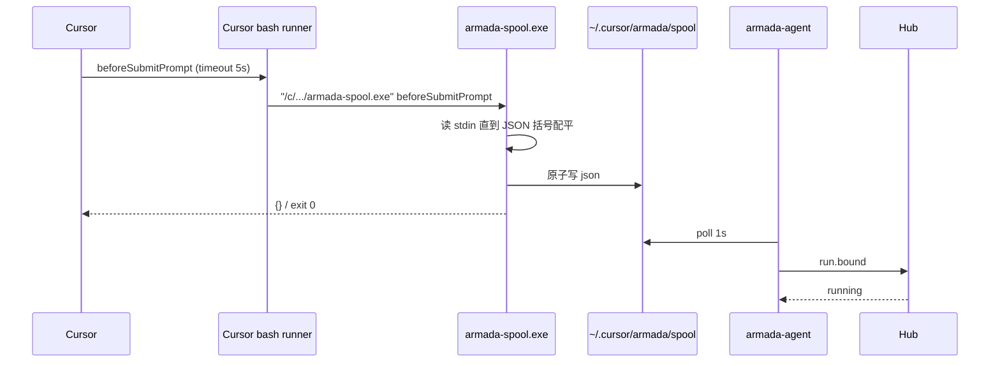

# Windows Hook Spooler 长期方案（sh 替代 PowerShell → native exe）

> 状态：实施基准（v1.2）  
> 日期：2026-08-31  
> 范围：Armada 受控端 Windows hook 热路径 + hub 工作区路径兜底匹配

## 0. TL;DR

| 项 | 内容 |
|---|---|
| 问题 | Windows 上 hook 在 5s 内写不出 spool → 扩展发不出 `run.bound` → hub 60s 后 `BIND_TIMEOUT`。对话本身已跑完。 |
| 核心方案 | Windows 热路径改为 `armada-spool.exe`：按 JSON 括号配对读完即退出，**不等 EOF**。Mac 仍用 `armada-spool.sh`。 |
| 关键约束 | 热路径不依赖 Python/Node；timeout 保持 5s；spooler p95 < 1s（目标 <200ms）；用本机 .NET Framework `csc.exe` 编译。 |
| 明确不做 | 不把「timeout 调到 30s」当主方案；**不为这个绑定 bug 升级中台 hub / 中台 vsix**；不改 `BIND_TIMEOUT_MS`；不改绑定只认 `beforeSubmitPrompt` 的规则。 |

## 1. 背景与需求

| 原始诉求 | 设计映射 |
|---|---|
| 对话已结束但仍显示「绑定中 / 正在关联会话」 | 保证 `beforeSubmitPrompt` 能在 5s 内落盘 spool，扩展发出 `run.bound` |
| 长期方案，不要权宜超时 | 去掉 Windows 热路径上会等 EOF 的 reader（PowerShell / `cat` / POSIX `read -N`） |
| 同工作区 Windows 路径变体仍能兜底绑定 | hub `findAttachableRun` 使用与扩展相同的 `workspacePathIn`（已有，属防御；主路径是 `run.bound`） |
| 「是不是中台也要更新」 | **否。** hub 从未收到 `run.bound`。升中台 vsix/重启 hub 不能让空 spool 变成绑定。 |

真机证据（PF39WTSM / Cursor 3.17.21）：

- v0（ps1）：hook 耗时 ~5.1s、exit 1；PowerShell 冷启动 + `ReadToEnd`。
- v1（sh + `cat`）：同样 ~5.2–5.4s、exit 1。Cursor Windows **不关闭 hook stdin**，`cat` 死锁。
- v1.1（`read -t 1 -N 262144`）：单测（Git bash）通过，真机 Cursor 自带 POSIX `sh` 忽略 `-t`，`-N` 等到 262144 字符直到被杀。
- Armada 日志：`cdp submit ok` + `run.ack accepted`，**从未** `run.bound`。

## 2. 现状盘点

| 可复用 | 需新建 |
|---|---|
| `hooks/armada-spool.sh`（Mac 已验证 <200ms） | `hooks/armada-spool.cs` + Framework `csc` |
| `extension/src/workspacePath.ts` | Windows `hookCommand` 生成 `"/c/.../armada-spool.exe" <event>` |
| `mergeHooks` 替换「ours」条目 | `install.ps1` / `ensureHooks` 编译 exe 并替换 sh/ps1 命令 |
| 本机始终有 .NET Framework 4.x `csc.exe` | — |

## 3. 设计原则

1. **热路径零重量运行时**：Windows hook 只准 native exe；不准再起 PowerShell / Python / Node。
2. **读完 JSON 就退出**：按 `{}`/`[]` 深度配对，UTF-8 高位字节当不透明；**禁止**等 EOF。
3. **timeout 仍是安全网不是主修复**：保持 5s。
4. **自动修复旧配置**：`ensureHooks` 必须把 ps1/sh 命令替换成 exe。
5. **路径比较只走归一化**：扩展绑定与 hub 兜底不得分叉（防御；主路径不依赖它）。
6. **fail-open**：spooler 失败不得挡住 Agent 发送（exe 恒 exit 0 + stdout `{}`）。
7. **可审计**：`hooks.json` 命令字符串可肉眼判断是否仍含 `sh` / `powershell.exe` / `.sh`。

## 4. 数据模型 / 接口契约

### 4.1 `hooks.json` 命令

| 平台 | `command` | timeout |
|---|---|---|
| macOS / Linux | `<abs>/armada-spool.sh <event>` | 5 |
| Windows | `"C:\Users\<user>\.cursor\hooks\armada-spool.exe" <event>` | 5 |

- 盘符转小写；反斜杠转 `/`；空格路径靠双引号。
- `isArmadaSpoolCommand` 识别 `.ps1` / `.sh` / `.exe`，以便清掉旧条目。
- `spoolScriptName("win32")` === `"armada-spool.exe"`；其它平台 `"armada-spool.sh"`。

### 4.2 路径归一化（已有，hub 必须共用）

实现：`extension/src/workspacePath.ts`  
等价关系（非穷尽）：

| hook `workspace_roots` | run `workspace_root` |
|---|---|
| `/C:/Users/PC/Desktop/work` | `c:\Users\PC\Desktop\work` |
| `C:/Users/PC/Desktop/work` | `c:\Users\PC\Desktop\work` |
| `/c/Users/PC/Desktop/work` | `c:\Users\PC\Desktop\work` |

`findAttachableRun`：`workspacePathIn(r.workspace_root, workspaceRoots)` 替代 `workspaceRoots.includes(r.workspace_root)`。prompt 仍 `trim` 精确相等。

**这条只在 hook 事件已到达、但没有 `runId` 时生效。** 当前 Windows 故障是 spool 为空，事件不到达，因此升 hub 无效。

### 4.3 错误码

不新增。绑定失败仍是 `unknown` + `BIND_TIMEOUT`（60s）。

## 5. 运行时链路

- 缓存：无。每次 hook 写新文件。
- 失效：扩展 ack 后删 spool（现有逻辑）。
- 降级：exe 写失败 → fail-open `{}`；5s 杀进程 → 无 spool → 60s `BIND_TIMEOUT`。
- 编译失败：`ensureHooks` 尝试拷 vsix 内预编译 exe；仍失败则 `hooks.status.installed=false`。
- 错误窗口先转发、runId 为空：hub 用归一化路径 + prompt 挂靠等待中的 run。

## 6. 安全与威胁模型

| 威胁 | 缓解 | 指标/约束 |
|---|---|---|
| hook 命令注入 | `event` 仅字母数字；路径由安装器写入、带引号 | 与现 sh 脚本一致 |
| 旧 ps1/sh 残留被拖死 | merge 时删除所有 armada-spool.ps1/sh/exe 条目再写一条 | Reload 后 hooks.json 不得含 `powershell.exe` 或 `armada-spool.sh`（Windows） |
| 跨工作区误绑 | prompt 精确匹配 + 路径归一化后相等，不含 running | 与现 ingest 测试一致 |
| PowerShell 把 CJK 变成 `???` | 仅当该工作区+时间窗内**恰好一条** pending 时按 `promptMatch: "edited"` 绑定；两条以上不猜 | 单测：`???` 唯一 pending 绑定；两条 pending 返回 null |
| 审计 | 扩展 Output「Armada」打 `run.bound`；hub 状态机不变 | 派发后 30s 内 `conversation_id` 非空 |
| 未签名 exe | 仅写入 `%USERPROFILE%\.cursor\hooks`，本机 `csc` 编译 | SmartScreen 可能提示；用户本机编译，不从网上下载未知 exe |

边界外：Cursor 若改用不走 bash 的 hook runner，引号 msys 路径可能失效（v2 触发：改 `cmd /c` 或绝对 `C:\` 路径）。

## 7. 实施路线图

| 阶段 | 内容 | 验收 | 上线 gate |
|---|---|---|---|
| **v1** | Windows 改 sh；install.ps1；hub 路径归一化；README | 见历史 §9 | 已上线，真机失败（`cat` 死锁） |
| **v1.1** | `armada-spool.sh` 用 `read -t/-N`；扩展 0.4.2 | open-stdin 单测（Git bash）绿 | 已上线，真机失败（Cursor POSIX sh 忽略 `-t`） |
| **v1.2（本次）** | native `armada-spool.exe`；扩展 0.4.3 | 见 §9 | 受控端装 0.4.3 并 Reload；**不升中台** |
| **v1.5** | 若真机 p95 仍 >1s：给 spooler 加耗时日志 | 触发：v1.2 后仍 BIND_TIMEOUT 且 hook 日志 >1s | — |
| **v2** | 预编译多 arch exe 打进 vsix；或 hook runner 不再是 bash 时改启动方式 | 触发：无 Framework / 无 bash 执行 exe | 需签名或用户本机编译兜底 |

跨仓：仅 Armada 仓。受控端装 0.4.3 vsix 并 Reload。hub 协议无破坏。中台机不必重启 hub。

发布顺序：

1. 本机（Windows 受控）打 vsix 0.4.3 并安装。
2. Reload Window。
3. 确认 `hooks.json` 命令为 exe。
4. 再派发。中台 hub 保持现网即可。

## 8. 风险与未决

| 风险 | 影响 | 应对 | 状态 |
|---|---|---|---|
| Cursor bash 无法 exec `.exe` | Windows 绑定全挂 | hook 日志；v2 改 `cmd /c` | 未阻塞：MSYS bash 可执行 Win32 exe |
| 无 `csc.exe` | 无法编译 | vsix 带预编译 exe；install.ps1 失败退出 | 未阻塞：Win10/11 自带 Framework 4.x |
| SmartScreen 拦 exe | hook 起不来 | 本机编译；用户目录 | 观察 |
| `/C:/Users/...` 与 msys `/c/Users` 漏一种 | 仅影响 hub 兜底 | `workspacePath.ts` 已覆盖；`/C:/` 回归测 | 关闭 |
| 双窗口抢 spool | 仍可能 runId 为空 | hub 兜底 + 路径归一化 | 关闭 |
| 未 Reload / 仍 ≤0.4.2 | 继续 BIND_TIMEOUT | README 写明 ≥0.4.3 | 文档 |
| 误升中台以为能修 | 浪费时间 | README / 本规格明确不做 | 关闭 |

阻塞项：无。中台更新：**非阻塞、非必须**。

## 9. 评审检查清单

- [x] 固定章节骨架
- [x] MVP/v1/v1.5+/v2 切分
- [x] 非目标、风险、阻塞、验收
- [x] 跨服务发布顺序与兼容（只升受控扩展；hub 不必发版）
- [x] 修订记录

验收清单（v1.2）：

1. `hookCommand("C:\\Users\\a\\.cursor\\hooks\\armada-spool.exe", "stop")` === `"C:\\Users\\a\\.cursor\\hooks\\armada-spool.exe" stop`
2. `mergeHooks` 把旧 `sh ".../armada-spool.sh"` 和 `powershell.exe ... ps1` 换成上式；timeout=5
3. `spoolScriptName("win32")` === `"armada-spool.exe"`
4. exe 在 stdin **保持打开** 时读完 compact JSON（含 UTF-8 `你好`）后 <1.5s exit 0 并落盘
5. Mac 命令仍为绝对路径 + event，不含 `sh "` 前缀、不含 `.exe`
6. `bun test` 全绿
7. 真机（上线 gate）：Windows 派发后 30s 内运行中，`conversation_id` 非空；Cursor hook 日志该次 `beforeSubmitPrompt` exit 0 且 <1s；Armada 日志出现 `run.bound`

## 10. 备选方案与不选原因

| 方案 | 不选原因 |
|---|---|
| timeout 30s + 修 ReadToEnd | 冷启动仍在；并发 hook 拖 Agent；非长期 |
| 继续 sh + `read -t` | Cursor 自带 POSIX sh 忽略 `-t`，真机已失败 |
| 升级中台 hub | hub 从未收到 `run.bound`；空 spool 升 hub 无效 |
| 预编译多 arch 打进 vsix 当 v1.2 唯一路径 | 本机 `csc` 已够；交叉编译/签名未就绪。vsix 带 exe 只作编译失败兜底 |
| Go/Rust spooler | 受控端无 toolchain；体积大 |

## 11. 回滚

装回 0.4.2 vsix 或把 `hooks.json` 改回 sh。hub 路径归一化是超集，回滚扩展不必回滚 hub。

## 12. 修订记录

| 日期 | 变更 |
|---|---|
| 2026-08-31 | 初稿。根因：Windows ps1 5s timeout。v1：sh spooler + hub 路径归一化。 |
| 2026-08-31 | v1.1：Windows Cursor 不关闭 hook stdin，`cat` 与 `ReadToEnd` 同样死锁。改为 `read -t/-N`。 |
| 2026-08-31 | v1.2.1：真机 Cursor Windows hook runner 是 PowerShell，msys `/c/...exe` 报 CommandNotFound。改为引号包裹的 `C:\...\armada-spool.exe`。扩展 0.4.4。 |
| 2026-08-31 | v1.2.2：0.4.5 的 in-process `.ps1` 等 stdin EOF，真机 5s exit 1。回到 exe（管道随进程退出）+ 乱码 prompt（`???`）且唯一 pending 时 `edited` 绑定。扩展 0.4.6。 |

