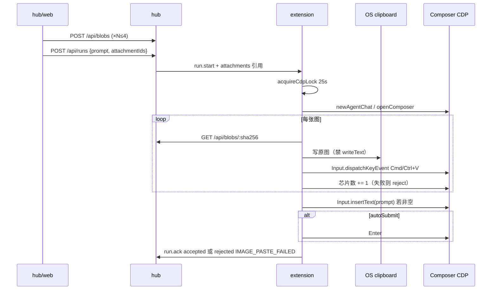

# Armada 图文派发（Composer 图片芯片）

> 状态：**需求方向封口；契约已按 Grok 4.5 审查修订，可落地**。CDP 贴芯片以真机探针 P1–P5 为上线 gate；**未标实施基准**（探针未出样本前不得把选择器/Windows 剪贴板格式写死为已验证）。  
> 日期：2026-09-02  
> 父文档：[2026-08-28-lan-cursor-workbench-design.md](./2026-08-28-lan-cursor-workbench-design.md) §13.2 / D17（本工作区可能缺失原文；不废止条款以讨论记录为准：真实 IDE 会话、已验证 CDP、整机注入串行）  
> 前身：2026-09-01 讨论记录（单图）→ 2026-09-02 续篇（多图 / 禁止压缩 / 超时不改）  
> 审查：[Grok 4.5 方案审查](fac4c9b0-89a8-4ef9-9137-7e73dea9fde6) 初评为不通过（C1–C5）；下列条款已吸收。

---

## 0. TL;DR

| 项 | 内容 |
| --- | --- |
| 问题 | 派发通道只有纯文本 `Input.insertText`；人手贴图走系统剪贴板 → Composer **图片芯片**。 |
| 核心方案 | 中台选/贴最多 4 张原图 → hub 按 sha256 落盘 → `run.start` 只带引用 → 扩展在 `cdp.lock` 内 HTTP 拉原字节 → 写 **OS 剪贴板**（禁止 `vscode.env.clipboard.writeText`）→ CDP 原生粘贴 → **芯片数 = N** → 再插 prompt（可空）→ Enter。 |
| 关键约束 | 成功 = 回车前 DOM 芯片数等于附件数。失败不降级 `@路径`。原图直传，**禁止任何压缩**。超时仍用现网 30s/25s，不另开时钟。 |
| 明确不做 | GIF/WebP；预览编辑；恢复用户剪贴板；CDP 点回形针；绕过 IDE 打模型 API；`@路径` 当成功；失败后改 `@` 发出去；为图文加长 `DISPATCH_TIMEOUT`；旧扩展版本门（操作员同步升级）。 |

---

## 1. 背景与需求

| # | 原始诉求 | 设计映射 |
| --- | --- | --- |
| R1 | Armada 能把截图/设计稿送进 Cursor | 派发与续聊带 1–4 张 PNG/JPEG，注入被控机 **原生 Composer** |
| R2 | **必须像人手** | 出图片芯片，不是文件引用药丸 |
| R3 | 多图 | 同一条消息里多枚芯片、一次回车；实现为串行贴 |
| R4 | 模型仍能看清图 | 禁止缩放/降质/重编码缩小；Hub 存上传原字节 |
| R5 | 只附图也能派 | prompt 可空；碰撞键含附件指纹；绑定不能只靠全文相等 |
| R6 | 控制台好用 | 文件多选 + 向派发/续聊框粘贴截图 |
| R7 | 续聊失败可见 | followup 贴图失败把该卡打成 `error` / `IMAGE_PASTE_FAILED`；cid 保留可再续 |

对照父文档不废止：任务必须是该机 IDE 内真实会话；CDP 只做已验证注入；整机注入串行。

---

## 2. 现状盘点

| 类别 | 内容 |
| --- | --- |
| 可复用 | `POST /api/runs` 文本；`run.start` / `run.followup` WS；`COMPOSER_FOCUS_JS` + `Input.insertText` + Enter（`extension/src/cdpInject.ts`）；`cdp.lock`（`extension/src/cdpLock.ts`）；注入槽 `dispatched`+`binding`（`hub/src/runs.ts`）；`armada.autoSubmit`；扩展 Bearer HTTP（`extension.ts` `adoptFromHub`） |
| 需新建 | hub blob 存储与 `POST/GET /api/blobs`；runs 附件有序引用；OS 剪贴板桥；CDP 原生粘贴 + 芯片计数；派发/续聊选图与粘贴；`stripImageMarkers` 绑定；详情 `[图片]` 展示；`armada.imagePaste` |
| 不复用 / 有害 | `executor.ts` 的 `vscode.env.clipboard.writeText`（图路径禁止，会清掉图片剪贴板）；工作区 inbox + `@`；合成 `ClipboardEvent`；Continue/Cline 式 base64 直打模型 |
| 现网会踩的坑 | `chatView.ts` 丢弃含 `<image_files>` / `[Image]` 的 transcript 用户句；`binding.ts` / `ingest.ts` / `transcriptBind.ts` 按 prompt 全文相等；`onRunAck` 仅在 `dispatched` 认 `rejected` |

**工作区 ≠ CDP。** hub 派发看扩展 WS `open_workspaces`（`hub/src/runs.ts` `create`），不探 CDP。Cursor 开着但未走 `armada-cursor.sh` 时仍会派发；文本路径降级为「已预填,待本机回车」。图路径：CDP 失败 → 立刻 `IMAGE_PASTE_FAILED`，禁止 `writeText`。

---

## 3. 设计原则

1. **芯片数是回车前唯一成功标准。** 探测失败 = 不回车。
2. **失败停，不降级 `@路径`。** 图若已在系统剪贴板，可人工在被控机 Cmd/Ctrl+V。
3. **注入槽内独占剪贴板。** 并行 run 已串行注入；槽结束才晋升 queued。
4. **原图保真。** 不压缩、不缩放、不降质。超限拒收，不帮用户压图。
5. **纯文本零变化。** 无附件时路径与现网一致（含 30s ack / 25s lock）。
6. **失败立刻释放注入槽。** `run.ack rejected`，`end_reason=IMAGE_PASTE_FAILED`。不用 `run.note` 当终态（现网 `run.note` 只进 audit，除 `BIND_AMBIGUOUS`）。
7. **回滚阀。** `armada.imagePaste=false` 且 **无附件** → 纯文本零变化。`false` **且有附件** → 立刻 `rejected` `IMAGE_PASTE_DISABLED`，不得空提交。

### 3.1 已否决方案

| 方案 | 为什么不选 |
| --- | --- |
| 工作区文件 + `@路径` | 不是人手芯片；可能只当普通文件 |
| 合成 paste / DataTransfer | 浏览器常忽略，易假成功 |
| 隐藏 file input + `DOM.setFileInputFiles` | 更像选文件。Windows 探针失败后可作工程备选，**不改产品语义** |
| 图塞 SQLite / 单帧 WS / `run.start` base64 | 8–24 MiB 打爆 |
| 超限自动压缩 | 违反 R4 |
| 先 `accepted` 再贴图 | `onRunAck` 进 `binding` 后忽略 `rejected`；要新协议 |
| 为图文把 `DISPATCH_TIMEOUT` 提到 90s | 传输不是瓶颈；产品确认维持 30s |
| 旧扩展 `ATTACHMENT_UNSUPPORTED` 版本门 | 操作员同步升级；漏升则附件被当纯文本发出（接受风险） |

### 3.2 v1 范围（已锁定）

**做：** 派发与续聊各最多 **4** 张 **PNG 或 JPEG**；每张原文件 **≤ 8 MiB**；合计 **≤ 24 MiB**；控制台多选 + 粘贴截图；只附图；续聊失败打卡。

**不做：** 见 §0。另：不清理 `IMAGE_PASTE_FAILED` 留下的空 Composer；不做 desktop 派发选图（只 hub/web）。

---

## 4. 数据模型 / 接口契约

实现位置：`hub/src/index.ts`、`hub/src/runs.ts`、`hub/src/db.ts`、`hub/src/concurrency.ts`、`hub/web/src/api.ts`、`extension/src/wsClient.ts` / `executor.ts`。

### 4.1 Blob 存储

| 项 | 契约 |
| --- | --- |
| 路径 | `$ARMADA_HUB_HOME/blobs/<sha256>`（与 `hub/src/auth.ts` `ARMADA_HOME` 相同根） |
| 字节 | **等于上传原文件**；sha256 为文件内容 SHA-256 hex |
| SQLite | 新表 `blobs(sha256 TEXT PK, mime TEXT, size INTEGER, refcount INTEGER, created_at INTEGER)`；`runs` 增 `attachments TEXT`（JSON 数组，可空/`[]`） |
| 去重 | 相同 sha256 只存一份；多次引用 `refcount++` |
| 同一张图贴两次 | 允许两个芯片；`attachments` 数组可重复同一 sha256 |
| TTL | 上传入库时 `refcount=0`。run **写入或覆盖** `attachments`：进入列的 sha256 `++`，从列移除的 `--`。run **终态**再对**当时列**每个 sha256 `--`（只这一次，不与覆盖重复算同一轮）。`refcount=0` 后 **24h** 删文件+行。hub 启动 + 每小时扫。blobs 目录超过 **512 MiB** 只打 audit，v1 不做 LRU |
| 限流 | 同 token：上传 **10 次/分钟**、并发 **2**。超限 429 `RATE_LIMIT` |

**备选（不选）：** blob id 用 uuid — 同内容重复占盘；TTL 跟 run 走即可但不利于续聊前预传。选 sha256+refcount。

### 4.2 HTTP

鉴权与现网 REST 相同：`Authorization: Bearer` 或 `?token=`（`hub/src/auth.ts`）。blob GET **文档要求 Header**；query token 仅兼容现网习惯，控制台/扩展实现用 Header。

#### `POST /api/blobs`

- `multipart/form-data` 字段 `file`（单文件；多图多次 POST，或一次 multipart 多个 `file`，实现选 **多次 POST** 与限流对齐）。
- 声明 `Content-Type` 须为 `image/png` 或 `image/jpeg`。
- Magic bytes：PNG `89 50 4E 47`；JPEG `FF D8 FF`。与声明不一致 → 400 `ATTACHMENT_INVALID_MIME`。
- 单张 `> 8 MiB`（`8 * 1024 * 1024` 字节）→ **413** `ATTACHMENT_TOO_LARGE`。
- 成功 201：`{ id, sha256, mime, name, size }`。`id` **= sha256**（与存储键一致）。

**备选（不选）：** JSON+base64 — 膨胀约 4/3，且易误进 SQLite。

#### `GET /api/blobs/:id`

- `:id` 为 sha256。
- 200：原字节，`Content-Type` 为入库 mime；`Cache-Control: private, max-age=3600`。
- 404 `ATTACHMENT_NOT_FOUND`。
- 扩展只在持有 `cdp.lock` 后拉取（减少未注入的预取；queued 期间图只在 hub）。

#### `POST /api/runs`

现有 `{ machineId, workspaceRoot, prompt }` 增加可选 `attachmentIds: string[]`（有序 sha256）。

| 条件 | 错误 | HTTP |
| --- | --- | --- |
| `attachmentIds.length > 4` | `ATTACHMENT_COUNT` | 400 |
| 任一张未找到 | `ATTACHMENT_NOT_FOUND` | 400 |
| 合计 size > 24 MiB | `ATTACHMENT_TOTAL_TOO_LARGE` | 413 |
| `prompt` 去空白后为空 **且** 无附件 | `EMPTY_PROMPT` | 400 |
| 现网碰撞等 | 不变 | 见 `httpStatusForRunError` |

`httpStatusForRunError`（`hub/src/concurrency.ts`）返回类型扩为含 **413**；映射 `ATTACHMENT_TOO_LARGE`、`ATTACHMENT_TOTAL_TOO_LARGE`。`POST /api/blobs` 单张超限与 `create`/`followup` **合计超限**都必须走到 413（测试覆盖 create 合计）。Blob 路由也可直接 413。

**碰撞键**（替换仅 `normalizePrompt(prompt)`）：

```
collisionKey = normalizePrompt(prompt) + "\n" + attachmentIds.join(",")
```

`normalizePrompt` 仍为 `extension/src/promptNormalize.ts`（去 `\r`、trim、空白折叠）。两张「空 prompt + 不同图」不碰撞；「空 prompt + 相同 sha256 序列」碰撞 → 409 `PROMPT_COLLISION`。

空 prompt 卡片标题（`hub/web/src/boardState.ts` `cardView`）：`[N 张图片]`。有 prompt 仍截断 prompt。

#### `POST /api/runs/:id/followup`

`{ prompt, attachmentIds?: string[] }`。校验与 create 相同（张数/体积/空 prompt+无图）。`recordFollowupPrompt` 仍只记文本 prompt（可空字符串）。**有附件时延后到 `run.ack accepted` 再记**，避免贴图失败留下幽灵用户句；无附件时保持现网（注入前即记）。附件列覆盖为本轮列表（不追加历史轮次——历史以 events 为准）；覆盖时按 §4.1 调整 refcount。

**碰撞：** followup 用**请求体** `prompt + attachmentIds` 与**其它** occupying run 的存盘键比较。不改本卡 `runs.prompt`（首轮标题不变）。本卡 followup 期间自身不与自己碰撞。

followup 失败（含贴图）：`onRunAck rejected` → 整卡 `error`，`end_reason=IMAGE_PASTE_FAILED`。`conversation_id` 不清。error 不在 `OCCUPYING_STATUSES`，可再 followup。

### 4.3 WebSocket

`run.start` / `run.followup` 增加可选：

```json
"attachments": [
  { "id": "<sha256>", "mime": "image/png", "name": "a.png", "sha256": "<sha256>", "size": 123 }
]
```

**无字节。** 无附件时省略该字段，旧扩展忽略未知字段（Q4 接受假成功风险）。

**`create` 即时 `sendTo` 与 `promoteNextQueued` 必须从 `runs.attachments` 组装同一形状的 `attachments` 数组。** 晋升漏字段视为实现缺陷；验收必测 queued → dispatched 后扩展仍收到完整引用（新扩展 + 排队不得退化成纯文本）。

扩展拉图：`GET http://<armada.hubUrl>/api/blobs/<sha256>`，`Authorization: Bearer <armada.token>`。

### 4.4 失败码（卡片）

| `end_reason` / ack reason | 何时 |
| --- | --- |
| `IMAGE_PASTE_FAILED` | CDP 不可达/无芯片/剪贴板写入失败/芯片数 ≠ N；**不** `writeText` |
| `IMAGE_PASTE_DISABLED` | 扩展 `armada.imagePaste=false` **且** 本 run 带附件 |
| 现网 `CDP_LOCK_TIMEOUT` / `STALE_DISPATCH` / `INJECT_FAILED:*` | 行为不变 |
| `DISPATCH_TIMEOUT` | 30s 内未 ack（现网 `sweepTimeouts`）；图文不特判 |

`IMAGE_PASTE_FAILED` / `IMAGE_PASTE_DISABLED`：`startRun`/`followup` 在芯片确认失败时 **不得** `accepted`；`followup` 失败路径 **不得** `bindKnown`。

`onRunAck`：除现网 `dispatched` 外，`end_reason=DISPATCH_TIMEOUT` 的 recoverable 窗口内 **`rejected` 也要落终态**（`IMAGE_PASTE_FAILED` 优先于显示 `DISPATCH_TIMEOUT`），避免晚到 reject 被吞、卡面停在超时。

`PendingRun`（`extension/src/binding.ts`）增加 `attachmentIds: string[]`（可空）。有附件的 pending 才能走「空正文唯一绑定」。

### 4.5 配置

`extension/package.json` + `extension/src/config.ts`：

| 项 | 默认 | 行为 |
| --- | --- | --- |
| `armada.imagePaste` | `true` | `false` 且无附件：纯文本零变化。`false` 且有附件：`rejected` `IMAGE_PASTE_DISABLED` |
| `armada.autoSubmit` | `true` | `false`：芯片+prompt 预填，**不回车**（与现网文本一致） |

---

## 5. 运行时链路

时钟（**不改**）：`DISPATCH_TIMEOUT_MS=30_000`、`cdp.lock timeoutMs=25_000`、`BIND_TIMEOUT_MS=60_000`。验收：**已持锁后** 4 张原图贴完并 ack，目标 p95 **< 25s**。锁等待计入同一 30s；争用下允许 `DISPATCH_TIMEOUT` / `CDP_LOCK_TIMEOUT`，不算贴图逻辑假失败。LAN 24 MiB 下载不是改时钟的理由。



### 5.1 注入顺序（有附件）

1. 若 `armada.imagePaste=false`：立刻 `rejected` `IMAGE_PASTE_DISABLED`（授权之后、`newAgentChat`/`openComposer` **之前**），不得开空对话、不得 `insertText("")`。
2. 持有 `cdp.lock`（`extension/src/executor.ts`，与现网相同，在授权之后）。
3. 新任务：`composer.newAgentChat`；续聊：`composer.openComposer`。
4. **有附件时不得复用现网 `injectPrompt` 的成功语义**（该函数 CDP 失败只把 `submitted=false` 再 `writeText`，然后 `startRun`/`followup` 无条件 `accepted`）。必须走独立 `injectImages`：芯片数确认失败或 CDP/剪贴板失败要返回失败；**失败路径不得 `accepted`**；`followup` 失败不得 `bindKnown`。成功唯一出口：芯片数 = N（再按 `autoSubmit` 决定是否已 Enter）之后才 `accepted`。
5. 按 `attachments` 顺序：拉原字节 → 落到 `os.tmpdir()` 仅供 OS 剪贴板桥 → 写剪贴板 → CDP 原生粘贴 → 确认芯片总数 = 当前下标+1。任一步失败：临时文件 `finally` 删；`run.ack rejected` `IMAGE_PASTE_FAILED`。
6. prompt 非空：`Input.insertText` + 现网前缀校验。prompt 为空：跳过 insertText，仍要求芯片数 = N 后才 Enter（或 `autoSubmit=false` 则停）。
7. `armada.autoSubmit=true`：现网 Enter（须能命中「带本轮芯片的框」，见 §5.3）。`false`：不回车。
8. 粘贴+探芯片每张有界重试 **≤2**。仍失败则停。
9. 纯文本（无附件）：**零变化**，包括 CDP 失败后 `writeText`。

### 5.2 剪贴板与转码

- 禁止 `vscode.env.clipboard.writeText` / 依赖 VS Code 文本剪贴板的 paste command 作为图路径成功手段。
- **禁止有损压缩。** Hub 与扩展均不得为体积或剪贴板容量降质。
- JPEG：探针 P6 若证明原件能出芯片 → **原字节**上剪贴板。若 OS/Composer 只收 PNG → **仅允许无损像素拷贝**（decode → PNG）。转码后变大写不进剪贴板 → `IMAGE_PASTE_FAILED`，不降质重试。
- macOS 预期：`PNGf` / `public.png`（osascript 读 POSIX file）。Windows：P5 之前不得写死 CF_PNG vs DIB；CF_HDROP 文件路径若变成药丸则判失败。
- v1 不恢复用户剪贴板；不剥 EXIF（原样存、原样贴）。

**备选（不选）：** 纯内存写剪贴板 — 系统桥多要文件句柄。选 tmp + `finally` 删。

### 5.3 芯片探测（上线 gate = P1）

回车前用 CDP `Runtime.evaluate` 数芯片。**选择器以探针样本为准**，规格不写死 CSS。实现可先用可替换的 `CHIP_COUNT_JS`，默认启发式（composer 内 `img` / 附件芯片节点），探针后改一行。

现网隐患：`COMPOSER_FOCUS_JS`（`cdpInject.ts`）优先 `innerText` 空框。芯片若让框变非空，后续 `insertText` 可能打到**另一个**空 Composer。P1 必须回答：贴图后目标框 `innerText` 是否非空。若非空，图路径的 focus 改为「空 **或** 已含本轮芯片的框」，不得误跳。

`COMPOSER_ENTER_JS` 现按 prompt 前缀找框；只附图时 prefix 为空，必须改成「当前带芯片的框」，否则会找错空框或 `NO_TARGET`。

粘贴键：macOS `Meta+V`，Windows `Ctrl+V`，经 CDP `Input.dispatchKeyEvent`（P2 验证是否读 OS 剪贴板）。

### 5.4 控制台（hub/web）

文件：`hub/web/src/components/Modals.tsx`、`RunDetail.tsx`、`api.ts`。

- 派发：`<input type=file accept="image/png,image/jpeg" multiple>` + 容器 `paste`（`clipboardData.files` / items）。按钮启用 = 已选工作区且（`prompt.trim()` **或** 附件 ≥1），与 API `EMPTY_PROMPT` 对齐。
- 第 5 张：**列表拒收**（UI 提示），不在加第 5 张时 400；点派发仍校验 ≤4 与合计 24 MiB。
- 列表可删单张；不提供预览编辑/裁剪。
- 粘贴截图：浏览器给什么 mime 就上传什么；非 png/jpeg 拒收。
- 续聊输入区同样附件条。发送条件：`prompt.trim()` **或** 至少一张图（改 `RunDetail.tsx` `sendFollowup` 的 `!followup.trim()`）。
- 不做 desktop 派发选图。

### 5.5 绑定与详情

`stripImageMarkers`（新文件建议 `extension/src/imageMarkers.ts`，hub ingest 与 web `chatView` 共用或各拷一份保持测试简单）：去掉 `[Image]`、`<image_files>…</image_files>`、`<image_description>…</image_description>`，再 `normalizePrompt`。

三处必须同一套 `stripImageMarkers` + `normalizePrompt`（`findAttachableRun` 在 `hub/src/runs.ts`，ingest 调用它；ingest 另有第二道门）。

| 位置 | 现网 | v1 |
| --- | --- | --- |
| `extension/src/binding.ts` `matchHookToPending` | `normalizePrompt` 全文相等；`if (!prompt) return null` | 剥标记后再比。剥完为空且 `PendingRun.attachmentIds.length>0`：该工作区+时间窗内 **唯一** 带附件 waiting run，且 hook 含 image 标记或剥完为空 → 绑定。多个 → `BIND_AMBIGUOUS` |
| `hub/src/runs.ts` `findAttachableRun` | `if (!want) return null`；`trim` 精确相等 | 剥标记 + `normalizePrompt`；空正文走唯一带附件 waiting；不得因 `want==""` 直接 return |
| `hub/src/ingest.ts` `submitHook && !run.conversation_id` | `payload.prompt.trim() === run.prompt.trim()` | 两侧都剥标记 + normalize 后再比；空正文走与上相同的唯一性，不得丢弃事件 |
| `extension/src/transcriptBind.ts` | `user_query` 内文相等 | 抽完 `user_query` 后再剥标记 |
| `hub/web/src/chatView.ts` | transcript 遇 image 标记 **整句丢弃**；hook 原样展示 | **hook 与 transcript 用户句均剥离**；剥完空则展示 `[图片]`（张数来自本轮 `attachments` / 标记个数）。**不是成功标准** |

正则在 P3/P4 样本到达后只调表达式，不改策略。

---

## 6. 安全与威胁模型

| 威胁 | 缓解 | 指标 / 边界 |
| --- | --- | --- |
| 未鉴权拉图 | 与 REST 相同 Bearer | 无 token → 401 |
| 任意文件当图 | magic bytes + 声明 mime 一致 | 400 `ATTACHMENT_INVALID_MIME` |
| 体积打满磁盘 | 8 MiB/张、24 MiB/单、TTL、10/分钟 | 413；512 MiB 只审计 |
| 图进工作区 / git | 禁止 inbox；临时文件 `os.tmpdir()` | 验收：工作区 `git status` 无新图 |
| 注入槽覆盖用户剪贴板 | 槽内视为持有；v1 不恢复 | 产品已接受 |
| token 进可分享 blob URL | 扩展用 Header | — |
| 旧扩展假成功 | 不做版本门 | 接受；操作员同步升级 |
| 截图含密钥 | v1 不做 OCR/脱敏 | 中台当敏感内容 |

边界外：操作员上传内容的合规由中台流程负责。

---

## 7. 实施路线图

发布顺序：**hub（blob + 附件字段）→ 扩展（贴图+绑定）→ 控制台选图**。控制台可与扩展并行，但未升扩展时带图派发会纯文本假成功（Q4）。

| 阶段 | 内容 | 验收 | 状态 |
| --- | --- | --- | --- |
| 讨论 v0 | 芯片 / 不 @ / 单张 | 产品确认 | 已记录 2026-09-01 |
| 讨论 v1 | 多图 4/8/24、禁止压缩、30s 不改、Q1–Q5 | 本文 §0–§3.2 | **已封口** |
| 契约落地 | §4 hub + 控制台上传 | 单测：413/张数/碰撞键/空 prompt | **代码已落**（探针未过，非实施基准） |
| 绑定+详情 | `stripImageMarkers` + chatView | 单测：带 `[Image]` 仍绑定；详情不丢用户句 | **代码已落** |
| 探针 | P1–P5（P6 可选） | 样本进附录或 issue | 未做 |
| 注入 | OS 剪贴板 + CDP 粘贴 + 芯片计数 | §8 | 探针 gate；骨架已落 |
| 上线 | 真机 macOS + Windows 各一条 4 图 | §8 | — |

**上线 gate（缺一不得标实施基准）：** P1 芯片 DOM 与 innerText；P2 Cmd/Ctrl+V 出芯片；P3 hook prompt 形态；P4 transcript `user_query`；P5 Windows 剪贴板格式。

---

## 8. 验收

1. 中台选 1–4 张 PNG/JPEG 派发 → Composer 出现 **同等数量** 芯片 + 文本（若有），`beforeSubmitPrompt` / transcript 含 image 标记。
2. `armada.autoSubmit=false`：芯片+prompt 停在输入框，不回车。
3. 纯文本派发回归：现网路径、30s/25s、CDP 失败仍 `writeText`。
4. 单张 > 8 MiB → 413；合计 > 24 MiB → 413；第 5 张 UI 拒收。
5. 芯片数不够 **不回车**，卡片 `IMAGE_PASTE_FAILED`。
6. 只附图、prompt 空：能派发、能绑定、标题 `[N 张图片]`。
7. 续聊贴图失败：整卡 `error`，cid 仍在，可再续聊。
8. sha256 往返与上传字节一致（禁止压缩的可证伪项）。
9. `armada.imagePaste=false` 且有附件：卡片 `IMAGE_PASTE_DISABLED`，Composer 无空提交。
10. 工作区无新图文件。
11. queued → dispatched 晋升后 `run.start` 仍带完整 `attachments`。

---

## 9. 风险与未决

| 项 | 影响 | 应对 | 状态 |
| --- | --- | --- | --- |
| 系统剪贴板单例 | 高 | 槽内持有；失败不提交 | 已锁 |
| 30s ack 窗口 | 中 | 产品确认不改；贴不完走 `DISPATCH_TIMEOUT` | 已锁 |
| Windows 剪贴板格式 | 高 | P5；失败不改产品语义 | **探针** |
| 芯片导致非空框 / 只附图无 prefix | 高 | P1；改 focus/Enter 目标选择 | **探针** |
| hook/transcript 改写 | 中 | strip；P3/P4 校准正则 | 策略已锁 |
| 旧扩展假成功 | 中 | 同步升级 | 已接受 |
| 父文档文件缺失 | 低 | 不废止条款按讨论执行 | 本工作区 |

---

## 10. 评审检查清单

- [x] 成功标准与非目标（芯片 / 不 @ / 不压缩 / 30s 不改）
- [x] 多图 4 / 每张 8 MiB / 合计 24 MiB
- [x] 失败走 `run.ack rejected`，不占槽到 `BIND_TIMEOUT`
- [x] 碰撞键含附件；空 prompt 绑定策略
- [x] 跨服务发布顺序与假成功风险（Q4）
- [x] 传输契约落到代码
- [ ] P1–P5 探针样本
- [ ] 未标记为实施基准

---

## 11. 修订记录

| 日期 | 版本 | 变更 |
| --- | --- | --- |
| 2026-09-01 | 讨论 v0 | 必须芯片；系统剪贴板 PNG；否决 `@`；§4–§6 待补充 |
| 2026-09-02 | 需求 v1 | 多图最多 4；8+24 MiB；禁止压缩；只附图；续聊失败打卡；控制台粘贴；不做旧扩展门；CDP 失败立即失败；超时维持 30s/25s；失败码走 reject |
| 2026-09-02 | 落地 v1.1 | hub blob/runs/绑定/控制台选图、扩展 `injectImages` 骨架落地。CDP 芯片选择器与 Windows 剪贴板格式仍待 P1–P5。 |

---

## 附录 A · 探针最小集（上线 gate）

在被控机 Cursor（启动器拉起）对空 Composer：

1. **不回车**人手贴 1 张 PNG：dump 输入框 `outerHTML`、`innerText`、可见 chip 节点。
2. 回车：抓 `beforeSubmitPrompt` 的 `prompt` 全文、jsonl 首条 user / `<user_query>`。
3. 重复 2 张图，确认芯片是 2 个节点还是合并。
4. Windows 另跑一遍，记录剪贴板格式（PNG/DIB/HDROP）与是否出芯片。
5. 可选 P6：剪贴板只放 JPEG 是否出芯片。

没有 1–4 的样本，不得把 `CHIP_COUNT_JS` 标为已验证。
