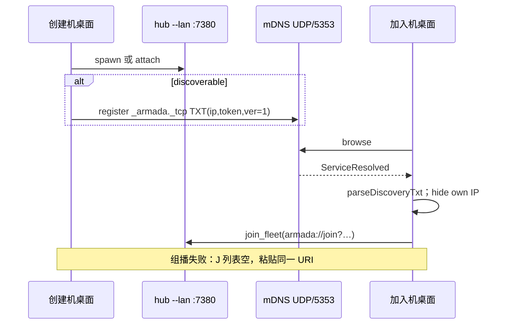

# Armada 局域网发现开放舰队

- 日期：2026-09-07
- 状态：可执行设计（产品确认：点一下加入；不开放仍可粘贴链接；mDNS；创建默认勾选开放）
- 父文档：桌面壳 [2026-09-01-armada-desktop-shell-design.md](../../../../docs/superpowers/specs/2026-09-01-armada-desktop-shell-design.md)（desk 仓；本仓实现）
- 修订范围：桌面壳增加「开放到局域网」广播与加入页发现列表。**不改** hub 协议、`--lan` 监听、token 生命周期、五列看板、`join_fleet` 鉴权。

---

## 0. TL;DR

| 项 | 内容 |
| --- | --- |
| 问题 | 受控端必须手工拿到 `armada://join?…`；同网有开放中台时仍要复制 IP/token。 |
| 核心方案 | 创建时默认勾选「开放到局域网」→ 桌面壳 mDNS 广播 `_armada._tcp`（TXT 带分享 IP + token）。加入页浏览列表，点一行走现有 `join_fleet`。不勾选则不广播；`--lan` 与粘贴链接不变。 |
| 关键约束 | ① 广播/浏览只在 Tauri 桌面进程，hub 仍 `src/index.ts --lan`。② 加入 URI 格式不变。③ 列表不展示 token。④ 广播失败不阻断创建。⑤ UDP 5353；拦组播时降级为粘贴。⑥ 本机 IP 与 TXT `ip` 相同的条目隐藏。 |
| 明确不做 | 改 hub 监听/鉴权；扫描网段；自建 UDP 信标端口；公网发现；看板内热切换开放；轮换 token；UI/日志打印完整 join URI 或 token。 |

---

## 1. 背景与需求

| # | 原始诉求 | 设计映射 |
| --- | --- | --- |
| R1 | 发现局域网内开放的舰队 | 加入页 mDNS 列表，实时增删 |
| R2 | 创建时可选择是否开放 | 创建 pane 复选框；默认**勾选** |
| R3 | 受控可选发现的舰队或自己输入链接 | 列表 + 现有粘贴框；两条路都进 `join_fleet` |
| R4 | 点一下就能加入 | TXT 携带 token，前端拼 `armada://join?hub={ip}:{port}&token={token}` |
| R5 | 不开放时链接仍可用 | 不广播；spawn 仍 `--lan`；复制分享链接行为不变 |

---

## 2. 现状盘点

| 类别 | 内容 |
| --- | --- |
| 可复用 | `create_fleet` / `join_fleet`（`desktop/src-tauri/src/hub.rs`）；`parseJoinUri` / `formatJoinUri`（`desktop-core/src/joinUri.ts`）；`pick_share_candidates` / `selectShareCandidate` / `shareJoinUri`；landing `index.html` 创建/加入 pane；`GET /api/health` 无鉴权（加入仍要 token，发现不走 health 扫描） |
| 需新建 | `desktop-core/src/discovery.ts`（TXT 解析、自机过滤、文案）；`desktop/src-tauri/src/discovery.rs`（mdns-sd 登记/浏览）；Tauri `start_fleet_browse` / `stop_fleet_browse`；`create_fleet(discoverable)`；landing 列表 UI |
| 不复用 / 有害 | 对 `/24` 扫 7380；把 token 写进实例名；hub 内嵌 mDNS（v1 不改 hub 进程模型） |

---

## 3. 设计原则

1. **一份 hub，发现只是进门。** 广播不替代鉴权；加入仍 probe health + Bearer。
2. **开放 = 可见，不是换一套网络。** `--lan` 与分享 IP 规则与今天相同。
3. **解析与加入 URI 单一实现。** TXT → `formatJoinUri`；禁止第二套 URL 语法。
4. **失败可粘贴。** mDNS 权限/组播被拦 → 空列表，不是死端。
5. **token 不进 DOM 文本、不进 toast、不进日志。**
6. **只杀自己的广播。** 退出舰队 / 退出 App 时 unregister；不扫不杀别人的服务。

### 3.1 已否决方案

| 方案 | 为什么不选 |
| --- | --- |
| UDP 自建信标 | 新端口、防火墙、Windows 保活，收益低于 mDNS |
| 扫描 7380 + `/api/health` | 慢、吵；不开放的中台也会被扫到 |
| hub 进程做 mDNS | v1 加入侧无 hub；要改 sidecar 启动参数与 Bun 依赖 |
| 不开放则绑 127.0.0.1 | 与「粘贴链接仍可加入」冲突 |

### 3.2 范围

| 阶段 | 做 | 不做 | 触发 |
| --- | --- | --- | --- |
| v1 | 创建默认开放；mDNS 广播/浏览；点选加入；粘贴保留；Windows 加入页可浏览 | 看板热切换；自定义舰队名；IPv6 | 本 spec |
| v1.5 | 看板内开关开放（unregister/register，不重启 hub） | — | 创建后要改开放且不愿退出时 |
| v2 | 舰队显示名手填；token 不进 TXT（发现后二次确认） | 公网目录 | 威胁模型升级 |

---

## 4. 数据模型 / 接口契约

### 4.1 mDNS

| 项 | 值 |
| --- | --- |
| 服务类型 | `_armada._tcp.local.` |
| 端口（SRV） | `7380`（与 `HUB_PORT` 一致） |
| 实例名 | 本机电脑名（macOS `scutil --get ComputerName`，否则 `hostname`）；空则 `Armada`；去掉 ASCII 控制字符 |
| 主机名 | `{ipv4}.local.`（mdns-sd 要求以 `.local.` 结尾） |
| 地址 | 与 `selectShareCandidate` 相同的 IPv4 |

TXT（每个 value ≤ 255 字节；token 为 64 hex，满足）：

| 键 | 约束 | 例 |
| --- | --- | --- |
| `ip` | 点分 IPv4，等于分享候选 | `192.168.1.23` |
| `token` | 非空；trim | `loadToken` 产物 |
| `ver` | 必须为 `1`，否则丢弃 | `1` |

缺 `ip` / `token` / `ver!=1` → 不当作舰队。

拼加入链接（与 `desktop-core/src/joinUri.ts` 一致）：

```
armada://join?hub={ip}:{port}&token={token}
```

`port` 取 SRV；若为 0 则 7380。

**备选（不采用）：** 实例名编码 token —— 会进系统发现 UI 和日志。

### 4.2 Tauri

`create_fleet` 增加参数 `discoverable: bool`（前端勾选；默认勾选所以常为 `true`）。

`CreateFleetResult` 增加：

| 字段 | 类型 | 含义 |
| --- | --- | --- |
| `advertised` | `bool` | 已成功 register |
| `advertiseError` | `string \| null` | 失败码 `advertise-failed`；成功为 null |

`discoverable=false` → 不 register，`advertised=false`，`advertiseError=null`。

新命令：

| 命令 | 参数 | 结果 |
| --- | --- | --- |
| `start_fleet_browse` | 无 | `ok`；已在浏览则幂等 |
| `stop_fleet_browse` | 无 | `ok` |

事件（webview，不含 token 明文以外的字段名；token 只出现在 `joinUri` 查询串，供点击调用，**禁止**写入 `<input>` 或 innerText）：

| 事件 | payload |
| --- | --- |
| `fleet-found` | `{ id, name, ipv4, port, joinUri }` |
| `fleet-lost` | `{ id }` |

`id` = mDNS fullname。本机 TXT `ip` ∈ 本机 `pick_share_candidates` 的 ipv4 集合 → **不发** `fleet-found`。

`quit_owned_hub` / App Exit：unregister + stop browse。

### 4.3 desktop-core API（`desktop-core/src/discovery.ts`）

```ts
export const MDNS_SERVICE_TYPE = "_armada._tcp.local.";
export const MDNS_TXT_VER = "1";
export function defaultDiscoverable(): boolean; // true
export function parseDiscoveryTxt(txt: Record<string, string>, name: string, port: number): DiscoveredFleet | { error: "incomplete" };
export function discoveryJoinUri(fleet: DiscoveredFleet): string;
export function shouldHideOwnFleet(advertisedIp: string, localIps: string[]): boolean;
export function discoveredRowView(fleet: DiscoveredFleet): { title: string; subtitle: string }; // subtitle = ip:port，无 token
export function advertiseFailedCopy(): string; // 「开放广播失败，请用分享链接邀请」
export function noOpenFleetsCopy(): string; // 「未发现开放舰队，可粘贴链接加入」
```

`DiscoveredFleet = { name, ipv4, port, token }`。

错误码：沿用现有 `fleetErrorMessage`；广播失败只用 toast，不占用 `#err`。

---

## 5. 运行时链路



| 场景 | 策略 |
| --- | --- |
| 浏览 | 仅加入 pane 可见时 `start_fleet_browse`；切到创建 / 打开看板 / 退出 App → `stop_fleet_browse` |
| 缓存 | 前端 `Map<id, row>`；`fleet-lost` 删除；TTL 无独立时钟（以 mDNS goodbye / ServiceRemoved 为准） |
| 广播失败 | 创建成功 + toast；分享链接仍可复制 |
| 组播被拦 | 空列表 + `noOpenFleetsCopy`；粘贴可用 |
| macOS 本地网络权限 | 用户拒绝 → 同组播失败 |
| 降级 | 不自动改扫网段 |
| 回滚 | 不勾选开放 = 与 2026-09-07 之前创建路径一致（无 mDNS） |

性能：browse 事件处理 p95 &lt; 50ms（内存 Map，无磁盘）。mDNS 查询由 crate 默认间隔，不自造高频发包。列表上限 **32** 条，超出丢弃新 `fleet-found`（防异常网）。

---

## 6. 安全与威胁模型

| 威胁 | 缓解 |
| --- | --- |
| 同 Wi-Fi 窃听 TXT 得到 token | 接受：与把分享链接发到同网等价；默认开放需产品知情（本 spec 已确认） |
| 伪造 `_armada._tcp` | 加入仍 `probe_hub` + token；假服务 → `unreachable` / `not-authorized` / `foreign-armada` |
| token 进日志/崩溃 | 禁止 `println!`/`console.log` 完整 URI；handler 解析后丢弃 raw |
| 把本机舰队点加入造成混乱 | 隐藏 TXT `ip` 属于本机分享候选的记录 |
| 公司网拦截 5353 | 粘贴链接；TCP 7380 路径不变 |

边界外：恶意 AP、mDNS 放大；v1 不鉴权 TXT。审计：不新增 telemetry。

---

## 7. 实施路线图

| Phase | 内容 | 验收 | Gate |
| --- | --- | --- | --- |
| 1 | `desktop-core` 解析/过滤/文案 | `bun test desktop-core/test/discovery.test.ts` 全绿 | 逻辑先于 UI |
| 2 | Rust txt 辅助 + mdns-sd 命令 | `cargo test` in `desktop/src-tauri`：txt 键、hide-own、create 结果含 `advertised` | 无真组播 CI |
| 3 | landing 开关 + 列表 | 勾选默认 true；点行 = `join_fleet`；空态文案；token 不在 DOM 文本 | bun test + 手测 |
| 4 | 打包 | 停 7380 源码 hub → `bun run tauri build` → 覆盖 `/Applications/Armada.app` → 创建舰队（须 spawn）→ 第二台或第二实例加入页能看到 | 真机 |

发布顺序：仅桌面壳 + 打包 sidecar；hub 协议无版本对齐。Windows 加入页同包（创建仍 macOS-only）。

兼容：旧 App 无浏览；新 App 加入旧中台仍靠粘贴。旧中台不广播。

---

## 8. 风险与未决

| 风险 | 影响 | 应对 | 状态 |
| --- | --- | --- | --- |
| 企业网关丢弃 5353 | 列表空 | 粘贴降级 | 接受 |
| mdns-sd 与系统 Bonjour 并存 | 偶发重复实例名 | crate 冲突时改名后缀；join 以 TXT ip+token 为准 | 监控 |
| 多网卡广播错 IP | 对端点了加不进 | IP 必须来自 `selectShareCandidate`，与剪贴板链接同一条 | 锁定 |
| 默认开放导致意外共享 | 同网可进 | 复选框可见；文案说明同一 Wi-Fi 可加入 | 产品已选默认勾选 |

阻塞项：无。

---

## 9. 评审检查清单

- [x] 固定章节骨架
- [x] v1 / v1.5 / v2 切分
- [x] 非目标、风险、阻塞、验收
- [x] 无跨仓协议变更；桌面包单独发布
- [x] 修订记录

---

## 10. 修订记录

| 日期 | 变更 |
| --- | --- |
| 2026-09-07 | 初稿。开放=点选加入（TXT 带 token）；不开放仍可粘贴；方案 mDNS；**创建默认勾选**。 |
