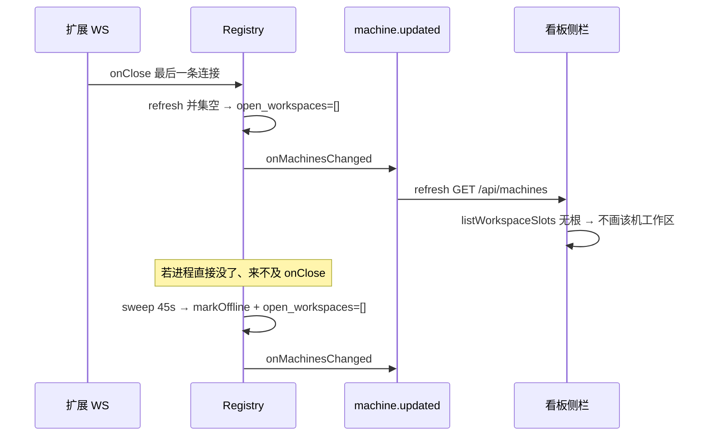

# Armada：离线工作区从侧栏消失

- 日期：2026-09-10
- 状态：设计草案 v1.0（产品确认方案 2；**未实施**；未达实施基准）
- 父文档：
  - [2026-08-28-lan-cursor-workbench-design.md](../../../../docs/superpowers/specs/2026-08-28-lan-cursor-workbench-design.md)（下称《主设计》；若本仓无此副本则以 desk 父仓为准）
  - [2026-09-02-armada-desktop-run-alerts-design.md](../../../../docs/superpowers/specs/2026-09-02-armada-desktop-run-alerts-design.md)（下称《通知》：slot 消失仍须开卡）
  - [2026-09-04-armada-ui-prefs-design.md](../../../../docs/superpowers/specs/2026-09-04-armada-ui-prefs-design.md)（`selectedWorkspace` 落盘）
- 修订范围：hub `Registry` 广告的 `open_workspaces` + 看板 `resolvedWs` 在 slot 消失时的回退/幽灵选中。**不改** run 状态机、ingest、扩展、桌面壳 landing、顶栏 `在线 x/y`。
- 触发：侧栏长期挂着灰点机器及其最后打开的工作区，碍眼；产品选择 **A**（掉线即从侧栏拿掉，不设离线抽屉）。

---

## 0. TL;DR

| 项 | 内容 |
| --- | --- |
| 问题 | 全部窗口断开后 hub **故意保留**最后一次 `open_workspaces`；机器 `offline` 后侧栏仍画灰点工作区。 |
| 核心方案 | **一条不变量：** `machines.open_workspaces` = 该机当前在线 WS 连接的工作区并集；无连接或机器 `offline` 则为 `[]`。侧栏只消费这份列表，不再第二套「离线也展示」。 |
| 关键约束 | ① 关最后一窗：立即写成 `[]`（不必等 45s sweep）。② `markOffline` 同时清空工作区并 `onMachinesChanged`。③ 已是 `offline` 的旧行启动时归一成 `[]`。④ 当前看板选中项若 slot 已消失且**没有**打开属于该仓的详情卡 → 跳到第一个仍在线 slot。⑤ 点通知 / 已打开该仓某卡：即使侧栏无 slot，仍停留在该仓看板并打开该卡（幽灵选中）。 |
| 明确不做 | 离线抽屉；删 `machines` 行；改顶栏分母；清历史 run；侧栏再滤一层 `status==="online"`；改派发/停跑。 |

---

## 1. 背景与需求

| # | 原始诉求 | 设计映射 |
| --- | --- | --- |
| R1 | 不在线的工作区自动消失，放着碍眼 | `open_workspaces` 不再保留 last-known；`listWorkspaceSlots` 对空数组本来就不生成 slot |
| R2 | 选 A：侧栏不进历史；回来再出现 | 历史 run 仍在 `runs` 表；同一 `machine_id`+`workspace_root` 重连后 slot 回来即可再点 |
| R3 | 点系统通知仍打开那张卡 | `resolveSelectedWorkspace` 在 `selectedRun` 属于该仓时保留幽灵 `selectedWs`（《通知》§4.4 / 降级表「slot 已消失」） |
| R4 | 可测、一处修 | 只改 `Registry` 广告语义 + 一处选中解析函数；夹具先红 |

对照《主设计》§4.2 / §5.1：侧栏「已打开工作区」本意是**当前可派**的路径。实现却在 `refreshMachineWorkspaces` 写了「无在线连接时保留最后已知值」，把「曾经打开」做成了菜单。本规格废止该保留策略。

---

## 2. 现状盘点

| 类别 | 内容 |
| --- | --- |
| 可复用 | `Registry.refreshMachineWorkspaces` 并集；`onMachinesChanged` → SSE `machine.updated` → 看板 `refresh`；`listWorkspaceSlots` 已按 `open_workspaces` 展开；`App.tsx` 已有「选中 key 不在 slots → 回退第一个 online」 |
| 需新建 | 空并集写 `[]`；`markOffline` 清工作区 + 广播；构造时把已 offline 行的非空 `open_workspaces` 归一；`boardState.resolveSelectedWorkspace`（把 `App.tsx` 内联逻辑抽出并加入幽灵规则） |
| 不复用 / 有害 | 侧栏再 `filter(s => s.online)`（与 hub 广告双闸）；离线分组 UI；把 `machines` 行删掉（丢掉 `display_name`） |

代码锚点：

| 位置 | 今天 | 目标 |
| --- | --- | --- |
| `armada/hub/src/registry.ts` `refreshMachineWorkspaces` | `union.size === 0` → `return false` 保留 last-known | 若 prev 非空则写 `[]` 并返回 true |
| 同文件 `markOffline` | 只 `status='offline'` | 同时 `open_workspaces='[]'`；若有变化则 `onMachinesChanged()` |
| 同文件 `sweep` | `markOffline` + `onMachineOffline`（改 run），**不**广播机器列表 | 依赖 `markOffline` 内广播；无 live run 时侧栏也能在 sweep 当拍刷新 |
| `armada/hub/web/src/App.tsx` `resolvedWs` | slot 不在列表就回退；**通知设的 selectedWs 会被抢走** | 改走 `resolveSelectedWorkspace` |
| `armada/hub/web/src/alertOpen.ts` | 只拼 key，不管 slot 是否存在 | 不改；由解析函数兑现《通知》承诺 |

---

## 3. 设计原则

1. **广告即菜单。** `GET /api/machines[].open_workspaces` 只表示此刻可派的根；禁止「最后打开过」。
2. **共享边界一处修。** 写路径在 `Registry`；读路径 web 不平行过滤。
3. **选中跟随可见 slot，卡打开时例外。** 空看板不钉死在幽灵仓；详情/通知需要那张卡时才幽灵。
4. **旧库一行 SQL 收口。** 已经 `offline` 且仍带着工作区的行，进程起来就写成 `[]`，否则本功能对存量舰队无效。
5. **先红后绿。** registry 空并集 / markOffline / 启动归一；web 解析函数四格真值表。测不红不准改生产。

---

## 4. 数据模型 / 接口契约

### 4.1 `machines.open_workspaces`

| 字段 | 约束（本规格后） |
| --- | --- |
| `open_workspaces` | JSON `string[]`。**等于** `conns` 中该 `machineId` 各连接 `openWorkspaces` 的并集。无连接 ⇒ `[]`。`status='offline'` ⇒ `[]`（落盘，不是读时假装）。 |
| `status` | 仍为 `online` \| `offline`；45s 无心跳 → `offline`（现 `sweep`）。不在本切片改超时。 |

HTTP：`GET /api/machines` 仍返回全表（含 offline 行）。侧栏不出现工作区，是因为数组为空，不是 404、不是删行。顶栏 `在线 x/y` 的 **y 仍含离线机器**（明确不做）。

错误码：派发仍 `WORKSPACE_NOT_OPEN` / `MACHINE_OFFLINE`（现 `runs.ts`）。本切片不改错误码表。

唯一键：不变（`machines.id`；连接键 `machineId:windowId`）。

### 4.2 选中解析（web）

新增纯函数（建议 `armada/hub/web/src/boardState.ts`）：

```ts
resolveSelectedWorkspace(
  slots: WorkspaceSlot[],
  selectedWs: string | null,
  selectedRun: { machine_id: string; workspace_root: string } | null,
): string | null
```

| 条件（自上而下第一条命中） | 结果 |
| --- | --- |
| `selectedWs` 能在 `slots` 里匹配 | 保持 `selectedWs` |
| `selectedRun` 非空且 `encodeWorkspaceKey(selectedRun.machine_id, selectedRun.workspace_root) === selectedWs` | 保持 `selectedWs`（幽灵；侧栏无高亮、不可派发） |
| 否则存在 slot | `encodeWorkspaceKey` 第一个 `online` slot，若无 online 则 `slots[0]` |
| `slots` 空且非幽灵 | `null`（空态「暂无在线工作区」） |

`selectedRun` 的查找范围：当前 `runs` **或** `hiddenRuns` 里 `id === selectedRunId` 的那一行（与 `openRunFromAlert` 已知 run 集合一致）。找不到行则视为 `selectedRun === null`。

兼容：`selectedWorkspace` 仍是 `encodeWorkspaceKey` JSON 数组串；非法值现逻辑已当 null。

### 4.3 Mac vs Windows

| | macOS 被控 | Windows 被控 |
| --- | --- | --- |
| 谁上报 `openWorkspaces` | 扩展 WS register/heartbeat | 同左 |
| 关窗 / 杀进程 | `onClose` → 空并集写 `[]` | 同左（TCP 断开同样 `onClose`） |
| 不发 close、只停心跳 | ≤45s 内仍可能显示（status 仍 online 且并集未刷新）；sweep 后 `[]` | 同左 |
| 看板 | 同一份 `hub/web` | 同一份 |

一边绿不算完成：registry 单测不依赖 OS；真机抽检各关一次 Cursor 窗口。

---

## 5. 运行时链路



**缓存：** 无新缓存。看板仍 15s 轮询 + SSE。

**失效：** SSE 必须在「工作区列表变空」时发出。今日 sweep **不**调 `onMachinesChanged`；无 running/queued 时侧栏最多再挂 15s。本规格把广播放进 `markOffline`，验收：**无 live run 的机器** sweep 后下一拍 SSE 侧栏已空（可用单测断言回调被调，不必真起 UI）。

**降级：**

| 失败 | 行为 |
| --- | --- |
| WS 闪断再连上 | `[]` 后 register 再写入真实并集；允许短暂空白，禁止为此恢复 last-known |
| 启动读到旧 offline+非空工作区 | 构造函数 `UPDATE … WHERE status='offline' AND open_workspaces != '[]'` 一次；不发 SSE（尚无订阅者） |
| 幽灵仓无任何 run 行 | 不保持幽灵，回退第一个在线 slot |
| 全部 slot 空、也无幽灵 | `resolvedWs === null`；中间看板空；派发按钮不可用（现逻辑） |

**回滚：** 回退 `registry.ts` + `boardState.ts` / `App.tsx`。SQLite 无迁移版本号；回滚后新的 last-known 会再次积累，旧行若已被写成 `[]` 不会自动填回（可接受）。

**失败路径（选中）：** 当前仓掉线且详情未开 → 必须切走，且把新 key 写入 `ui-prefs.selectedWorkspace`（沿用现 `useEffect`）。禁止把已消失 key 长期写在权威偏好里还当成「我还在看它」（无卡打开时）。

---

## 6. 安全与威胁模型

| 威胁 | 缓解 | 边界外 | 审计 |
| --- | --- | --- | --- |
| 操作员在已关窗口上点派发 | 并集为空 → 无 slot；即使旧偏好仍指向该 key，`canDispatch` 依赖 slot.online，幽灵不可派 | 有人直接 POST `/api/runs` | 现有 `WORKSPACE_NOT_OPEN` |
| 伪造 machine 列表 | 仍走 hub token | 无 | 无新事件 |
| 把绝对路径写进新存储 | **不新增文件** | — | — |

本切片不引入新隐私面。`open_workspaces` 仍是本机路径，仅 LAN token 可读。

---

## 7. 实施路线图

| 阶段 | 范围 | 验收 | 上线 gate |
| --- | --- | --- | --- |
| **v1** | Registry 空并集 / markOffline 清空 / 启动归一；`resolveSelectedWorkspace` + App 接线；对应 `bun test` | 见 §7.1 | `bun test hub/test hub/web/test` 绿；真机关 Cursor：侧栏该仓消失；点一张旧通知仍开卡 |
| **v1.5** | 不排期。仅当产品改口要「离线抽屉」或「顶栏 y 不含离线机」再开 | — | 产品书面 |
| **v2** | 不排期。删除长期离线 `machines` 行 | — | 产品书面 |

### 7.1 v1 可验证验收

| ID | 场景 | 必须结果 |
| --- | --- | --- |
| A1 | 单窗 register `["/ws/a"]` 后 `onClose` | `open_workspaces === []`，`onMachinesChanged` 被调用；status 仍可为 `online`（未到 sweep） |
| A2 | 两窗 `/ws/a` + `/ws/b`，只关 a | 并集 `["/ws/b"]`，b 仍在侧栏 |
| A3 | `markOffline` | `status==='offline'` 且 `open_workspaces==='[]'`，`onMachinesChanged ≥ 1` |
| A4 | DB 里先插入 `offline` + `["/old"]`，再 `new Registry` | `listMachines` 该行工作区为 `[]` |
| A5 | sweep 将 stale online 置 offline | 同 A3；`hub/test/ws.test.ts` 现用例补断言工作区空 |
| W1 | slots 含 A，selected=A，无 selectedRun，A 从 slots 消失 | 解析结果 = 第一个剩余 online |
| W2 | slots 无 A，selected=A，selectedRun 在 A | 解析结果仍为 A（幽灵） |
| W3 | `openRunFromAlert` 指向已消失 slot 的已知 runId | 详情为该 run；看板过滤为该 `workspace_root`；不跳到别的仓 |
| W4 | 侧栏空 | 文案仍「暂无在线工作区」；无灰点组 |

**打包：** 本切片不改桌面壳。源码 hub 占 7380 即可验看板。若操作员用 `/Applications/Armada.app`，须 overlay 后**创建舰队**才吃到新 sidecar（见 `armada-desktop-packaged-verify`）；不得把「附着旧 hub」当成验收。

---

## 8. 风险与未决

| 风险 | 影响 | 应对 | 状态 |
| --- | --- | --- | --- |
| 关窗后 WS 闪断，侧栏闪一下空 | 低；空白短于心跳重连 | 接受；禁止加 last-known 或 debounce 当 v1 | 接受 |
| 强杀进程 45s 内仍显示（status 仍 online） | 中；用户可能觉得「没立刻没」 | 文档写明：干净 close 立刻空；强杀等 sweep。不做假心跳 | 接受 |
| 幽灵看板与侧栏无高亮不一致 | 低 | 仅详情/通知路径；点别的仓即解除 | 接受 |
| `resolvedWs` useEffect 把幽灵 key 写入 ui-prefs | 低；刷新且未开卡会按 W1 切走 | 不为此加「禁止写 prefs」特判 | 接受 |
| 顶栏 `1/3` 仍暗示有离线机 | 产品可能后续嫌烦 | **不做**；记在此 | 需产品另开 |
| 多操作员同 hub | 无新问题；列表同源 | — | 无 |

**阻塞项：** 无。非 CDP/jsonl 写路径，不走 `armada-feasibility-before-solution`。

**相邻已发现、本切片不修（需你拍板才做）：**

1. 顶栏 `在线 x/y` 分母含永远离线的机器。
2. `GET /api/machines` 仍返回离线行（只是工作区空）。
3. 已隐藏 run / 跨仓未读红点在 slot 消失后侧栏无处可点（通知仍可开卡）。

---

## 9. 评审检查清单

- [x] 固定章节骨架（0–10）
- [x] MVP/v1 与 v1.5+ 切开
- [x] 非目标、风险、阻塞、验收 ID
- [x] 跨仓：仅 `armada` hub + hub/web；无 Findesk；无协议版本对齐
- [x] 修订记录
- [x] 关键决策写了备选与为何不选
- [x] 必须做有可验证条件（A1–A5 / W1–W4）
- [x] 无「后续优化」空话；延迟项标阶段
- [x] 路径可落到 `registry.ts` / `boardState.ts` / `App.tsx`

---

## 10. 备选方案（为何不选）

| 方案 | 为何不选 |
| --- | --- |
| 只在 `listWorkspaceSlots` 丢掉 `offline` | hub 继续撒谎；关窗后 45s 内仍当 online 展示 last-known；存量 offline 行要再滤一层。双闸。 |
| 侧栏「离线」折叠组 | 产品选 A，不要抽屉。 |
| 删除 `machines` 行 | 丢掉展示名；顶栏 y、审计、FK 到 runs 变复杂。工作区空已够。 |
| 给 `refreshMachineWorkspaces` 加 debounce 防闪 | v1 无证据需要；会让关窗延迟消失，和 R1 相反。 |

---

## 11. 修订记录

| 日期 | 版本 | 变更 |
| --- | --- | --- |
| 2026-09-10 | v1.0 | 初稿。产品确认：消失=A；实现=Registry 不变量 + 通知幽灵选中。 |
