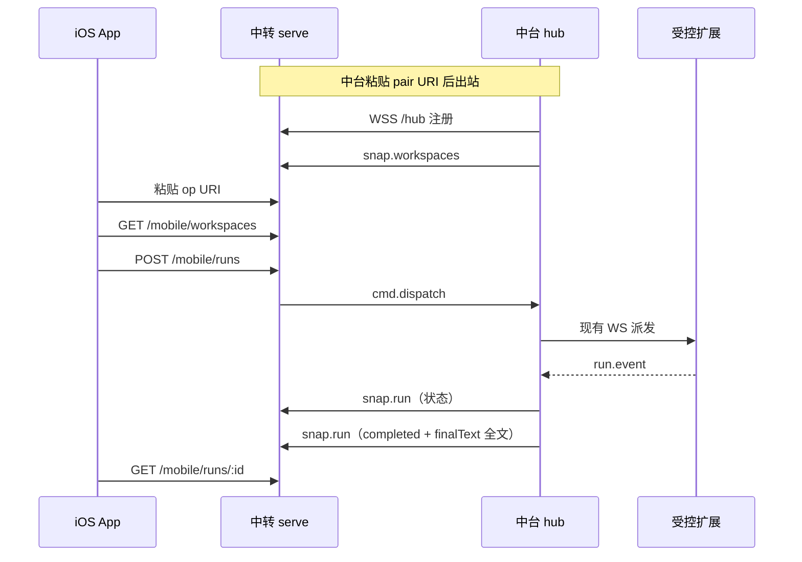

# Armada 远程：中转 serve + 简易 iOS App

- 日期：2026-09-12
- 状态：可执行设计（产品确认：公网中转 + 开源 iOS App + 邀请绑定；TestFlight 内测；不裸映射 7380）
- 父文档：
  - [README.md](../../../README.md)（局域网舰队；hub `:7380`）
  - [2026-09-07-armada-lan-fleet-discovery-design.md](./2026-09-07-armada-lan-fleet-discovery-design.md)（局域网发现；**不改** 本 spec 的公网路径）
- 修订范围：新增 **中转 serve** 与 **手机 App**；中台 hub 增加 **出站绑定**。不改受控扩展 `armada.hubUrl` 局域网语义、不改 run 状态机、不把 `7380` 暴露到公网。

---

## 0. TL;DR

| 项 | 内容 |
| --- | --- |
| 问题 | 人不在局域网时无法选仓派发、看完整终态正文、回答 Ask；裸 frp 映射 7380 等于把共享 token 挂公网。 |
| 核心方案 | 自建 **中转 serve**（公网 HTTPS）。中台出站连中转；开源 iOS App 只打中转。受控 Cursor 仍只连中台。绑定方式对齐受控机： **一条邀请 URI（含中转地址 + fleet 凭证）**，不是只填 URL。 |
| 关键约束 | ① 权威状态在中台 hub（`hub/src/runs.ts`）。② 中转只存快照 + 完整 `finalText`。③ App 不实时推思考流。④ 终态正文 = `assistantBodyText`（`hub/web/src/chatView.ts`），产品层不截断。⑤ 分发走 TestFlight；苹果开发者账号过期则不能传新包。 |
| 明确不做 | 公网裸 frp/Funnel 映射 7380；微信小程序 v1；飞书卡片当主界面；Bark 当操作面；把 OpenClaw/CursorRemote 换掉执行层；v1 上架 App Store。 |

---

## 1. 背景与需求

| # | 原始诉求 | 设计映射 |
| --- | --- | --- |
| R1 | 不在同一局域网也能控中台 | 中转公网 HTTPS；中台 **出站**；手机 4G 只连中转 |
| R2 | 选任意 **已打开** 工作区并下发 | `GET /mobile/workspaces` ← 中台 `GET /api/machines[].open_workspaces` |
| R3 | 超长 prompt（含粘贴 review） | 中转与 hub **不截断** prompt；飞书/APNs 体积限制只影响投递，不砍存储 |
| R4 | 终态必须是完整助手正文 | `finalText` = `assistantBodyText`；空正文不得标 `completed` |
| R5 | 状态订阅，不要手机刷进度 | 中台变更推中转；App 用 APNs/轮询打开详情；不推工具日志 |
| R6 | 问答 Ask | 快照 `pendingAsk`；App 按钮 → `POST /mobile/runs/:id/answer` → hub `POST /api/runs/:id/answer-ask` |
| R7 | Armada 与 App 均开源、可自建 | 中转可自部署；绑定 URI 里带 `relay` 主机，不写死某一云厂商 |
| R8 | 绑定像受控机邀请链接 | `armada-relay://pair?…` / `armada-relay://op?…` |
| R9 | TestFlight 装到自己手机 | 内测 Internal；不上架 v1 |

对照：受控机今天贴 `armada://join?hub={ip}:{port}&token=`（`desktop-core/src/joinUri.ts`）。远程三端用 **另一 scheme**，避免和局域网 join 混用。

---

## 2. 现状盘点

### 2.1 可复用

| 能力 | 代码位置 | 远程怎么用 |
| --- | --- | --- |
| 单 token 鉴权 | `hub/src/auth.ts` | **仅局域网**；中转另造 fleet/operator 凭证 |
| 机器 + 已开仓 | `GET /api/machines` ← `hub/src/registry.ts` | 中转工作区菜单 |
| 派发 / 取消 / Ask | `hub/src/index.ts` `/api/runs*` | 中转翻译成 mobile API |
| 复制正文 | `assistantBodyText`（`hub/web/src/chatView.ts`） | 终态 `finalText` 唯一算法 |
| 邀请链接形态 | `formatJoinUri` / `parseJoinUri` | 中转 URI 仿此，**新 scheme** |
| 局域网发现 | mDNS `_armada._tcp` | **公网路径关闭 mDNS**；`shareIp.ts` 继续排除 `tailscale`/`wg` |

### 2.2 需新建

| 能力 | 落点 |
| --- | --- |
| 中转 serve | 本仓 `relay/`（v1 同仓，协议与 hub 对齐；可日后拆仓） |
| 中台出站连接 | `hub/` 配置绑定 URI，拨 `wss://{relay}/hub` |
| iOS App | `mobile/ios/`（或独立开源仓，本 spec 为协议源） |
| 中转快照库 | SQLite 即可（单副本）；fleet / operator / run 快照 |

### 2.3 不复用 / 有害

- 把 `7380` TCP 映射到 VPS（frp/ngrok/Funnel）：共享 token = 全舰队 root（`auth.ts`）。
- 扩展写死 `http://` / `ws://`（`extension/src/extension.ts`）去连公网域名：受控机 **继续只连中台局域网**。
- 中转当第二份 hub 再跑一套 run 状态机。
- OpenClaw / CursorRemote CDP 中继：与现有注入口冲突或换掉 Cursor 窗口执行。

---

## 3. 设计原则

1. **一份 hub 权威。** 取消、Ask、终态以中台 SQLite 为准；中转是入口与缓存。
2. **邀请即绑定，地址不是绑定。** 公网 URL 必要但不充分；必须有 `fleet` + secret。
3. **出站优于入站。** 中台防火墙不开放 7380 到公网。
4. **App 是遥控器，不是指挥台。** 五件事：仓、派发、状态、完整正文、Ask。
5. **产品不截断，通道可换载体。** 存全文；APNs 只推标题。
6. **开源自建。** 任何人可部署中转；URI 里的 `relay` 可换主机。
7. **失败可回局域网。** 中转挂了，中台网页与受控扩展行为与今天一致。

### 3.1 已否决方案

| 方案 | 为什么不选 |
| --- | --- |
| 只配中转公网 URL、无 secret | 开放代理；与「无 token 不能 join」不一致 |
| 公网 frp 映射 7380 | 扫描 + 共享 token + SSE `?token=` 进日志 |
| 把 hub 搬到 VPS | 每台受控要改 `hubUrl`；与现有局域网舰队冲突 |
| 飞书卡片当主界面 | 卡片 30KB，装不下超长 prompt/全文 |
| Bark 当操作面 | 单向通知，APNs ≤ 4KB |
| 微信小程序 v1 | 能装但审核/订阅消息弱；「一次成型」选原生 App |
| Tailscale 当产品形态 | 每终端装 VPN，开源用户门槛高；可作个人应急，不当默认 |
| CursorRemote / portal-oss | 抢 CDP，与 Armada 注入冲突 |

### 3.2 范围

| 阶段 | 做 | 不做 | 触发 |
| --- | --- | --- | --- |
| **v1** | 中转 serve；hub 出站；邀请 URI；iOS 五屏；TestFlight Internal；完整 `finalText`；Ask | 上架；小程序；APNs 正文；远程开窗；followup 续聊 | 本 spec |
| **v1.5** | APNs 状态/Ask 通知（点进详情拉全文）；`POST cancel`；中转管理页生成邀请 | 多中转集群 | 内测证明派发后需要锁屏提醒 |
| **v2** | App Store；operator 与 hub secret 轮换；多操作者 | 把 7380 公网化 | 对外分发 |

---

## 4. 数据模型 / 接口契约

### 4.1 邀请 URI（绑定协议）

**方案：** 两条 URI，同一 `relay` + `fleet`，凭证分离。

**备选不选「只填 https://relay.example.com」：** 无身份。  
**备选不选复用 `armada://join`：** 会和局域网 hub token 搞混。

#### 中台绑定（出站）

```
armada-relay://pair?relay=https%3A%2F%2Frelay.example.com&fleet={fleetId}&secret={hubSecret}
```

| 查询键 | 约束 |
| --- | --- |
| `relay` | `https://` 主机，无路径或仅 origin；禁止 `http://`（v1） |
| `fleet` | `[a-z0-9-]{8,64}` |
| `secret` | 32 字节 hex（64 字符），中转签发，**仅 hub 使用** |

中台落盘：`~/.armada/relay.json`（mode `0600`），字段 `{ relay, fleet, secret }`。解析失败 → 不拨号，局域网不受影响。

验收：粘贴错误 secret → 中转 `401`，hub 日志 `RELAY_AUTH`，**不**把 secret 打进日志。

#### App 绑定（操作者）

```
armada-relay://op?relay=https%3A%2F%2Frelay.example.com&fleet={fleetId}&token={operatorToken}
```

| 查询键 | 约束 |
| --- | --- |
| `relay` / `fleet` | 与 pair 相同 |
| `token` | 32 字节 hex；**不能**等于 `secret` |

中转在创建 fleet 时同时生成两条链接（管理页或 CLI）。App 用 `token` 调 HTTPS API。`secret` 调 App 接口 → `403 OPERATOR_REQUIRED`。

验收：App 误贴 `pair` URI → 明确文案「这是中台链接」。hub 误贴 `op` → `403 HUB_REQUIRED`。

### 4.2 中转 serve 进程

| 项 | v1 |
| --- | --- |
| 监听 | `127.0.0.1:8780` 或 `:443` 经 Caddy | 公网只 443 |
| TLS | 部署方提供；开发可用 Caddy |
| 存储 | `$RELAY_HOME` SQLite（默认 `~/.armada-relay`） |
| 健康 | `GET /health` 无鉴权 `{ ok, name: "armada-relay" }` |

**备选不选多副本：** 进程内连接表 + SQLite，水平扩展另开 spec。

### 4.3 中台 ↔ 中转（出站 WS）

中台连接：`wss://{relay-host}/hub?fleet={id}&secret={hubSecret}`（secret **仅** 握手查询或首帧，生产推荐首帧，避免进反代日志；v1 允许 query，v1.5 改首帧）。

| 方向 | 消息 | 约束 |
| --- | --- | --- |
| 中转 → hub | `{ type: "cmd.dispatch", requestId, workspaceId, prompt, attachmentIds? }` | prompt 字符串不截断；单请求体上限 **20 MiB**（防炸内存） |
| 中转 → hub | `{ type: "cmd.answer", requestId, runId, body }` | 与 `answer-ask` 字段对齐 |
| 中转 → hub | `{ type: "cmd.cancel", requestId, runId }` | v1.5；v1 可实现 |
| hub → 中转 | `{ type: "snap.workspaces", machines: [...] }` | 与 `listMachines` 同形；offline 仓为 `[]` |
| hub → 中转 | `{ type: "snap.run", run }` | 见 4.4 |
| hub → 中转 | `{ type: "cmd.result", requestId, ok, error? }` | 错误码原样：`WORKSPACE_NOT_OPEN` 等 |

心跳：25s；断线指数退避，上限 30s（对齐 `extension/src/wsClient.ts` ReconnectPolicy）。

中台离线：中转将 fleet 标 `hubOffline`；App 列表仓为空；进行中卡 `status=hub_offline`（展示用，不改中台 DB）。

验收：拔中台网线 15s 内 App `GET /mobile/workspaces` 为空数组且带 `hubOffline: true`。

### 4.4 Run 快照（中转存）

| 字段 | 约束 |
| --- | --- |
| `runId` | 中台 run id，不另造 |
| `machineId` / `workspaceRoot` | 派发原样 |
| `prompt` | 全文；中转 TEXT |
| `status` | 映射 hub：`queued` / `dispatched` / `binding` / `running` / `completed` / `aborted` / `error` / `cancelled` / `unknown`；另加展示 `hub_offline` |
| `finalText` | 仅终态；`assistantBodyText` 全文；**禁止**摘要字段 |
| `error` | hub 错误码字符串 |
| `pendingAsk` | 无则 `null`；有则 `request_id` + questions[] |
| `updatedAt` | 中台变更 Unix ms |

**完成门禁：** `status=completed` 当且仅当 `finalText.length > 0`。否则中转存 `error`/`unknown` 并文案 `NO_ASSISTANT_BODY`。

**备选不选 2KB excerpt：** 已否决。

工作区 id：`workspaceId = "{machineId}|{workspaceRoot}"`（与看板 slot key 同思路）。关窗后菜单消失；历史 run 详情仍可打开（幽灵仓，对齐离线 slot spec 的「卡开着可停留」）。

### 4.5 App ↔ 中转 HTTPS

鉴权：`Authorization: Bearer {operatorToken}`。禁止 `?token=`（避免抄 SSE 公网泄漏）。

| 动作 | 方法 | 成功 | 错误 |
| --- | --- | --- | --- |
| 列仓 | `GET /mobile/workspaces` | `{ hubOffline, workspaces: [{ workspaceId, machineId, workspaceRoot, label }] }` | 401 |
| 派发 | `POST /mobile/runs` `{ workspaceId, prompt }` | `201 { run }` | `400 INVALID`；透传 `WORKSPACE_NOT_OPEN` / `MACHINE_OFFLINE` / `409 PROMPT_COLLISION` / `429 RUN_LIMIT` → HTTP 与 hub 同码 |
| 列表 | `GET /mobile/runs?limit=50` | 最近 50，非 archive | |
| 详情 | `GET /mobile/runs/:id` | 含 `finalText` 全文、`pendingAsk` | 404 |
| 回答 | `POST /mobile/runs/:id/answer` | 202；body 同 hub `answer-ask` | 409 无 pending |
| 取消 | `POST /mobile/runs/:id/cancel` | 200 | v1 建议做 |

限流：同一 `operatorToken` **20 次派发 / 5min**；超限 `429` 且写中转 audit。  
`GET` 不额外限流；客户端打开详情或 10s 轮询。

单 prompt / `finalText` 中转落盘不截断；单 HTTP 请求体 **20 MiB**，超则 `413 PAYLOAD_TOO_LARGE`（仍不是「产品摘要」）。

**不做的中转路由：** `/api/runs/:id/events` 全文、SSE 到手机、blobs 上传 v1、followup、ui-prefs、audit export。

### 4.6 中台落地（不改语义）

中转 `cmd.dispatch` → 本机 `POST /api/runs`（`hub/src/index.ts`），`Bearer` 用 **局域网** `~/.armada/token`（loopback）。  
Ask → `POST /api/runs/:id/answer-ask`。  
终态：hub 用现有 events + `assistantBodyText` 计算后 `snap.run`。

错误码表不新发明，沿用 `httpStatusForRunError`。

### 4.7 iOS App 五屏

1. 粘贴 `armada-relay://op?…`（或扫码）  
2. 工作区列表（`label` = 路径最后一段；空态：「中台离线或没有打开的仓」）  
3. 派发：多行 prompt，无字数 UI cap  
4. 任务列表：状态色点  
5. 详情：`finalText` 可滚动 + 复制；Ask 按钮  

推送 v1 可省略；v1.5 APNs **不携带** `finalText`。

TestFlight：Bundle ID 建议 `app.armada.remote`（实现时可改，须写进发布说明）。Internal 组即可。

### 4.8 苹果账号（运维，非协议）

| 状态 | 商店/TestFlight | 已安装 App | 中转 |
| --- | --- | --- | --- |
| 开发者账号有效 | 可传 Build；TestFlight 构建 90 天 | 可用 | 无关 |
| 账号过期 | **不能** 传更新；TestFlight 停 | 已装的最后一版通常仍能跑 | 照常 |
| 已上架后过期 | 下架新下载；已装仍运行 | **不能** 维护商店版本直到续费 | 无关 |

验收文档：README 写明年费是发版许可，不是运行时依赖。

---

## 5. 运行时链路



| 环节 | 策略 | 失败 / 降级 |
| --- | --- | --- |
| 中转宕机 | App 登录失败/超时 | 局域网指挥台不受影响 |
| 中台休眠 | `hubOffline` | 派发 `503 HUB_OFFLINE` |
| 邀请泄露 | 中转 CLI `rotate-op` / `rotate-hub`（v1.5）；v1 删 fleet 重建 | 文档要求重置 |
| 请求体 > 20 MiB | 413 | 用户拆文件；产品仍不「摘要存储」 |
| APNs 未接 | App 前台轮询 10s | 可接受 v1 |

缓存：中转快照以最后一次 `snap.run` 为准；App 详情 **每次打开强制 GET**（避免旧 `finalText`）。TTL 无；列表 10s。

p95（同区域 VPS，排除 DERP）：`GET /mobile/workspaces` < 400ms；`POST /mobile/runs` 到中台 ack < 1s。

---

## 6. 安全与威胁模型

| 威胁 | 缓解 | 指标 / 约束 |
| --- | --- | --- |
| 只配 URL 被扫到 | 邀请含 secret/token | 无凭证 401 |
| 公网 7380 | **禁止**文档与默认配置做端口映射 | README 反模式专节 |
| hub secret 进 App | 分 pair / op | App 用 pair → 明确拒绝 |
| 快照含代码 | HTTPS；operator 审计 `GET` 详情 | audit 90 天 |
| 反代日志泄漏 | v1.5 握手改首帧 | v1 文档警告勿把 WSS query 打到 info 日志 |
| 开放中转多租户撞 fleet | `fleetId` 随机；secret 64 hex | 创建接口需管理 token（部署时 `RELAY_ADMIN_TOKEN`） |
| 苹果账号过期 | 发版停，不自动失陷中转 | 见 4.8 |

边界外：受控 Cursor 账号、CDP、局域网 token 生命周期——本 spec 不扩大。

回滚：删除 `~/.armada/relay.json`，停出站；中转进程停掉。受控与局域网 UI 与本 spec 前一致。

---

## 7. 实施路线图

### 7.1 仓库与发布顺序

| 顺序 | 产物 | 验收 |
| --- | --- | --- |
| 1 | `relay/` serve + 单测 URI 解析、鉴权分叉、完成门禁 | `bun test relay/` |
| 2 | hub 出站 + `relay.json`；loopback 调现有 `/api/runs` | 中台断网后局域网派发仍成功 |
| 3 | iOS 五屏 + TestFlight Internal | 4G 下完成：绑 op → 选仓 → 派发 → 详情见全文 → Ask |
| 4 | README：自建中转、反模式（勿 frp 7380）、苹果年费 | 外链本 spec |

跨仓：v1 **本仓先合中转+hub**；iOS 可同 PR 或紧随。扩展 **不必升级**（仍连中台）。桌面 mDNS **不改**。

版本对齐：中转 `protocolVersion: 1`；hub/App 拒绝更高主版本。

### 7.2 每阶段验收（必须可测）

| ID | 阶段 | 验收 |
| --- | --- | --- |
| A1 | v1 | 无 secret 的 `https://relay` 无法派发 |
| A2 | v1 | pair/op 交叉使用返回 403 且不连错通道 |
| A3 | v1 | 关仓后菜单无该项；`WORKSPACE_NOT_OPEN` |
| A4 | v1 | `completed` 的 `finalText` 与中台详情「复制正文」逐字节相同（同一次 run） |
| A5 | v1 | 超长 prompt（>100KB）往返不截断（低于 20 MiB） |
| A6 | v1 | 中台离线：App 不假装 running |
| A7 | v1.5 | 通知点击打开对应 run，正文仍走 GET |

上线 gate：A1–A6 全过才标「可 TestFlight」；禁止带「把 7380 映射出去」的示例进 README。

---

## 8. 风险与未决

| 风险 | 影响 | 应对 | 状态 |
| --- | --- | --- | --- |
| 20 MiB 仍小于「无限」 | 极端粘贴失败 | 413 + 文案；不改成摘要 | 已知 |
| TestFlight 90 天 | 内测包过期 | 升 build 重传；账号须有效 | 已知 |
| 开发者账号过期 | 不能维护商店/TF 版本 | 年费续期；已装可暂用 | 已知 |
| iOS 工程是否同仓 | 体积/签名 | v1 可 `mobile/ios/`；独立仓须 submodule 或文档指向本 spec | 实现时定，**不阻塞协议** |
| APNs 证书 | v1 无推送 | 轮询 | 非阻塞 |
| 中转单副本 | 宕机则远程失明 | 可接受；局域网降级 | 已知 |

阻塞项：无（协议已拍板）。实现前需准备：VPS + HTTPS 域名、Apple Developer（TestFlight）。

---

## 9. 评审检查清单

- [x] 固定章节骨架  
- [x] MVP/v1/v1.5/v2  
- [x] 非目标、风险、验收、回滚  
- [x] 发布顺序：中转 → hub 出站 → App；受控扩展不改  
- [x] 路径落到 `hub/src/index.ts`、`registry.ts`、`auth.ts`、`chatView.ts`、`joinUri.ts`  
- [x] 修订记录  

**未勾：** 实现代码与 TestFlight 包（本文件只定协议）。

---

## 10. 修订记录

| 日期 | 变更 |
| --- | --- |
| 2026-09-12 | 初稿。中转 serve + 开源 iOS App + 邀请 URI；否决裸 frp/仅 URL；终态全文；TestFlight；账号过期只影响发版。 |

本文件为远程能力的 **实施基准**。变更绑定字段或完成门禁须改本 spec 并升 `protocolVersion`。
