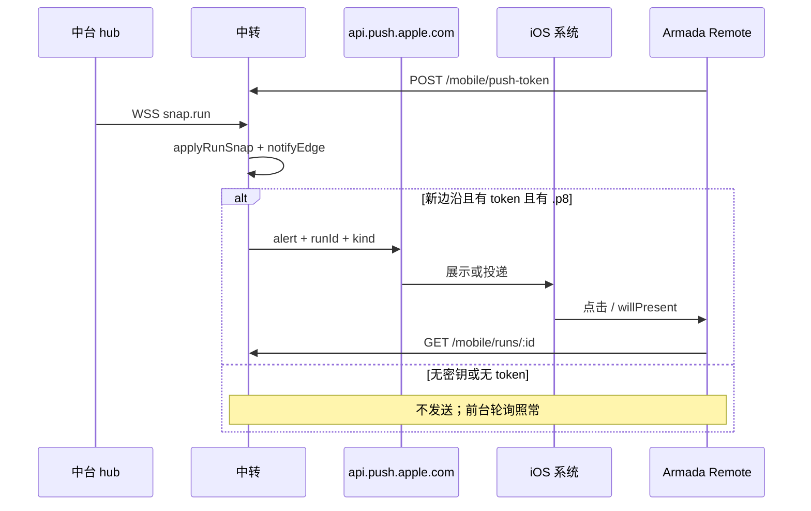

# Armada App：可见 APNs（Ask / 终态）

- 日期：2026-09-16
- 状态：**实施基准**（方案 1 已拍板；TestFlight 生产 APNs；开发者账号 Active）
- 父文档：
  - [2026-09-12-armada-relay-mobile-design.md](./2026-09-12-armada-relay-mobile-design.md)（下称《远程》：v1 前台轮询；§4.9 把锁屏通道定为可见 APNs）
  - [armada-hub-app-parity](../../../.cursor/rules/armada-hub-app-parity.mdc)（操作员能力 App 同一轮要能看见、做完）
- 修订范围：中转代发可见 APNs；iOS 登记 device token、点通知进详情强制 GET。不改 hub 状态机、不改 `runToSnap` 字段、不改受控扩展、不把 `7380` 公网化。
- 触发：App 已接通中转；操作员离开 App 仍要知道 Ask / 完成 / 失败。

---

## 0. TL;DR

| 项 | 内容 |
| --- | --- |
| 问题 | App 前台 10s 轮询；锁屏 / 被杀后看不到 Ask 与终态。中台网页已有同类通知。 |
| 核心方案 | **中转拥有 token 并代发可见 APNs。** `applyRunSnap` 上检测与中台 `completionNotify.ts` 相同的边沿 → HTTP/2 打 `api.push.apple.com`。载荷只有短 alert + `runId` + `kind`。点进详情强制 GET。 |
| 关键约束 | ① 权威仍在 hub；中转失败不改 run。② APNs **永不带** `finalText`。③ 只打生产 APNs（TestFlight）。④ 无 `.p8` / 用户关通知 = 不发，轮询照常。⑤ 正在看该 run 时前台不弹横幅。 |
| 明确不做 | 轮询排本地通知；静默推送当主通道；VoIP；前台 SSE（仍属《远程》v1.5）；Android；sandbox 双环境；APNs 塞正文；中台发 APNs；把 `.p8` 打进 App 包。 |

---

## 1. 背景与需求

| # | 原始诉求 | 设计映射 |
| --- | --- | --- |
| R1 | 手机 App 已接通，要加通知 | 可见 APNs；不是再做一条操作面 |
| R2 | 离开 App / 锁屏也能收到 | 系统展示横幅；不依赖 App 进程 |
| R3 | 事件对齐中台 | 边沿 = `hub/web/src/completionNotify.ts`：新 Ask（含 Plan/Build）+ 新进入 `completed`/`error`/`unknown`/`aborted` |
| R4 | App 开着不要连弹 | 单通道 APNs；`willPresent` 在 `watchingId === runId` 时不弹 |
| R5 | TestFlight 已在用，账号 Active | 只认 `environment=production`；`api.push.apple.com` |
| R6 | 正文完整 | 点通知 → `GET /mobile/runs/:id`；算法仍是 `assistantBodyText` |

对照《远程》§4.9：本文件把 **v2** 从「以后」落成可执行契约。v1.5 SSE **本规格不做**。

**产品已拍板（2026-09-16 对话）：** 方案 C 的体验用方案 1 实现（单通道 APNs）；TestFlight 生产；不接 sandbox。

---

## 2. 现状盘点

### 2.1 可复用

| 能力 | 代码位置 | 本规格怎么用 |
| --- | --- | --- |
| 中台通知边沿 | `hub/web/src/completionNotify.ts` + `hub/web/test/completionNotify.test.ts` | 中转镜像同一套纯函数语义 |
| 快照推送 | `hub/src/relayClient.ts` `runToSnap`；`relay/src/server.ts` `snap.run` | 触发点挂在 `applyRunSnap` 之后 |
| 操作员鉴权 | `relay/src/server.ts` `/mobile/*` Bearer op | `POST/DELETE /mobile/push-token` 同鉴权 |
| 详情 | `mobile/ios/.../Screens.swift` `AppRoute.run` + `RunDetailView` 已强制 GET | 通知只补 `pendingOpenRunId` |
| Bundle / Team | `app.armada.remote` / `LW2A4J4KKG` | APNs topic 与签名一致 |

### 2.2 需新建

| 能力 | 落点 |
| --- | --- |
| token 表 | `relay/src/db.ts` `push_tokens` |
| 登记 API | `relay/src/server.ts` `POST/DELETE /mobile/push-token` |
| 边沿检测 | `relay/src/notifyEdge.ts`（与中台同构单测） |
| APNs 发送 | `relay/src/apns.ts`（JWT + HTTP/2；测试注入 transport） |
| 已推游标 | `runs.notified_status` / `notified_ask_id`；重启不补推 |
| App Push | `ArmadaRemote.entitlements`；`UNUserNotificationCenter`；登记；点开 |

### 2.3 不复用 / 有害

- 中台 `Notification` / `requestDesktopAlert`：那是网页和桌面壳，碰不到锁屏上的 App。
- App 轮询里 `UNUserNotificationCenter.add`：与 APNs 双通道，必连弹。
- 静默 `content-available`、VoIP PushKit、后台 SSE/WS：见《远程》§4.9.3。
- 证书 `.cer/.p12`：年年续、分环境；本规格只用 Auth Key `.p8`。

---

## 3. 设计原则

1. **一份边沿，一个发送者。** 边沿语义拷中台；发送只在中转。Hub 不持有 device token。
2. **推送是叫醒，不是正文。** 4KB 里只放短文案和 `runId`。
3. **失败不影响 run。** APNs 4xx/5xx / 无密钥只写 audit，`applyRunSnap` 照常提交。
4. **能降级。** 无 token、无 `.p8`、用户关权限 → 前台轮询与今天一致。
5. **开源自建。** `.p8` 在中转机环境变量；App 不内置发送密钥。
6. **测试先红边沿，真机才算锁屏。** CI 不连苹果；A9 必须 TestFlight 真机。

### 3.1 已否决

| 方案 | 为什么不选 |
| --- | --- |
| 中台发 APNs | 中台在局域网、可能休眠；每台中台都要 `.p8`；App 不直连 hub |
| 轮询本地通知 + APNs | 两边沿；前台去重比单通道脏 |
| v1 就上 SSE | 不解锁屏；本规格只做通知 |
| sandbox + production 双环境 | 本阶段只验收 TestFlight |
| `cancelled` 也推 | 中台 `takeNewlyAlertable` 明确不弹 |
| collapse-id 按 kind 分开 | 同一 run 的 Ask→完成应替换为一条横幅 |

### 3.2 范围

| 阶段 | 做 | 不做 | 触发 |
| --- | --- | --- | --- |
| **本规格 v1** | token 登记；生产 APNs；Ask + 四终态；点进详情 GET；前台 `willPresent` | SSE；Android；sandbox；本地通知；多 operator 轮换 | 账号 Active + 要锁屏 |
| **以后** | 《远程》v1.5 SSE；多中台/多 op；App Store 审核另开 | — | 开着 App 仍觉得 10s 钝；或要上架 |

---

## 4. 数据模型 / 接口契约

### 4.1 `push_tokens`

```sql
CREATE TABLE IF NOT EXISTS push_tokens (
  token TEXT NOT NULL,
  fleet_id TEXT NOT NULL REFERENCES fleets(id),
  environment TEXT NOT NULL CHECK (environment = 'production'),
  updated_at INTEGER NOT NULL,
  PRIMARY KEY (fleet_id, token)
);
```

| 字段 | 约束 |
| --- | --- |
| `token` | 64 位 hex（APNs device token）；禁止日志打全文，audit 只留后 8 位 |
| `fleet_id` | v1 一条 op = 一舰队；该舰队下所有 token 都收 |
| `environment` | 只允许 `production` |

**备选不选 token 全局 PRIMARY KEY：** 同一手机理论上可绑另一舰队（解绑再绑）；按 `(fleet_id, token)` 隔离。

### 4.2 已推游标（防补推）

`runs` 增加：

| 列 | 含义 |
| --- | --- |
| `notified_status` | 上次已推的终态；非终态为 `NULL` |
| `notified_ask_id` | 上次已推的 `pendingAsk.request_id`；无 Ask 为 `NULL` |

`applyRunSnap` **先读旧行**，算边沿，写快照，再异步发送。中转进程启动时 **不**扫描历史补推。新 INSERT 且已是终态 → 推一次（对齐中台「seed 之后新 id 已完成仍火」）。进程启动瞬间库里已有的行不算「新 INSERT」。

验收：重启中转后不对已 `completed` 的旧 run 再推。

### 4.3 登记 API

均走现有 `/mobile/*` Bearer op。`hub` secret → 仍 `403 OPERATOR_REQUIRED`。

```
POST /mobile/push-token
{ "token": "<64 hex>", "environment": "production" }
→ 204
```

| 错 | 码 |
| --- | --- |
| 无/错 Bearer | 401 |
| pair secret | 403 `OPERATOR_REQUIRED` |
| token 非 64 hex | 400 `INVALID` |
| `environment` ≠ `production` | 400 `INVALID` |

同 fleet 最多 **20** 个 token：UPSERT 后按 `updated_at ASC` 删到 20（重装/换机自动挤掉最旧）。不返回 `TOKEN_LIMIT`。

```
DELETE /mobile/push-token
{ "token": "<64 hex>" }
→ 204
```

不存在的 token 也 204（幂等）。解绑必须调 DELETE；App 本地清 token。

**速率：** 登记不走派发的 20/5min。单独：每 token 10s 一次 UPSERT 即可；滥用靠 20 行上限。

### 4.4 边沿（必须与中台同构）

纯函数放 `relay/src/notifyEdge.ts`。输入是中转 `RunSnap` 形状（`pendingAsk`、`status`、`prompt`），**不** import `hub/web`（那边有 DOM `Notification`）。

单测 `relay/test/notifyEdge.test.ts` 必须覆盖中台已有用例：

| 用例 | 期望 |
| --- | --- |
| seed 快照已 completed | 不推 |
| running → completed/error/unknown/aborted | 各推一次；同状态再 snap 不推 |
| completed → running → completed | 再推一次 |
| seed 之后新 id 已是 completed | 推 |
| running → cancelled | **不推** |
| pendingAsk 出现 | `kind=ask` 一次；同一 `request_id` 不推 |
| `request_id` 更换 | 再推 ask |
| Ask 清除 | 不推 completed |
| Plan/Build（`pendingAsk.kind=plan`） | 当 Ask |

同一 snap 若同时新 Ask 且新终态：先 ask 再终态（两条 APNs，同一 `apns-collapse-id`，后者替换前者）。正常状态机不会在同一拍同时出现。

终态集合与中台 `ALERT_STATUSES` 一致：`completed` `error` `unknown` `aborted`。**不含** `cancelled`。

### 4.5 APNs 载荷

HTTP/2 POST `https://api.push.apple.com/3/device/{token}`

请求头：

| 头 | 值 |
| --- | --- |
| `authorization` | `bearer <jwt>` |
| `apns-topic` | `app.armada.remote` |
| `apns-push-type` | `alert` |
| `apns-priority` | `10` |
| `apns-collapse-id` | `run-{runId}`（≤64 字节） |

Body（未压缩 JSON ≤ 4KB；超限视为实现 bug，不截 `finalText` 来塞）：

```json
{
  "aps": {
    "alert": { "title": "Armada 需要你处理", "body": "…" },
    "sound": "default",
    "badge": 1
  },
  "runId": "…",
  "kind": "ask"
}
```

| `kind` | title（与中台字符串一致） | body |
| --- | --- | --- |
| `ask` | `Armada 需要你处理` | 第一问 `questions[0].prompt` 空白折叠后 ≤120；否则 prompt ≤120 |
| `completed` | `Armada 任务完成` | prompt ≤120 |
| `error` | `Armada 任务失败` | 同上 |
| `unknown` | `Armada 任务异常` | 同上 |
| `aborted` | `Armada 任务已中止` | 同上 |

**禁止字段：** `finalText`、完整 prompt、Ask 选项全文、`hubSecret`、op token。

角标：APNs 固定 `badge: 1`（中转不知道 App 已读）。App 下次 `refresh` 把 `UIApplication.shared.applicationIconBadgeNumber` 设成全部未读条数；清零当未读为 0。

### 4.6 JWT / 环境变量

| 变量 | 必填 | 含义 |
| --- | --- | --- |
| `RELAY_APNS_KEY_PATH` | 是 | `.p8` 路径；mode 建议 `0600` |
| `RELAY_APNS_KEY_ID` | 是 | Key ID |
| `RELAY_APNS_TEAM_ID` | 是 | `LW2A4J4KKG` |
| `RELAY_APNS_BUNDLE_ID` | 默认 `app.armada.remote` | topic |

缺任一项：`createRelayServer` 打 **一条** warn（`APNS_DISABLED`），`send` 变 no-op。JWT ES256，`iat` 后缓存，**50 分钟**内复用（苹果要求 < 60 min）。

**不选**把 `.p8` 写进仓库或 App。**不选**环境变量内联整段 PEM（易进进程列表）；只走文件路径。

发送模块注入 `post(url, headers, body) → { status, json }`，单测不碰真 APNs。

### 4.7 发送、重试、删除 token

| APNs 响应 | 行为 |
| --- | --- |
| 200 | audit `apns.ok`；写游标 |
| 410 / 400 `Unregistered` / `BadDeviceToken` | 删该 `(fleet, token)`；其它 token 继续 |
| 403 `ExpiredProviderToken` | 丢弃 JWT 缓存，立即重签一次；仍失败则进重试 |
| 429 / 5xx / 网络超时 | 该 token 最多 **3** 次，退避 2s / 8s / 30s |
| 413 | audit `apns.payload_too_large`；**不重试**；当 bug |

SLA：边沿成立后 **5s 内**发出第一次 HTTP/2（不含苹果到达时间）。p95 只计中转侧「决定发送 → 请求离开进程」。

游标在 **第一次尝试发出前** 就写，避免 5xx 风暴把同一 Ask 打成 N 条横幅。代价：若三次都失败，用户收不到，直到下一次边沿（例如新 Ask）。可接受；前台轮询仍能看见。

**备选不选「成功才写游标」：** 苹果 5xx 时会连弹。Ask 比漏推更怕刷屏。

并发：同一 `runId` 发送串行（内存 Promise 链）。多 run 可并行，但每 fleet 同时 in-flight ≤ 20。

### 4.8 App 契约

Bundle `app.armada.remote`：

1. `ArmadaRemote.entitlements`：`aps-environment = production`  
2. Developer Portal App ID 打开 Push Notifications  
3. 绑定成功或冷启动已绑定：`requestAuthorization([.alert, .sound, .badge])` 后 `registerForRemoteNotifications()`  
4. `didRegister` → `POST /mobile/push-token`（token 变了也 POST）  
5. `didFail`：只记本地；不挡轮询  
6. 解绑：`DELETE` + `unregister`（能调则调）

点击 / 冷启动：

1. 从 `userInfo["runId"]` 写入 `Session.pendingOpenRunId`  
2. `WorkspaceListView` 观察后 `path = NavigationPath()` 再 `append(AppRoute.run(id))`  
3. `RunDetailView` 现有 `reload()` 强制 GET  
4. 未绑定：丢弃 pending（无法 GET）

前台：

```text
willPresent:
  watchingId == runId → []          // 对齐 shouldAlert
  otherwise → [.banner, .sound, .list]
```

`watchingId` = 当前 `RunDetailView` 在导航栈顶的 `runId`，否则 `nil`。列表页对任何 run 都弹。

系统通知权限 denied：与无 APNs 相同。不要反复弹系统框；每安装问一次。

### 4.9 错误码（App 文案）

| 码 | App |
| --- | --- |
| `INVALID`（token） | 「推送登记失败」；不影响绑定 |
| 登记网络失败 | 静默；下次启动再试 |

推送失败 **没有** 操作员可见错误码（对齐「不改 run」）。

---

## 5. 运行时链路



| 环节 | 策略 | 失败 / 降级 |
| --- | --- | --- |
| 中台 → 中转 WSS | 现有 `snap.run` | hub 离线则无新边沿 |
| 边沿 | 旧行 vs 新 snap | 重启不补推 |
| APNs | 5s 内首次；3 次退避 | 不改 run；audit |
| 无 `.p8` | no-op | 轮询 |
| 用户关通知 | 系统不展示 | 轮询 |
| 点通知 run 已删 | GET 404 | 详情现有错误文案 |
| 中转宕机 | 发不出 | 局域网中台通知仍在 |

缓存：JWT 50 min。device token 以最后一次 POST 为准。详情每次打开强制 GET（已有）。

指标：

| 项 | 指标 |
| --- | --- |
| 中转发出 | 边沿后 5s 内第一次 POST；重试 ≤3，总等待 ≤ 2+8+30s |
| 载荷 | JSON < 4096 字节 |
| 登记 | POST p95 < 400ms（同区域，不含苹果） |
| 苹果到达 | **不**计入中转 SLA |

---

## 6. 安全与威胁模型

| 威胁 | 缓解 | 指标 / 约束 |
| --- | --- | --- |
| `.p8` 进 git / 进 App | 只放中转机文件；README 反模式 | 仓库 hook 不扫也能靠 code review；CI 无此文件 |
| 任意人登记 token | 必须 op Bearer | 无凭证 401 |
| 用 pair secret 登记 | 403 `OPERATOR_REQUIRED` | 与现网一致 |
| token 日志泄漏 | audit 后 8 位 | 禁止 `console.log(token)` |
| 伪造 APNs 唤醒打开任意 URL | 只读 `runId`；GET 仍要 Bearer；未绑定丢弃 | 不能靠通知绑新舰队 |
| 推送刷屏 / 资源耗尽 | fleet ≤20 token；同 run 串行；先写游标 | 20 行硬顶 |
| alert 泄露 prompt | 与中台桌面通知同等；≤120 字；无终态正文 | 4KB 硬顶 |
| 过期账号 | 不能出新 TestFlight / 维护 Key | 已装包仍可能收到，直到 Key 吊销 |

边界外：中台网页通知、桌面壳 `requestDesktopAlert`、受控机、局域网 token。本规格不改它们。

回滚：

1. 去掉中转四个 `RELAY_APNS_*` 并重启 → 立即停发  
2. App 旧包无 Push 能力 → 登记失败，行为回到纯轮询  
3. 不需要回滚 hub / 扩展  
4. 表 `push_tokens` 可留；无发送即无害  

兼容：`protocolVersion` **不升**。新路由与新列向后兼容；旧 App 不登记则无推送。

发布顺序：

| 顺序 | 产物 | 为何 |
| --- | --- | --- |
| 1 | 中转：表 + API + 边沿 + 发送（无 `.p8` 也能上） | 旧 App 无感 |
| 2 | 中转机放 `.p8` 并重启 | 此时还没有 token，不会误推 |
| 3 | iOS Push 能力 + 登记 + 点开；**新 TestFlight** | 无新包则系统不给 device token |
| 4 | 真机锁屏验收 A9 | 模拟器不算 |

Hub / 扩展：**本规格零改动**（`runToSnap` 已含 `pendingAsk` + status）。

版本对齐：中转先于 App；App 遇未知路由当登记失败即可。

---

## 7. 实施路线图

### 7.1 Phase

| Phase | 内容 | 验收 | 上线 gate |
| --- | --- | --- | --- |
| **P0** | `notifyEdge` + 镜像中台测试（先红后绿） | `bun test relay/test/notifyEdge.test.ts` 覆盖 §4.4 表 | 测不红不准写发送 |
| **P1** | db 列/表、登记 API、`applyRunSnap` 挂钩、mock transport | `bun test relay/`：登记鉴权、410 删 token、无密钥 no-op、seed 不补推 | 中转可先部署 |
| **P2** | iOS entitlements、登记、`pendingOpenRunId`、`willPresent` | TestFlight 安装后设置里能看到通知权限；绑定后中转库有 token 行 | 无 Push 签名不出 TF |
| **P3** | 真机锁屏 | A9 | 才算完成 |

P0 与 P1 可同 PR。P2 必须带 Push 的新 build。P3 不能用模拟器。

### 7.2 验收清单

| ID | 阶段 | 验收 |
| --- | --- | --- |
| N1 | P0 | 与 `completionNotify.test.ts` 同构：cancelled 不火；Ask 一次；seed 不火 |
| N2 | P1 | 无 Bearer 401；pair 403；非 production 400 |
| N3 | P1 | mock APNs 200；载荷无 `finalText`；`collapse-id` 有 |
| N4 | P1 | 无 `RELAY_APNS_*` 时 snap 仍写入、测试断言 `post` 未被调 |
| N5 | P1 | 重启夹具：已 completed 行不发 |
| N6 | P2 | 解绑后 DELETE；再推不投到这部已解绑设备（中转无该 token） |
| N7 | P3 | 真机锁屏：Ask 横幅；点进详情正文与中台「复制正文」逐字节相同 |
| N8 | P3 | 真机锁屏：completed 横幅；正在看该详情时前台不弹 |
| N9 | P3 | 关系统通知后：无横幅，前台列表仍 10s 内更新 |

上线 gate：N1–N5 绿才能合中转；N6–N9 真机过了才能宣称「App 有通知」。禁止用「中转日志 200」代替锁屏验收。

---

## 8. 风险与未决

| 风险 | 影响 | 应对 | 状态 |
| --- | --- | --- | --- |
| `.p8` 尚未放到中转机 | 发不出 | 无密钥 no-op；不挡轮询 | **运维待做**（见下） |
| 旧 TestFlight 无 Push entitlement | 没有 device token | 必须出新包 | **发版待做** |
| 苹果到达延迟 / 丢（极少） | 锁屏晚或没有 | 不写进 SLA；轮询兜底 | 已知 |
| 游标先写导致三次都失败则漏推 | 该次边沿不再发 | 接受；新 Ask / 新一轮终态会再火 | 已选 |
| 中台改 `ALERT_STATUSES` 中转未跟 | 两边通知不一致 | 镜像测试；改中台通知须改本模块 | 已知 |
| archive 脚本 `CODE_SIGNING_ALLOWED=NO` | 可能打出无 Push 的包 | 实现时 archive 必须带 Push capability；以 TF 包 entitlements 为准 | 实现注意 |
| 模拟器 | 无法验 A9 | 文档写死 | 已关闭 |

### 8.1 需要你动手（不是产品分叉）

实现代码可以先合；**锁屏要响必须你做这两件：**

1. Apple Developer → Keys 建 **APNs Auth Key**，文件放到中转机，配齐 `RELAY_APNS_KEY_PATH` / `KEY_ID` / `TEAM_ID=LW2A4J4KKG`，重启中转。  
2. App ID `app.armada.remote` 打开 Push，打 **新 TestFlight**（旧包没有 `aps-environment`）。

### 8.2 本规格已默认、除非你改口

| 项 | 默认 |
| --- | --- |
| 文案 | 与中台 title/body 相同 |
| `cancelled` | 不推 |
| 角标 | APNs 发 `1`；App 刷新后改成未读数 |
| 多设备 | 同 fleet 全推 |
| SSE / Android / 本地通知 | 不做 |

无其它未决产品项。

---

## 9. 评审检查清单

- [x] 固定章节骨架（§0–10）  
- [x] MVP（本规格 v1）与明确以后项（SSE/Android）  
- [x] 非目标、风险、阻塞运维、验收 N1–N9  
- [x] 发布顺序：中转 → `.p8` → TestFlight App；hub/扩展不改  
- [x] 路径落到 `relay/src/{db,server,notifyEdge,apns}.ts`、`mobile/ios/ArmadaRemote/*`、`hub/web/src/completionNotify.ts`（只对齐，不改）  
- [x] 修订记录  

---

## 10. 修订记录

| 日期 | 变更 |
| --- | --- |
| 2026-09-16 | 初稿并定为实施基准。单通道可见 APNs；生产环境；边沿对齐中台；token 在中转；点进 GET。产品拍板：方案 1；TestFlight；不要轮询本地通知。 |
