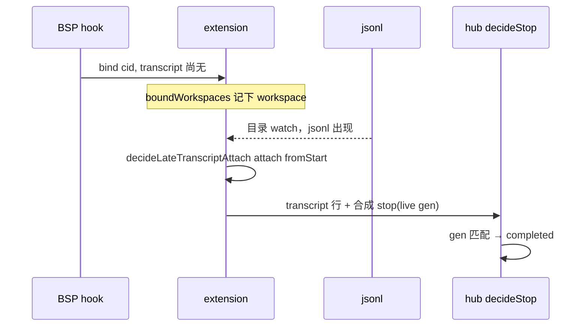

# Armada：jsonl 补挂停跑 + Cursor 式工具折叠

- 日期：2026-09-17
- 状态：v1 实施基准（真机形状来自 `r-3a334fe3` 同期 `hub.db` / jsonl）
- 父文档：`armada-durable-boundaries`（cid 管事件，`generation_id` 管忙闲；jsonl `turn_ended` 是耐久闲信号）
- 触发：打包卡一直「跑」；详情刷满 `Read · 552282.txt`。操作员认为任务早已结束。

---

## 0. TL;DR

| 项 | 内容 |
| --- | --- |
| 问题 | ① hook 首次 bind 时 jsonl 还不存在 → `transcript_path=null`，之后不补挂，`turn_ended` 进不了 hub，徽章卡在 running。② `segmentChat` 在本轮尚无助手正文时把每个工具平铺，Cursor 则收进折叠。 |
| 核心方案 | **同一 cid 的 jsonl 一旦出现就 `tailer.attach`(fromEnd=false)**；`decideStop` 决策表不动。详情：无正文也折过程段；连续相同 `name+summary` 合成一行 `× N`。 |
| 关键约束 | 禁止 `sessionEnd` / AAR 正文当完成闸；禁止 sidecar `stop` 乱配 live gen；late attach 不得 `fromEnd`（否则丢掉第一轮 `turn_ended`）；折叠只改 `eventsToChat`/`segmentChat`/`ChatThread`。 |
| 明确不做 | 改 `decideStop` 出口码；用 `sessionEnd user_close` 收口；裁 `hub.db`；App 画工具列表（v1 中转仍只推助手正文）。 |

**可行性：** 读路径已有同期 jsonl 与 `run.running transcript_path=null`。写路径是本机 `fs.watch` 到 jsonl 后 attach，不是新 CDP 点击。Mac/Win 共用扩展代码。

---

## 1. 背景与需求

| # | 原始诉求 | 设计映射 |
| --- | --- | --- |
| R1 | 任务结束后徽章不要一直「跑」 | 第一轮 jsonl 补挂后，`turn_ended` 合成 stop，盖 live `generation_id` |
| R2 | 工具刷屏要对齐 Cursor | 过程段默认可折叠；连续相同工具一行带次数 |
| R3 | 不要重装才能「好」 | 修扩展 bind + hub web；装包后才生效，但根因不是「必须重打才能用」的随机故障 |

**备选（不选）：**

| 方案 | 为什么不选 |
| --- | --- |
| `sessionEnd` 当 stop | 真机 `final_status=generating`，agent 仍在跑 13 分钟 |
| sidecar `stop` 无 AAR 也 apply | 会误收子会话 / 协议续轮 |
| 只改 `RunDetail` 分页 | App/relay 不共享；墙仍在 `eventsToChat` |

---

## 2. 现状盘点

| 类别 | 内容 |
| --- | --- |
| 可复用 | `TranscriptTailer.attach`（已有则不重置 offset）；`maybeCompleteFromDisk` + `synthesizedStopPayload`；`ProcessFold`；`adoptFromHub`（仅 WS `registered` 一次） |
| 需新建 | `decideLateTranscriptAttach`；`boundWorkspaces`；磁盘事件里对已 bind 且无 path 的 run 补挂；`collapseRepeatedTools`；`segmentChat` 无助手也折过程 |
| 有害 | `applyBinding` path=null 后永不 `boundPaths.set`；`segmentChat`「无 assistant 则平铺」 |

代码锚点：

| 位置 | 今天 | 目标 |
| --- | --- | --- |
| `extension/src/extension.ts` `applyBinding` | jsonl 未出现 → path null，只 watch 目录 | 记住 `workspaceRoot`；文件出现后 attach **从头** |
| `onTranscriptDisk` | 只 `tryBindFromTranscripts`（pending）+ poll 已有 path | 增加 `attachMissingTranscripts` |
| `hub/web/src/chatView.ts` `segmentChat` | 无 assistant 平铺 tool/thought | 一律收成 `process` |
| `ChatBlock.tool` | 无 count | 连续相同合并 `count` |
| App `runToSnap` | 只用助手正文 | v1 不改 |

真机形状（`r-3a334fe3`）：

- 20:13:18 `run.running` `transcript_path=null`，live=`37dd9e9a`
- 打包轮 jsonl 有 `turn_ended`，`run_events` 里 **没有** 对应 transcript 行
- 20:30:54 hook `stop` gen=`cdd22a94` ≠ live，靠 AAR `STOP_SESSION_GEN` 侥幸收口

---

## 3. 设计原则

1. 闲只认 jsonl `turn_ended` 盖 live gen（hook stop 是备份）。
2. 补挂是 bind 的延续，不是第二次 followup bind（禁止 `fromEnd`、禁止 `FollowupStopGuard.arm`）。
3. 展示对齐 Cursor：过程默许折叠；当前工具名出现在折叠标题。
4. 连续相同工具合并，展开也不复原 1250 行。
5. 一个共享函数决策 late attach；扩展只接线。
6. App v1 不画工具行；折叠发生在 `chatView`，日后 App 若画工具可吃 `count`。
7. 最小必要：不 vacuum 库、不改 stop 决策表。

---

## 4. 数据模型 / 接口契约

### 4.1 late attach

```ts
decideLateTranscriptAttach({
  alreadyAttachedPath?: string;
  candidatePath: string | null; // exists + transcriptPathBelongsToCid
}): { action: "attach"; path: string; fromEnd: false } | { action: "skip" }
```

| 输入 | 结果 |
| --- | --- |
| 已有 `boundPaths` | skip（adopt 再 attach 也因 tailer existing 直接 return） |
| candidate null | skip |
| 无 path 且 candidate 在 | attach，`fromEnd: false` |

错误：文件尚未创建 → skip，等下一次 fs 事件。不报错、不改 `status`。

### 4.2 ChatBlock.tool

| 字段 | 约束 |
| --- | --- |
| `count?` | 仅连续相同 `name`+`summary` 合并后 `>1` 才出现 |
| 分隔 | 中间插入 thought/其它工具则断开 |

兼容：无 `count` ≡ 1。relay `assistantBodyForPrompt` 仍忽略 tool。

---

## 5. 运行时链路



折叠：`eventsToChat` → `collapseRepeatedTools` → `segmentChat` 过程段 → `ChatThread` `ProcessFold`（默认收起；标题带最后一次工具 summary 与 `× N`）。

降级：补挂失败则仍靠 hook `stop`+AAR（现状）。折叠失败则退回平铺（测试锁住）。

---

## 6. 安全与威胁模型

| 威胁 | 缓解 |
| --- | --- |
| 补挂错 cid 的 jsonl | `transcriptPathBelongsToCid` |
| fromEnd 丢掉第一轮 stop | 契约强制 `fromEnd: false` |
| 展开 1250 行卡死 webview | 合并后一行；不提供「展开成原始 N 行」 |
| 用折叠标题推断完成 | 标题只展示过程；忙闲仍只看 `status` |

审计：扩展 log `late transcript attach {runId}`。不新增 hub audit 动作。

---

## 7. 实施路线图

| Phase | 内容 | 验收 |
| --- | --- | --- |
| v1 | late attach + 过程折叠 + 连续工具合并 | 夹具红测试转绿；`bun test` 相关包 |
| v1.5 | 若 App 开始画工具行，消费 `count` | 有产品需求再开 |
| v2 | 裁 `run_events` / 不落 postToolUse | 另案 |

上线 gate：扩展 + `hub/web` 进包后 overlay `/Applications/Armada.app`。源码 hub 占 7380 时创建舰队会附着旧 web。

---

## 8. 风险与未决

| 风险 | 影响 | 应对 | 状态 |
| --- | --- | --- | --- |
| jsonl 出现但 watch 不响 | 仍卡 running | adopt 仍在 WS 重连时兜底 | 接受 |
| 从头 ingest 长 jsonl | 详情瞬间多一批 transcript | `eventsToChat` 已有 transcript 去重 | 接受 |
| 折叠默认收起看不到「正在 Read」 | 误以为没动 | 折叠标题带最后工具名 | v1 已选 |

阻塞：无。Windows 与 Mac 同一 attach 函数，Win 无 hook 仍靠 jsonl synth stop（本就是正路）。

---

## 9. 评审检查清单

- [x] 固定章节骨架
- [x] MVP/v1/v1.5 切分
- [x] 非目标、风险、验收
- [x] 跨仓：仅 `armada/`；App v1 不做工具列表（中转不改 snap）
- [x] 修订记录

---

## 10. 修订记录

| 日期 | 变更 |
| --- | --- |
| 2026-09-17 | 初稿。真机 `r-3a334fe3`：bind 无 path + `segmentChat` 无正文平铺。 |
| 2026-09-18 | `lastGenerationId` 与 hub `decideArm` 同一张表（BSP + 主人 UUID `preToolUse`）。真机 `r-5fb47426`：协议续轮换 gen 后 synth 仍盖退役 BSP → `STOP_GEN_RETIRED`。不改 `decideStop`。 |
