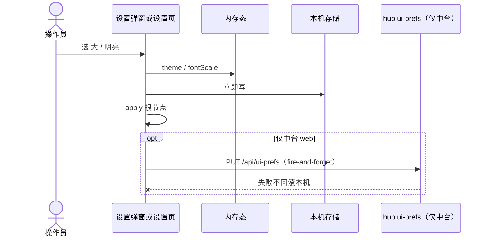

# Armada 外观设置（主题 + 字号）

- 日期：2026-09-18
- 状态：**待评审**（方案 A 已口头确认：各端本地、不同步）
- 父文档：
  - [armada-hub-app-parity](../../../.cursor/rules/armada-hub-app-parity.mdc)（中台给操作员的外观入口，App 同一轮要能看见、改完）
  - [2026-09-17-armada-android-app-design.md](./2026-09-17-armada-android-app-design.md)（Android 对等 iOS）
- 修订范围：中台顶栏设置弹窗；iOS / Android 舰队页进入的设置页。两项：明亮/黑夜、字号三档。不改 `runToSnap`、中转、派发、Ask、stop。
- 触发：中台 Markdown 详情偏小；App 无主题/字号入口。要全局放大（含 Markdown 详情），先做这两项。

---

## 0. TL;DR

| 项 | 内容 |
| --- | --- |
| 问题 | 中台主题开关裸露在顶栏；无字号。App 跟随系统、详情 Markdown 写死 13px。操作员无法把全局文字（含 Markdown）放大。 |
| 核心方案 | **方案 A：各端本地偏好 + 只放大字号。** 中台 `ui-prefs.json` + localStorage；App UserDefaults / SharedPreferences。**禁止** App 读写 `/api/ui-prefs`，禁止中转新路由。禁止 `zoom` / 整页 `scaleEffect`。禁止把 root rem 跟着字号乘——间距膨胀会把 240px 看板挤成竖排单字。 |
| 关键约束 | ① 字号三档：`normal=1`、`large=1.25`、`xlarge=1.5`。② 默认：黑夜 + 正常（= 当前中台观感）。③ 缩放必须覆盖看板/侧栏/派发 **和** 详情 Markdown（含代码块）。④ 解绑不丢外观（本机偏好，不跟 token）。 |
| 明确不做 | App↔中台同步；跟随系统作为第三档主题；更多字号；只放大聊天；语言/通知；改 `runToSnap`；`/mobile/ui-prefs`。 |

**可行性：** 纯本机 UI 偏好，不是 IDE/CDP 写路径，不触发 `armada-feasibility-before-solution`。

| OS | 是否阻塞 |
| --- | --- |
| 中台 Chromium / 打包 Tauri | 本规格；只放大 `font-size`，禁止 `zoom` |
| iOS / Android | 本规格；原生字号倍率（不缩放布局）+ Markdown `font-size * scale` |
| 被控 macOS / Windows | 无关；禁止改 hook / CDP / `decideStop` |

---

## 1. 背景与需求

| # | 原始诉求 | 设计映射 |
| --- | --- | --- |
| R1 | 顶部加字号：正常 / 大 / 超大 | 三档枚举 `fontScale`，默认 `normal`；倍率 1 / 1.25 / 1.5（2× 在 240px 看板不可排） |
| R2 | 全局字体整体放大，含 Md 详情 | 只放大字号，禁止 `zoom`，禁止 root rem 跟倍率走。中台 `--armada-text-scale` 只乘 `font-size`。看板列 `min-w-[240px]` 可伸。App `fontScale` / Dynamic Type；Markdown `calc(13px * var(--md-scale))` |
| R3 | App 加设置页：明亮黑夜 + 字号，先做这两项 | 舰队页「设置」→ 独立页，仅两行 |
| R4 | 中台也要加；明亮黑夜收进弹窗 | 顶栏「设置」弹窗，去掉裸露「明亮/黑夜」按钮 |
| R5 | A：不用同步，保存在自己地方 | 中台只写本 hub 文件/本浏览器；App 只写本机。无跨端 API |

**诉求外、本规格不发明：** 跨设备一致、跟随系统、无障碍动态字体档位对齐、仅内容区缩放。

**备选（不选）：**

| 方案 | 为什么不选 |
| --- | --- |
| B. App 写回 hub `ui-prefs` | 用户明确不同步；手机黑夜会切办公室中台；还要新开 `/mobile/*` |
| C. 只放大 Markdown | 违反 R2「全局」 |
| 中台全部 `px` 改 `rem` | 改动面大于设置本身；与 Tailwind `text-[13px]` 冲突 |

---

## 2. 现状盘点

### 2.1 可复用

| 能力 | 代码位置 | 本规格怎么用 |
| --- | --- | --- |
| 中台主题 | `hub/web/src/theme.ts` `loadTheme` / `applyTheme`；`html[data-theme]` | 弹窗改主题；逻辑不拆第二套 |
| 中台偏好文件 | `hub/src/uiPrefs.ts` `theme`；`GET/PUT /api/ui-prefs` | **仅中台**增 `fontScale`；App 不碰 |
| 顶栏 | `hub/web/src/App.tsx` header「明亮/黑夜」 | 换成「设置」，原按钮删除 |
| 中台 Markdown | `hub/web/src/components/ChatThread.tsx` `text-[13px]` | 不改组件；`--armada-text-scale` 覆盖该类 |
| iOS 舰队工具栏 | `Screens.swift` `WorkspaceListView` 解绑/刷新 | 加「设置」 |
| Android 舰队栏 | `MainActivity.kt` `FleetScreen` TopAppBar | 加「设置」 |
| iOS Markdown | `MarkdownView.swift` body `font: 13px` | `from(_:scale:theme:)`，`--md-scale` + 显式配色 |
| Android Markdown | `MarkdownHtml.kt` 同样 13px，无暗色 | 同签名；补暗色 CSS |
| App 本地存储 | iOS `UserDefaults`；Android `TokenStore` plain prefs | 新 key，不解绑删除 |

### 2.2 需新建

| 能力 | 落点 |
| --- | --- |
| `fontScale` 归一化 | `hub/src/uiPrefs.ts` + `hub/web/src/uiPrefs.ts` + `theme.ts`（或拆 `appearance.ts`） |
| 中台设置弹窗 | `hub/web/src/components/SettingsModal.tsx`（名称可同形缩短） |
| CSS 字号变量 | `hub/web/src/index.css` `--armada-text-scale` 乘 `text-[Npx]` / `text-sm`；禁止 `zoom` |
| iOS 设置页 + 环境 | `Screens.swift` `SettingsView`；`ArmadaRemoteApp` `preferredColorScheme` |
| Android 设置页 + theme | `MainActivity.kt` `settings` 路由；`MaterialTheme` 明暗 |
| Markdown 倍率 | iOS `MarkdownHTML.from`；Android `MarkdownHtml.from` |

### 2.3 今天的缺口

| 层 | 今天 | 目标 |
| --- | --- | --- |
| 中台顶栏 | 即时切主题，无字号 | 「设置」弹窗两项 |
| `UiPrefs` | 无 `fontScale` | `normal \| large \| xlarge` |
| App | 无设置页；跟随系统 | 独立设置页；默认黑夜 |
| Markdown | 13px 写死；Android 无暗色 | 随 `fontScale`/`theme` |

---

## 3. 设计原则

| # | 原则 | 可执行含义 |
| --- | --- | --- |
| P1 | 各端自己的地方 | App 零次请求外观 API。中台 PUT 失败仍应用本机 DOM |
| P2 | 两项封顶 | 设置 UI 禁止第三项（v1） |
| P3 | 默认 = 当前中台 | `dark` + `normal`；切到大/超大才偏离现状 |
| P4 | 只放大字号，不改 Markdown 渲染器 | 禁止 `zoom` / 整页 scale；WebView 只加 `--md-scale` + 主题色 |
| P5 | 外观不是 run 状态 | 不进 `RunSnap`、不进 SSE |
| P6 | 解绑保留 | 外观 key 不在 `unbind()` 清理列表 |
| P7 | iOS / Android 文案同一套 | 标题「设置」；「外观」「字号」；档位「黑夜/明亮」「正常/大/超大」 |

---

## 4. 数据模型 / 接口契约

### 4.1 枚举

| 字段 | 合法值 | 倍率 | UI 文案 | 默认 |
| --- | --- | --- | --- | --- |
| `theme` | `dark` \| `light` | — | 黑夜 / 明亮 | `dark` |
| `fontScale` | `normal` \| `large` \| `xlarge` | 1 / 1.25 / 1.5 | 正常 / 大 / 超大 | `normal` |

非法值（缺省、`"neon"`、`1.5`、`null`）→ 默认。**禁止**存数字倍率；只存档位名。

### 4.2 中台 `UiPrefs`（`hub/src/uiPrefs.ts`）

现有字段保持。新增：

```text
fontScale: "normal" | "large" | "xlarge"   // 默认 "normal"
```

| 规则 | 验收 |
| --- | --- |
| `normalizeUiPrefs` 丢掉未知 key | 已有用例仍过；新增非法 `fontScale` → `normal` |
| `mergeUiPrefs` known 列表加入 `fontScale` | PUT `{ fontScale: "large" }` 保留 `theme` / `readRuns` |
| 文件 `~/.armada/ui-prefs.json` mode `0o600` | 与现网一致 |
| App **不得** GET/PUT 此接口 | 代码搜索 `/api/ui-prefs` 仅 `hub/` + `hub/web/` |

中台浏览器镜像（与 theme 同形）：

| key | 值 |
| --- | --- |
| `armada.theme.v1` | `dark` \| `light`（已有） |
| `armada.fontScale.v1` | `normal` \| `large` \| `xlarge` |

`localDiffersFromDefaults` 必须把 `fontScale !== normal` 算进差异，否则首次从 defaults 迁移会丢字号。

### 4.3 App 本机 key（不解绑删除）

| 端 | 存储 | key | 值 |
| --- | --- | --- | --- |
| iOS | `UserDefaults.standard` | `armada.theme.v1` / `armada.fontScale.v1` | 同上枚举字符串 |
| Android | `TokenStore` 的 **plain** `armada` SharedPreferences（非 encrypted） | 同上 | 同上 |

**备选不选：** 放进 encrypted store（外观不是秘密）；放进 Keychain（过重）；跟 `token` 一起清掉（解绑后绑定页会跳回系统外观，违背 P6）。

### 4.4 错误码

外观无网络契约。中台 PUT `/api/ui-prefs` 沿用现网：

| 情况 | HTTP | 客户端 |
| --- | --- | --- |
| 非法 body | 400 `INVALID` | 本机已 apply，忽略 |
| 读文件失败 | 503 `READ_FAIL` | 本机 localStorage 继续生效 |
| 写失败 | 500 `WRITE_FAIL` | 同上 |

App 写 UserDefaults / apply() 失败：保持内存态；下次冷启动回默认。无 toast 义务（与现网 theme 静默一致）。

### 4.5 兼容

| 方向 | 策略 |
| --- | --- |
| 旧中台读新 JSON | 多出的 `fontScale` 被旧 `normalize` 当 junk 丢掉；主题不受影响 |
| 新中台读旧 JSON | 无 `fontScale` → `normal` |
| 旧 App | 无设置页；行为不变 |
| 回滚本规格 | 删 `data-font-scale` 即恢复 1×；文件里残留 `fontScale` 无害 |

无版本协商、无限流。偏好文件 < 1 KB；p95 不作为本功能指标。写入是同步 localStorage / `apply()`，目标：点击后 **下一帧** DOM/主题已变（< 100 ms 体感），不走网络等待。

---

## 5. 运行时链路



### 5.1 中台 apply

1. `document.documentElement.dataset.theme = theme`（已有）
2. `document.documentElement.dataset.fontScale = fontScale`
3. CSS：`--armada-text-scale` 为 1 / 1.25 / 1.5。`html { font-size: 16px }` 钉死 rem，间距不跟字号膨胀；`text-[10px]`–`text-[16px]` / `text-xs` / `text-sm` 仍 `calc(... * var(--armada-text-scale))`。侧栏 `224px`；看板列 `min-w-[240px]` 可随窗口伸，禁止 `max-w-[240px]`，禁止 `zoom`。卡片标题 `break-words line-clamp-3`，禁止 `break-all`。顶栏 chip `whitespace-nowrap` + `flex-wrap`。桌面窗口默认 1440×900（min 1100×700）。

`normal` 倍率为 1（不覆盖，保持现网 px）。冷启动：`main.tsx` 在 render 前 `applyTheme` + `applyFontScale`，避免闪 1× 再跳。

**缓存：** 无 HTTP 缓存。失效 = 下一次点击或冷启动读盘。  
**降级：** 未列出的字号 class 保持原 px；v1 只覆盖中台现用档。

### 5.2 App apply

| 端 | 主题 | 原生文字 | Markdown |
| --- | --- | --- | --- |
| iOS | 根 `preferredColorScheme(.dark/.light)` | `.environment(\.dynamicTypeSize)`：normal→`.large`，large→`.xxLarge`，xlarge→`.accessibility1`。禁止根视图 `scaleEffect`。 | `MarkdownHTML.from`：`--md-scale` + `calc(13px * var(--md-scale))`，禁止 `zoom` |
| Android | `MaterialTheme` 包 `Root` | `LocalDensity`：**只改 `fontScale`**，`density` 不变。禁止 `graphicsLayer` 整页缩放。 | `MarkdownHtml.from` 同 iOS：`--md-scale`，禁止 `zoom` |

详情打开时用**当前**倍率生成 HTML；改设置后已打开的 WebView 必须 reload 同一 `text`（改 `lastText` 哨兵或显式 `scale` 依赖）。

### 5.3 入口

| 面 | 入口 | 容器 | 内容 |
| --- | --- | --- | --- |
| 中台 | header 右侧，「退出中台」左侧：「设置」 | 模态（点遮罩或「完成」关闭） | 外观分段 + 字号分段 |
| iOS | 舰队 `topBarTrailing`：「设置」（保留刷新） | `NavigationLink` 全页 | 同上 |
| Android | `FleetScreen` actions：「设置」 | `nav.navigate("settings")` 全页 | 同上 |

绑定页（未绑定）不放设置。冷启动未绑定也 apply 已存外观（绑定页本身跟着变）。

### 5.4 失败 / 降级

| 失败 | 行为 |
| --- | --- |
| localStorage 抛错 | 内存 apply 仍执行；刷新可能回默认 |
| PUT ui-prefs 失败 | 不弹红条、不回滚（与现网 theme 一致） |
| SharedPreferences apply 失败 | 内存态保留到进程结束 |
| WebView 未吃到字号倍率 | 单测锁 HTML 含 `--md-scale: 1.25` 且无 `zoom:`；真机抽查详情正文 |

回滚：revert 本规格提交；操作员清 localStorage / 卸 App 即回默认。

---

## 6. 安全与威胁模型

| 威胁 | 缓解 | 指标 / 约束 |
| --- | --- | --- |
| 偏好当秘密存 encrypted | 不存 token；只用 plain prefs | token 仍只在 Keychain / EncryptedSharedPreferences |
| `ui-prefs.json` 被读 | 已有 `0o600`；无新增敏感字段 | 文件不含 token |
| Markdown HTML 注入 | 沿用现网 escape；只加字号变量/颜色 | `MarkdownHtmlTest` 仍禁止裸 `<script>` |
| 设置页误加退出/解绑 | v1 只有两项 | UI 测试：设置页无「解绑」 |
| 中转暴露 prefs | **不新增** `/mobile/ui-prefs` | grep 无该路径 |

边界外：本机 root 可读 UserDefaults，不在本规格。审计：中台 PUT 已有 `UI_PREFS_*` audit；字号不另造 action。

---

## 7. 实施路线图

同一 git 提交集可分文件，但 **同一轮** 中台 + iOS + Android 都要有入口（parity）。允许内部先中台 CSS 再 App，**对外完成态**三者齐全。

| 阶段 | 范围 | 验收 | 上线 gate |
| --- | --- | --- | --- |
| v1（本规格） | 两项设置；各端本地；全局缩放含 MD | §7.1 全绿 | hub 单测 + web 单测 + Android `MarkdownHtml` 测；中台打包 overlay；iOS/Android 真机或模拟器点一次 |
| v1.5 | 跟随系统 | 仅当操作员明确要第三档「系统」 | 未触发 = 不做 |
| v2 | App↔中台同步 | 仅当操作员要多端一致；需 `/mobile` 契约 | 未触发 = 不做 |

### 7.1 v1 验收（必须可点）

| ID | 面 | 条件 |
| --- | --- | --- |
| A1 | 中台 | 顶栏无「明亮/黑夜」裸按钮；有「设置」 |
| A2 | 中台 | 弹窗仅外观+字号；选「大」后看板标题与详情 Markdown 计算字号约为原 1.25 倍（13px → ~16.25px）；卡片标题按词换行且最多 3 行，不是竖排单字 |
| A3 | 中台 | 「超大」→ 1.5 倍（13px → ~19.5px）；刷新后仍是超大；看板列仍可并排阅读 |
| A4 | 中台 | PUT 失败（断 hub）本机仍保持所选档 |
| A5 | iOS | 舰队→设置；两项；Markdown 详情随档位；解绑再绑定仍在 |
| A6 | Android | 同 A5；暗色主题下 Markdown 不是黑字配深底 |
| A7 | 契约 | App 源码无 `/api/ui-prefs`、无 `/mobile/ui-prefs` |
| A8 | 默认 | 清数据后 = 黑夜 + 正常，与改前中台观感一致 |

### 7.2 测试夹具（先红后绿）

| 测试 | 必须先红的断言 |
| --- | --- |
| `hub/test/uiPrefs.test.ts` | 非法 `fontScale` clamp；merge 只改字号保留 theme |
| `hub/web/test/uiPrefs.test.ts` | `fontScale: large` 使 `localDiffersFromDefaults` 为 true |
| `hub/web` 设置弹窗 | 静态 markup 含「设置」「正常」「超大」，不含顶栏即时「明亮」按钮（header 路径） |
| iOS Markdown（若现有测试 harness）或 Android `MarkdownHtmlTest` | `from(..., large, dark)` HTML 含 `--md-scale: 1.25`、无 `zoom:`、且暗色 color |

禁止未红先改生产 CSS。

### 7.3 发布顺序

1. `armada` 主干：hub normalize + web 弹窗 + iOS + Android（同仓）。
2. 中台：停 7380 源码 hub → `desktop` pack overlay → 创建舰队验证设置（`armada-desktop-packaged-verify`）。
3. App：iOS TestFlight / Android APK 按现网渠道；**不**要求本规格改 relay。
4. 无跨仓版本号；旧 App 对着新 hub 无影响（不读 prefs）。

---

## 8. 风险与未决

| 风险 | 影响 | 应对 | 状态 |
| --- | --- | --- | --- |
| CSS `zoom` 放大布局导致整页滚动 | 操作员要的是字号不是画布缩放 | 只乘字号；禁止 `zoom` | 已修 |
| root rem 跟字号走 + 列宽钉 240px | `pr-16` 变成 96–128px，标题只剩 4～6 个汉字 | rem 钉 16px；标题 `break-words line-clamp-3`；列可伸 | 已修 |
| 1.5× / 2× 字号对 240px 看板过大 | 即使用冻结 rem，2× 的 26px 汉字一行只挤约 6 字 | 档位改为 1.25 / 1.5 | 已修 |
| 大字号顶栏中文竖排 / 800×600 像文档 | 标题「Armada」和按钮挤成单字列 | 顶栏 nowrap+wrap；窗口 1440×900 | 已修 |
| 1.5× 下文案换行增多 | 详情区更长 | 允许纵向滚内容，禁止横向滚整页画布 | 接受 |
| App 从「跟随系统」改为默认黑夜 | 浅色系统用户第一次升级变黑 | R5/P3；设置里一键明亮 | 接受 |
| Android 详情 WebView 忽略字号变量 | MD 仍 13px | 单测锁 `--md-scale` + `calc(13px * var(--md-scale))` | 缓解预案 |
| 中台 localStorage 与 `ui-prefs.json` 不一致 | 两台浏览器官感不同 | **故意**：那是「自己的地方」。同浏览器以 local 立即生效，PUT 成功后其它打开该 hub 的页面下次 GET 才对齐 | 已决：中台多标签允许短暂不一致 |
| 1.5× 手机可用性 | 一屏字少 | 超大封顶 1.5；不再提供 2× | 已修 |

**阻塞项：** 无。不依赖中转、不依赖被控机、不依赖新权限。

**未决（规格已拍板，实施时勿再问）：** 不同步；默认黑夜+正常；App 不解绑清外观。

---

## 9. 评审检查清单

- [x] 固定章节骨架（0–10）
- [x] MVP/v1/v1.5+ 切分（§7）
- [x] 非目标、风险、阻塞、验收
- [x] 跨服务发布：无跨仓；hub+iOS+Android 同轮；relay 不动
- [x] 修订记录
- [ ] 用户确认本文后，状态改为 **实施基准**

---

## 10. 修订记录

| 日期 | 变更 |
| --- | --- |
| 2026-09-18 | 初稿。方案 A：各端本地、不同步；中台弹窗 + App 设置页；`fontScale` 三档。 |
| 2026-09-18 | 真机反馈：`zoom`/`scaleEffect` 是整页画布放大。改为只乘字号；布局宽高不变。 |
| 2026-09-18 | 真机：大字号顶栏中文竖排、800×600 窗口不协调。改为 root rem 跟字号、列宽钉 px、窗口 1440×900。 |
| 2026-09-18 | 真机：rem 跟字号走后 240px 卡片标题竖排。改回 rem=16px；倍率 1.25 / 1.5；标题 clamp；列可伸。 |
