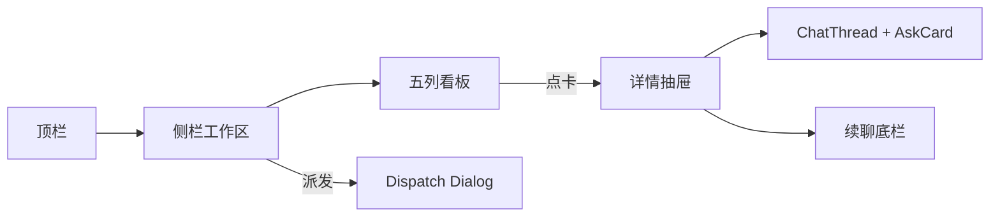
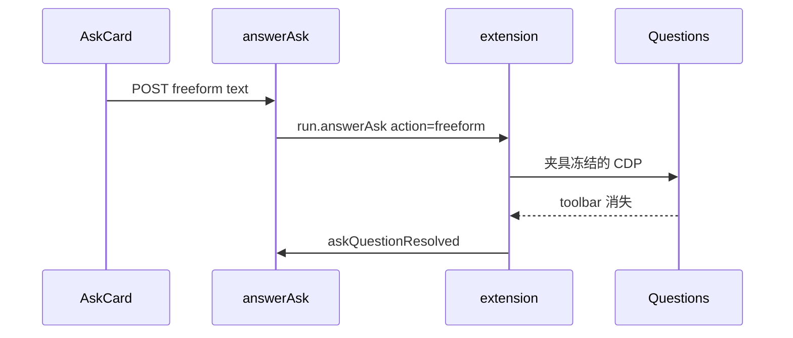

# Armada UI 组件升级（shadcn）+ Ask 自由输入

- 日期：2026-09-18
- 状态：**待评审**（v2：2026-09-19 —— 豆包 / ChatGPT **只对齐手机 App 视觉**；中台用 shadcn 换皮，五列看板不动）
- 父文档：
  - [2026-09-07-armada-ask-question-hitl-design.md](../../../../docs/superpowers/specs/2026-09-07-armada-ask-question-hitl-design.md)（desk 仓；Ask v1：选项 Continue / Skip；**明确不做自由文字**，本规格把它补进 Ask **组件**）
  - [2026-09-18-armada-appearance-settings-design.md](./2026-09-18-armada-appearance-settings-design.md)（主题 / 字号；禁止 `zoom`、禁止 root rem 跟倍率走）
  - [2026-09-18-armada-prompt-snippets-design.md](./2026-09-18-armada-prompt-snippets-design.md)（快捷提示词；本规格只换皮，不改插入语义）
  - [armada-hub-app-parity](../../../.cursor/rules/armada-hub-app-parity.mdc)
  - [armada-feasibility-before-solution](../../../.cursor/rules/armada-feasibility-before-solution.mdc)
- 修订范围：中台 `hub/web` 用 shadcn 换现有组件皮；**iOS / Android 按豆包 / ChatGPT 移动端对齐视觉**（列表、详情气泡、底栏、Ask 芯片）。Ask 卡补自由输入；`POST /api/runs/:id/answer-ask` 增加 `freeform`；扩展 CDP 自由输入。两端信息架构都保留。不改 `generation_id` / `decideStop` / ingest cid / `runToSnap` 字段集。
- 触发：中台要 shadcn 组件升级；手机要对话产品观感；Ask 缺自由输入；App 按钮又大又丑。

---

## 0. TL;DR

| 项 | 内容 |
| --- | --- |
| 问题 | 中台手写控件不统一；手机详情像后台表单，Ask 按钮过大；Ask 不能打字作答。 |
| 核心方案 | **两条皮、一套能力、一个 `origin/master`。** 中台：shadcn 换皮，**五列看板留下**。App：按豆包 / ChatGPT 移动端换视觉（气泡、紧凑底栏、芯片选项），**列表→详情结构留下**。Ask 两端卡内补自由输入。 |
| 关键约束 | ① 豆包 / GPT **不准**用来改中台导航或删看板。② shadcn **不准**进 iOS/Android。③ `freeform` 须 Mac+Windows 真机过闸。④ 自由输入不是 `followup`。⑤ 主题/字号规格不废止。 |
| 明确不做 | 中台改成 ChatGPT 桌面壳；App 改成完整 cid 逐条流（仍是 prompt 气泡 + 终态正文，现网数据没有全量线程）；复制品牌吉祥物/字标；Plan 自由输入；切 `feat/*`。 |

**可行性：**

| 路径 | 是否阻塞 | 说明 |
| --- | --- | --- |
| shadcn 换皮 / App 按钮密度 | 否 | 纯 UI；可在 master 先改、先测 |
| Ask 点选项 / Skip | 否 | v1 已过闸 |
| Ask `freeform` CDP | **是** | Questions **在屏** DOM + 不选字母、打字、提交后框关。Mac 一次、Windows 一次。夹具入仓、单测先红，再写生产 |

| OS | 是否阻塞 |
| --- | --- |
| 中台 Chromium / 打包 Tauri | shadcn 换皮；验收 overlay `/Applications/Armada.app` |
| 被控 macOS / Windows | 仅 `freeform` 提交闸 |
| iOS / Android | 豆包 / ChatGPT **风格**本规格；不引入 WebView 套壳 |

---

## 1. 背景与需求

| # | 原始诉求 | 设计映射 |
| --- | --- | --- |
| R1 | 用 shadcn 改造（中台）UI | 只动 `hub/web`：原语 + CSS 变量；五列 / 侧栏 / 抽屉 / 弹窗换皮 |
| R2 | 所有组件 UI 升级 | 中台清单见 §4.2；App 清单见 §4.6。两边都 **不改路由树** |
| R3 | 豆包、ChatGPT 对齐 **手机** UI 风格 | **仅 iOS / Android。** 中台禁止按这两款改布局。App 抽：右气泡用户、左齐助手、胶囊底栏、芯片选项、紧凑主按钮 |
| R4 | Ask 不选可直接输入 | 中台 Ask 卡内 + App 详情 Ask 区；`action: "freeform"` |
| R5 | App 选项下按钮又大又丑 | 按 ChatGPT / 豆包：选项不是大 Button；Skip/Continue 小、靠右或等分紧凑 |
| R6 | 不拆、主干改造测试 | 同一规格、`origin/master` |

**诉求外、本规格不发明：** 中台对话列表首页；App 拉全量 jsonl 做成多轮气泡；语音键；点选项即发送。

**备选（不选）：**

| 方案 | 为什么不选 |
| --- | --- |
| 中台按 ChatGPT 桌面改成列表+线程 | **v0/v1 误读。** 豆包 / GPT 只服务手机；中台留看板 |
| 中台详情改主栏、底栏兼派发 | 改了中台信息架构 |
| 只换 token、Ask 下个 PR | 用户明确不拆；Ask 卡就是要升级的组件之一 |
| 自由输入走 `followup` | pending 时 `CONVERSATION_BUSY`；模型读的是 Questions 工具结果 |
| 切 `feat/ui` | 主干是 `master` |

---

## 2. 现状盘点

### 2.1 可复用

| 能力 | 代码位置 | 本规格怎么用 |
| --- | --- | --- |
| 页面结构 | `App.tsx` header + `Sidebar` + `Board` + 遮罩 `RunDetail` + `DispatchModal` / `SettingsModal` | **保留树**；内部 className 换 shadcn |
| 五列数据 | `boardState.ts` `groupRuns` / `COLUMN_LABELS` | 不改分组；卡片用 `Card` / `Badge` |
| 详情宽 | `RunDetail.tsx` `DrawerShell` + `detailWidth` | 保留拖宽；Sheet 皮肤 |
| 主题 / 字号 | `theme.ts`、`--armada-text-scale` | 映射到 shadcn 变量；`appearanceLayout.test.ts` **看板 224/240 断言保留** |
| Ask v1 | `runs.answerAsk`、CDP 点字母 + Enter / Esc | `continue` / `skip` 保持 |
| 快捷提示词 | `PromptSnippetBar.tsx` | 芯片换皮，插入语义不变 |
| App 列表→详情 | iOS `RunRow` / `RunDetailView`；Android `RunDetailScreen` | **结构不动**；按 §4.6 换成对话气泡风格 |

### 2.2 需新建

| 能力 | 落点 |
| --- | --- |
| shadcn 脚手架 | `hub/web/components.json`、`src/lib/utils.ts` `cn`、`src/components/ui/{button,input,textarea,dialog,sheet,badge,card,separator,dropdown-menu,scroll-area}.tsx`、Vite `@` 别名 |
| 令牌 | `index.css`：`html[data-theme]` 写 shadcn 变量，**不**再整表反转 zinc 当第二套色 |
| Ask 卡自由输入 | `ChatThread.tsx` `AskCard`；iOS `AskView`；Android `AskBlock` |
| `action: "freeform"` | `hub/src/runs.ts`；`api.ts`；扩展 CDP（**P0 过闸后**） |

### 2.3 不复用 / 有害

| 有害做法 | 原因 |
| --- | --- |
| 删 `Board.tsx` 五列 | 用户要留看板 |
| 废弃 `detailWidth` / `DispatchModal` | 属于导航改版 |
| light 反转 zinc **同时**上 shadcn token | 两套色 |
| 未过闸 `insertText` | 可能误发续聊 |

---

## 3. 设计原则

1. **信息架构冻结。** 顶栏 → 侧栏工作区 → 五列看板 → 右侧详情抽屉 → 派发/设置弹窗。只换组件实现。
2. **令牌唯一。** shadcn CSS 变量是中台唯一色板；旧 `bg-zinc-*` 从页面上退掉。
3. **两套视觉目标。** 中台 = shadcn 操作台。App = 豆包 / ChatGPT 移动端。禁止把手机风格倒灌进五列看板，也禁止把看板风格留在手机详情。
4. **升级组件，不改操作路径。** 中台：侧栏派发、点卡开抽屉。App：工作区列表 → 任务列表 → 详情。Ask 仍先选再 Continue，另补自由输入。
5. **技术栈不混。** shadcn 只在 `hub/web`。App 用 SwiftUI / Compose 复刻手机视觉合同。
6. **先红后改（CDP）。** `freeform` 无在屏夹具不得写生产点击。

App 从豆包 / ChatGPT **只抽这些**（验收可观察）：

| 抽（仅 App） | 不抽 |
| --- | --- |
| 用户提示词右气泡；终态回复左齐 Markdown | 完整多轮 transcript（snap 没有逐条事件） |
| 底栏胶囊输入 + 小发送钮（详情续聊 / 派发 sheet） | 语音键、发现页、GPT 商店 |
| Ask 选项紧凑芯片/行；Skip/Continue 小按钮 | 通栏 `.large`；点选项即发送 |
| 列表行：标题 + 状态字幕 + 未读点 | 把 App 改成五列看板 |

中台强调色仍 Ask 蓝 `#599CE7` + Plan `#F1B467`。App 主色跟现网 accent，不要另套豆包绿。

---

## 4. 数据模型 / 接口契约

### 4.1 前端结构（不变）

`App.tsx` 仍：`header` + `Sidebar` + `Board`（五列）+ 选中时 `fixed` 遮罩 + `RunDetail` 抽屉 + `DispatchModal` + `SettingsModal`。

`Board.tsx` 仍 `COLUMN_LABELS` 五列，`min-w-[240px]` 保留（字号规格禁止挤成竖排）。空列文案由「—」改为「暂无」。

### 4.2 组件对照（换皮清单）

| 现网 | 换成 | 验收 |
| --- | --- | --- |
| 顶栏裸 `button` | `Button variant="ghost" size="sm"` | 设置 / 退出 / 已隐藏仍在原位 |
| 侧栏派发与桌面动作 | `Button` | 仍三条桌面动作 + 派发 |
| 看板卡片 `div.border` | `Card` + 状态 `Badge` | 点卡仍 `onSelect`；未读/待处理 chrome 函数不改 |
| 详情 `DrawerShell` | shadcn `Sheet` 皮肤（可仍自管宽度） | 拖宽、关遮罩仍在 |
| 续聊 `textarea` | `Textarea` + 发送 `Button` | Enter 发送现网不变；**pending Ask 时续聊仍禁用**（自由输入在 Ask 卡内） |
| `DispatchModal` / `SettingsModal` | `Dialog` | 字段与 API 不变 |
| `PromptSnippetBar` | `Badge` / `Button size="sm"` | 插入语义不变 |
| Ask 选项大块 `button` | 紧凑可点选行 | 仍先选再 Continue |
| Ask Skip / Continue | `Button size="sm"` | 不再 `min-h-11` 通栏感 |
| App Ask 通栏 large | 见 §4.6 | 豆包 / GPT 密度 |

### 4.3 `POST /api/runs/:id/answer-ask`（`freeform`）

现网：`action: "continue" | "skip"`。增加 `"freeform"`。

```json
{ "request_id": "ask-…", "action": "freeform", "text": "不选选项，直接说的内容" }
```

| 规则 | 值 |
| --- | --- |
| `text` | trim 后 1–4000；否则 `ASK_TEXT_EMPTY` / `ASK_TEXT_TOO_LONG` |
| `answers` | `freeform` 时必须空；非空 `option_ids` → `ASK_INVALID_OPTION` |
| Plan | `ASK_INVALID_OPTION`（同 skip） |
| 幂等 / 忙 | 与 v1 相同：`already`；`ASK_IN_FLIGHT` 15s |

WS `run.answerAsk`：`action: "freeform"`, `text`, `answers: []`。`runToSnap.pendingAsk` 不加字段。

| error | 文案（三端同句） |
| --- | --- |
| `ASK_TEXT_EMPTY` | 先写回复，或不选选项去点上面的答案 |
| `ASK_TEXT_TOO_LONG` | 回复太长，请缩短后再发 |

**备选不选：** `continue` + 空 `option_ids`（与 v1「必须 1 个 option」冲突）。

### 4.4 扩展 `Executor.answerAsk`

| `action` | CDP（过闸后冻结） | 禁止 |
| --- | --- | --- |
| `continue` | 点 letter → Enter | 点名叫 Continue 的 button |
| `skip` | Esc | 点最后一个 letter |
| `freeform` | 夹具写明的动作（假说：不点 letter，composer `insertText` + Enter，toolbar 消失） | `followup()` / Plan |

Mac / Windows 同一选择器。未过闸：hub **不接受** `freeform`。Ask 卡可先画出输入框，发送禁用，直到 P0 绿后同一批 master 打开。

### 4.5 Ask 卡合同（三端）

| 元素 | 行为 |
| --- | --- |
| 题干 | 现网 Markdown |
| 选项 | 紧凑行；单击 = 选中（`aria-pressed`）；**不**自动提交 |
| 自由输入 | 选项下方「或者直接输入」`Textarea`；有字时 Continue 改为提交 `freeform` 并清掉选中项 |
| Skip / Continue | 卡片右下小按钮；Continue 在「无选中且输入为空」时禁用 |
| Plan | 仅 Build；无自由输入、无 Skip |
| 详情底栏续聊 | pending Ask 时 **保持禁用**（避免和卡内输入双通道） |

### 4.6 App 视觉合同（豆包 / ChatGPT，仅手机）

现网详情是「提示词卡片 + 回复区块 + 大按钮」。目标皮肤（数据仍是 `prompt` + `finalText` + `pendingAsk`）：

| 块 | 现网 | 目标 |
| --- | --- | --- |
| 列表 `RunRow` | 左竖条 + 圆点 + 两行字 | 去厚重竖条；标题 17pt、字幕 13pt secondary；未读仍小圆点 |
| 提示词 | `DetailPromptCard` 整块「提示词」+ 左色条 | **右对齐用户气泡**（最大宽度 ~78%），不再用「提示词」分区标题当主视觉 |
| 回复 | `DetailReplyBlock`「回复」+ 横线 | **左对齐** Markdown，无分区大标题；无正文时一句 secondary |
| Ask | 大选项 Button + 通栏 Skip/Continue | 题干 + 紧凑选项；Skip/Continue 小、右对齐或等分，**禁止** iOS `.controlSize(.large)` / 全宽 `minHeight: 44`；Android 禁止非 compact 撑满 |
| 自由输入 | 无 | 选项下胶囊输入，一行起、最高 6 行 |
| 续聊 / 派发 | `VolumeButton` / `BarButton` 通栏堆 | 详情底栏或 sheet **一条胶囊** + 小发送；取消为文字按钮 |

Plan 卡：保留 Build 主按钮，不要和 Ask 的 Skip/Continue 同一套巨大双钮。

---

## 5. 运行时链路

### 5.1 中台（不变）



轮询 / SSE / `GET events` 现网不变。

### 5.2 Ask 自由输入（闸后）



失败：现网 `submit_failed`；卡内输入保留。降级：提示去本机。回滚：`pending_ask` 形状不变。

### 5.3 性能 / 安全

| 项 | 约束 |
| --- | --- |
| shadcn | 只拷 §2.2 列出的原语，不打全套 blocks |
| `freeform` | 4000 字；审计 `text_len` + 前 80 字 |
| 限流 | `ASK_IN_FLIGHT` |
| 换皮 | 无新网络；列表仍不扫 jsonl |

威胁与缓解同操作员答题通道；不扩大 CORS。

---

## 6. 视觉令牌

### 6.1 中台（shadcn）

`index.css` 用 `html[data-theme]` 驱动 shadcn 变量（不用 `.dark` class，以免和 `applyTheme` 打架）。

| Token | Dark | Light |
| --- | --- | --- |
| `--background` | `#212121` | `#ffffff` |
| `--foreground` | `#ececec` | `#0d0d0d` |
| `--card` | `#2f2f2f` | `#f7f7f8` |
| `--user-bubble` | `#2f2f2f` | `#e8e8e8` |
| `--primary` | `#599CE7` | `#3b82c4` |
| `--plan` | `#F1B467` | `#d9973a` |
| `--radius` | 卡片 `0.75rem`；气泡 `1rem`；芯片 `999px` |

**密度（禁止大又大、小又小）：**

| 角色 | 中台 | App |
| --- | --- | --- |
| 主按钮 / 选项 / Skip / Continue / Build | `h-8`（32px）+ 13px | 36pt |
| 快捷提示词芯片 | `h-7`（28px）+ 12px，唯一例外 | 32pt compact |
| 元信息 | 12px | caption 13pt |
| 禁止 | `min-h-11`、`text-[10px]`、Ask `min-w-[128px]`、iOS `.large`+44 | 通栏 44 + 12pt 内边距叠高 |

`hub/web/test/uiDensity.test.ts` 扫源码，混用即红。

线程正文可升到 14–15px，仍乘 `--armada-text-scale`。看板列 `min-w-[240px]`、侧栏 `w-[224px]` **保留**（外观规格）。

空列：「暂无」。无机器 / 无工作区文案可润色，但不改入口位置。

### 6.2 App（豆包 / ChatGPT 密度，不是 shadcn token）

| 项 | 值 |
| --- | --- |
| 气泡圆角 | 18pt continuous |
| 用户气泡 | 现网 accent 浅底 / dark 下 secondarySystemFill |
| 助手区 | 透明底，正文 17pt（Markdown 仍乘字号规格） |
| 底栏 | 距底安全区 8；输入高 36–40pt 起；发送 32pt 圆 |
| Ask 选项 | 垂直 padding 6–8；左右 10 |
| Ask 动作 | 高 32–36pt，非 44×全宽 |

---

## 7. 实施路线图

全部 `armada` **`origin/master`** 连续提交。

| 阶段 | 范围 | 验收 | Gate |
| --- | --- | --- | --- |
| **P0** | Questions 在屏自由输入真机 | 夹具入 `docs/superpowers/fixtures/armada-ask-question/`；Mac + Windows | 未绿禁止 P3 生产 |
| **P1** | shadcn 脚手架 + 令牌；顶栏/侧栏/五列/抽屉/弹窗/线程换皮 | `bun test hub/web/test`（含 `appearanceLayout` 224/240）；overlay 仍能派发、点五列、开抽屉续聊 | 非 CDP |
| **P2** | 中台 Ask 卡紧凑化；**App 按 §4.6 换对话皮肤**（气泡、胶囊底栏、小 Ask 钮） | 列表→详情→选项 Continue/Skip 仍通 | 非 CDP（Ask 提交仍 v1） |
| **P3** | `freeform` hub + 扩展 + 卡内输入 | 单测先红再绿；双 OS 真机 | **P0 已绿** |
| **P4** | 停 7380；`tauri build` overlay | 看板+抽屉+Ask 选项+自由输入+App | 打包壳 |

P1+P2 可先 overlay；自由输入入口在 P3 前禁用或不上。

---

## 8. 跨仓 / 发布顺序

仅 `armada/`。P3：扩展 → hub → web → App 同一批 master。旧扩展忽略 `freeform` → 15s `ASK_SUBMIT_FAILED`。回滚 `git revert`；`pending_ask` 无新必填字段。

---

## 9. 风险与未决

| 风险 | 影响 | 应对 | 状态 |
| --- | --- | --- | --- |
| 自由输入不是 composer Enter | 误发续聊 | P0 记录提交后 jsonl 是否多 user 行 | **阻塞 P3** |
| 换皮漏页面 | 新旧 class 混杂 | §4.2 清单逐页；禁止残留 `bg-zinc-950` 当主底 | 开放 |
| shadcn CLI × bun / TW4 | init 失败 | 手写 `cn` + 拷所列 ui 文件 | 开放 |
| iOS 触控过小 | 难点 | 视觉紧凑，命中区 36–40pt，不要 44+12 大块 | 开放 |

**阻塞项：** P0。未关闭不得宣称能打字答题。

---

## 10. 评审检查清单

- [x] 固定章节骨架
- [x] P0–P4 切分
- [x] 非目标、风险、阻塞、验收
- [x] 仅 armada；`freeform` 发布顺序
- [x] 修订记录
- [x] 五列看板保留（2026-09-19）
- [x] 豆包 / GPT 仅 App，不改中台导航（2026-09-19）
- [ ] P0 真机夹具

未勾 P0 不得标 P3 为实施基准。**P1 中台换皮 + P2 App 皮肤可在本确认后开工。**

---

## 11. 修订记录

| 日期 | 版本 | 变更 |
| --- | --- | --- |
| 2026-09-18 | v0 | 误把参考豆包 / ChatGPT 做成删除五列、对话壳首页。 |
| 2026-09-19 | v1 | **撤回 v0 信息架构。** 保留五列 / 侧栏 / 抽屉 / 派发弹窗。范围改为 shadcn 换皮 + 组件升级；Ask 自由输入放在卡内；续聊底栏 pending 时仍禁用。 |
| 2026-09-19 | v2 | 用户澄清：豆包 / ChatGPT **只对齐手机 UI 风格**。中台继续 shadcn 看板换皮；App 详情改为用户右气泡 + 助手左齐 + 胶囊底栏。 |
