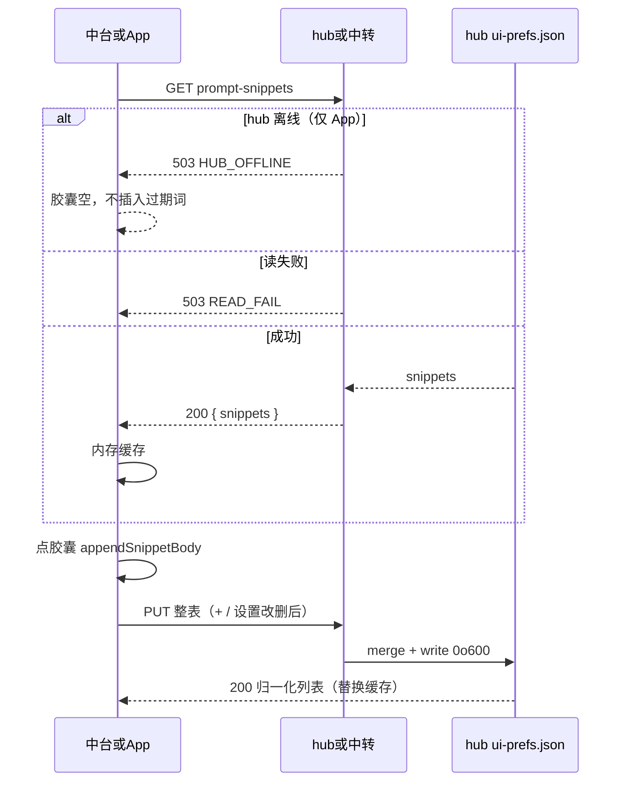

# Armada 快捷提示词（中台 + App）

- 日期：2026-09-18
- 状态：**实施基准**（方案 1 已确认；2026-09-18 对照代码复审通过）
- 父文档：
  - [armada-hub-app-parity](../../../.cursor/rules/armada-hub-app-parity.mdc)（中台给操作员的能力，App 同一轮要能看见、做完）
  - [2026-09-18-armada-appearance-settings-design.md](./2026-09-18-armada-appearance-settings-design.md)（设置页已有外观/字号；**本规格修订其 P2「设置只有两项」**：外观两行保留，另加「快捷提示词」区块）
  - [2026-09-12-armada-relay-mobile-design.md](./2026-09-12-armada-relay-mobile-design.md)（App 只打中转 `/mobile/*`；权威在 hub）
- 修订范围：`ui-prefs.json.promptSnippets`；hub `/api/prompt-snippets`；中转 `/mobile/prompt-snippets` + hub cmd；中台派发/续聊条与设置；iOS/Android 派发/续聊 sheet 与设置。不改 `runToSnap`、ingest、stop、CDP、`decideStop`、外观倍率。
- 触发：操作员反复手打同一段约束/审查口令；需要标题入口一键追加到输入框末尾，且中台与手机同一份。

---

## 0. TL;DR

| 项 | 内容 |
| --- | --- |
| 问题 | 派发弹窗与任务详情续聊框都是纯 textarea。没有可复用的提示词入口。App 同样没有。 |
| 核心方案 | **方案 1。** hub 一份 `promptSnippets` 存在 `~/.armada/ui-prefs.json`。读写走独立 `GET/PUT /api/prompt-snippets` 与 `/mobile/prompt-snippets`。输入框上方点标题追加 `body`。**新增只在中台**：点「添加」打开覆盖对话框。App **只 GET 同步 + 插入**，派发/续聊不创建。设置页中台与 App 均可改/删。 |
| 关键约束 | ① 权威只在 hub 文件。② App **禁止** 读写 `/api/ui-prefs`（外观规格不废止）。③ 不进 `RunSnap` / SSE。④ PUT 整表替换，上限 30。⑤ 插入不发送。 |
| 明确不做 | 按仓分组；拖拽排序；导入导出；默认内置词；点胶囊即发送；中转持久化 snippets 表；冲突 OT；改 hook/CDP/stop；**App 派发/续聊创建快捷提示词**。 |

**可行性：** 操作员偏好 CRUD，不是 IDE/CDP 写路径，不触发 `armada-feasibility-before-solution`。被控 Mac / Windows 无差异。

| OS | 是否阻塞 |
| --- | --- |
| 中台 Chromium / 打包 Tauri | 本规格；验收用 overlay `/Applications/Armada.app` |
| 中转 | 本规格；新 `/mobile/prompt-snippets` |
| iOS / Android | 本规格；同一 JSON 与错误码 |
| 被控 macOS / Windows | 无关；禁止为此改 hook / CDP / `decideStop` |

---

## 1. 背景与需求

| # | 原始诉求 | 设计映射 |
| --- | --- | --- |
| R1 | 输入框上方可自定义快捷提示词 | 派发弹窗 + 续聊框上方同一条 `PromptSnippetBar` |
| R2 | 点「添加」快速添加：标题 + 提示词 | **仅中台**覆盖对话框两字段；PUT 整表，新项 append。App 不创建 |
| R3 | 点入口把提示词放到输入框**最末尾** | `appendSnippetBody`：空框填入；非空则必要时补 `\n` 再追加 `body` |
| R4 | 两块都要（派发 + 续聊） | `DispatchModal` 与 `RunDetail` 共用组件；App `DispatchSheet` 派发/续聊同一套插入 |
| R5 | App 也需要同一套 | 中转 GET `/mobile/prompt-snippets` → hub 同文件；禁止各端本地分叉；App 派发页不 PUT 新建 |
| R6 | 能加、能改、能删；删除放设置 | 中台胶囊插入 +「添加」；App 胶囊只插入；`SettingsModal` / `SettingsView` / `SettingsScreen` 列表编辑+删除 |

**诉求外、本规格不发明：** 按工作区分词库、云账号、拖拽、内置模板、语音自动带出提示词。

**备选（不选）：**

| 方案 | 为什么不选 |
| --- | --- |
| 2. 独立 `prompt-snippets.json` | 与 `uiPrefs` 再开一套读写/mode `0o600`/测试；列表没有独立生命周期 |
| 3. 各端 localStorage / UserDefaults | 做不到「同一套」 |
| App 读写 `/api/ui-prefs` | 外观规格明确禁止；手机会改到主题/字号 |
| 中转 SQLite 缓存列表 | hub 离线时表面能插，上线后和权威分叉 |
| 逐条 POST/PATCH/DELETE | v1 单操作员；多三条 cmd 与中转路由，收益只是弱并发 |

---

## 2. 现状盘点

### 2.1 可复用

| 能力 | 代码位置 | 本规格怎么用 |
| --- | --- | --- |
| 操作员偏好文件 | `hub/src/uiPrefs.ts` `readUiPrefs` / `writeUiPrefs` / `mergeUiPrefs`；`~/.armada/ui-prefs.json` mode `0o600` | 新增字段 `promptSnippets`；normalize + merge known 列表 |
| 中台偏好 HTTP | `hub/src/index.ts` `GET/PUT /api/ui-prefs` | **不**作为本功能写路径；GET 可顺带带出该字段（备份完整） |
| 中台设置弹窗 | `hub/web/src/components/SettingsModal.tsx` | 外观/字号下方加「快捷提示词」 |
| 中台派发框 | `hub/web/src/components/Modals.tsx` `DispatchModal` textarea | 框上方挂条 |
| 中台续聊框 | `hub/web/src/components/RunDetail.tsx` followup `<form>` | 框上方挂条 |
| hub→中转 cmd | `hub/src/relayClient.ts` `onCommand`；打包路径 `hub/src/relayAttach.ts` **必须同步** | 抄 `cmd.archive` 形：hubFetch 本机 HTTP，`cmd.result` 带回数据 |
| 中转转发 | `relay/src/server.ts` `sendHub` / `waitHub` / `hubCmdStatus` | GET/PUT `/mobile/prompt-snippets`；`waitHub` 增加 `snippets` |
| App 设置 | iOS `Screens.swift` `SettingsView`；Android `SettingsScreen` | 新 Section，不解绑清列表（列表本就不在本机） |
| App 派发/续聊 | iOS `DispatchSheet`；Android `DispatchSheet` | TextEditor 上方芯片 + `+` |
| 错误文案 | iOS `RelayAPIError.operatorMessage`；Android `OperatorMessages.kt` | 新码；**禁止**复用 `INVALID`（现网文案是「推送登记失败」） |

### 2.2 需新建

| 能力 | 落点 |
| --- | --- |
| 归一化 | `hub/src/uiPrefs.ts` `normalizePromptSnippets`；web 镜像类型 `hub/web/src/uiPrefs.ts` |
| 插入纯函数 | `hub/web/src/promptSnippets.ts` `appendSnippetBody`（App 按同一规则各写 5 行，禁止第三套语义） |
| hub HTTP | `hub/src/index.ts` `GET/PUT /api/prompt-snippets` |
| 中台 API 封装 | `hub/web/src/api.ts` `getPromptSnippets` / `putPromptSnippets` |
| 中台条 + 添加框 | `hub/web/src/components/PromptSnippetBar.tsx`（名称可同形缩短） |
| 设置管理区 | `SettingsModal` 新区块 |
| 中转路由 + cmd | `cmd.promptSnippetsGet` / `cmd.promptSnippetsPut` |
| App DTO + API | iOS `RelayAPI.swift`；Android `RelayClient.kt` |
| App UI | 设置列表；DispatchSheet 芯片行 |

### 2.3 今天的缺口

| 层 | 今天 | 目标 |
| --- | --- | --- |
| `UiPrefs` | 无 `promptSnippets` | `PromptSnippet[]`，默认 `[]` |
| 中台输入框 | 无条 | 派发 + 续聊上方同一条 |
| `/mobile/*` | 无 snippets | GET/PUT 与中台 JSON 同形 |
| `waitHub` | 只认 `run` | 认 `snippets`；GET 结果不得冒充 run |
| App 设置 | 仅外观/字号 | 加管理区 |
| `settingsModal.test.tsx` | 「只提供主题和三档字号」 | 允许第三区块「快捷提示词」，外观两项行为不变 |

---

## 3. 设计原则

| # | 原则 | 可执行含义 |
| --- | --- | --- |
| P1 | hub 一份权威 | 客户端内存是缓存；PUT 失败必须回滚到上次成功 GET/PUT |
| P2 | 外观通道隔离 | App 源码不得出现 `/api/ui-prefs`、`/mobile/ui-prefs`。本功能只打 `prompt-snippets` |
| P3 | 不是 run 状态 | 禁止改 `RunSnap`、`snap.run`、SSE `run.*` |
| P4 | 插入 ≠ 发送 | 点胶囊只改草稿；Enter / 派发按钮语义不变 |
| P5 | 删改进设置 | 胶囊无删除叉；防止误删 |
| P6 | 最小边界 | 共享 normalize + 一条 HTTP 形；UI 三端抄同一交互，不先抽跨语言 SDK |
| P7 | 文案三端同一套 | 见 §4.6；新错误码有中文，不把 `INVALID` 显示成推送失败 |

**备选不选：** 胶囊长按删除（误触且 App/web 手势不一致）；乐观 PUT 成功前就持久化到 UserDefaults（与 P1 冲突）。

---

## 4. 数据模型 / 接口契约

### 4.1 类型

```ts
type PromptSnippet = {
  id: string;     // 匹配 /^[a-z0-9-]{8,64}$/ ；缺省 hub 用 crypto.randomUUID()（36 字符，合法）
  title: string;  // trim 后 1–40，按 JS string.length（UTF-16 code unit）
  body: string;   // trim 后 1–8000，同上
};

type PromptSnippetsResponse = { snippets: PromptSnippet[] };
```

`UiPrefs`（`hub/src/uiPrefs.ts` 与 `hub/web/src/uiPrefs.ts` 必须同形）新增：

```ts
promptSnippets: PromptSnippet[];  // 默认 []
```

`version` 仍为字面 `1`（与现网 `UiPrefs.version: 1` 兼容；新字段靠 normalize，不升 version）。

中台 `hub/web/src/App.tsx` 现网 `putUiPrefs` 都是**部分字段**（theme / fontScale / selectedWorkspace / readRuns / detailWidth）。**禁止**把 `loadLocalUiPrefsMirror()` 的默认 `promptSnippets: []` 一并 PUT，否则会把 hub 词库覆盖成空。词库只走 `/api/prompt-snippets`。

| 规则 | 验收 |
| --- | --- |
| `UI_PREFS_DEFAULTS.promptSnippets` | `[]` |
| `normalizeUiPrefs` 缺字段 | `[]`，其它字段不变 |
| `mergeUiPrefs` known | 加入 `"promptSnippets"`；PUT 外观不丢词库，PUT 词库不丢 `theme`/`fontScale`/`readRuns` |
| web 镜像 | `loadLocalUiPrefsMirror` / `localDiffersFromDefaults` **不**把词库算进 LS 差异；`applyUiPrefsToLocalStorage` 不写 snippets key |
| 手改坏文件再 GET | 丢掉非法元素，保留合法项；文件不可解析仍 `READ_FAIL` |
| 数组顺序 | 即展示顺序；`+` append 到末尾 |

**读路径 clamp vs 写路径拒绝：**

| 路径 | 超 30 / 缺 title / 坏 id |
| --- | --- |
| `normalizeUiPrefs`（读文件、内部 merge 保护） | 丢掉非法项；超过 30 保留**前** 30 |
| `PUT /api/prompt-snippets` 请求体 | **整表拒绝**，文件不改 |

### 4.2 Hub HTTP

鉴权：与现网 `/api/ui-prefs` 相同 Bearer（`hub/src/index.ts` 现有 `app.use` token 闸）。

| 方法 | 路径 | 成功 | 失败 |
| --- | --- | --- | --- |
| GET | `/api/prompt-snippets` | `200 { snippets }` | `503 { error: "READ_FAIL" }` |
| PUT | `/api/prompt-snippets` | `200 { snippets }`（归一化后，含补全的 id） | 见下表 |

PUT 请求体必须是 `{ snippets: PromptSnippet[] }`。`snippets` 不是数组 → `SNIPPET_INVALID`。

实现：`readUiPrefs` → 校验请求（未过则不写）→ `mergeUiPrefs(cur, { promptSnippets: body.snippets })` 前先跑 **严格** `assertPromptSnippets(body.snippets)` → 通过后再 merge/write。

id 规则（PUT）：

| 入参 | 结果 |
| --- | --- |
| 省略 `id` 或 `id == null` | hub `crypto.randomUUID()` |
| 合法 id | 原样保留 |
| `""` / 不匹配正则 | `SNIPPET_INVALID` |
| 同一 PUT 内 id 重复 | `SNIPPET_INVALID` |

| 情况 | HTTP | `error` |
| --- | --- | --- |
| body 非对象 / `snippets` 非数组 / 任一项 trim 后空 / 超长 / 提供了但非法的 id | 400 | `SNIPPET_INVALID` |
| `snippets.length > 30` | 400 | `SNIPPET_LIMIT` |
| 读文件失败 | 503 | `READ_FAIL` |
| 写文件失败 | 500 | `WRITE_FAIL` |
| 未授权 | 401 | 现网一致 |

空表 `{ snippets: [] }` 合法（清空）。

**禁止** 把本功能的写循环进 `PUT /api/ui-prefs` 作为客户端主路径。`mergeUiPrefs` 仍识别该字段，只为完整 prefs 备份/手工 restore 不丢词库。

### 4.3 中转 HTTP 与 cmd

App 基址仍是中转 origin。超时：复用 `relay/src/server.ts` `DISPATCH_TIMEOUT_MS`（现网 15s）→ `HUB_TIMEOUT`。

```text
GET  /mobile/prompt-snippets
PUT  /mobile/prompt-snippets    body: { snippets }
```

成功 JSON 与 hub 同形：`{ snippets }`。

| 情况 | HTTP | `error` |
| --- | --- | --- |
| 无 operator Bearer | 401 | `unauthorized` |
| fleet `hub_online !== 1` 或 `sendHub` 失败 | 503 | `HUB_OFFLINE` |
| `waitHub` 超时 | 502 | `HUB_TIMEOUT`（`hubCmdStatus` 默认 502） |
| PUT 走 `checkRate` 失败 | 429 | `RATE_LIMIT`（现网桶：5 分钟 20 次，与派发共用） |
| GET | **不**走 `checkRate` | 打开 sheet 轮询不得吃派发配额 |
| hub 业务错误 | 透传码 | `hubCmdStatus` 扩展见下 |

`hubCmdStatus` 增补（未列的保持现网）：

| `error` | 状态 |
| --- | --- |
| `SNIPPET_INVALID` | 400 |
| `SNIPPET_LIMIT` | 400 |
| `READ_FAIL` | 503 |
| `WRITE_FAIL` | 500 |

Hub WS cmd（`relayClient.ts` 与 `relayAttach.ts` 各一份，禁止只改其一）：

```text
{ type: "cmd.promptSnippetsGet", requestId }
{ type: "cmd.promptSnippetsPut", requestId, snippets: PromptSnippet[] }

# 成功
{ type: "cmd.result", requestId, ok: true, snippets: PromptSnippet[] }
# 失败
{ type: "cmd.result", requestId, ok: false, error: "SNIPPET_LIMIT" | ... }
```

`relay/src/server.ts` 现网：

```ts
p.resolve({ ok: !!msg.ok, error: msg.error, run: msg.run });
```

必须改为同时传递 `snippets: msg.snippets`。`waitHub` 类型扩为：

```ts
{ ok: boolean; error?: string; run?: RunSnap; snippets?: PromptSnippet[] }
```

验收：GET 成功时 `run` 为空/缺省；**禁止**为了复用类型而塞假 run。

Hub 处理：`hubFetch("/api/prompt-snippets")` GET 或 PUT，把 HTTP `error` 映射到 `cmd.result.error`。

### 4.4 插入语义

唯一函数（web 单测锁死；App 抄注释契约）：

```ts
export function appendSnippetBody(current: string, body: string): string {
  const b = body.trimEnd(); // 保存时已 trim；插入不再 trimStart，避免破坏用户刻意前导空格
  if (!current) return b;
  return current.endsWith("\n") ? current + b : current + "\n" + b;
}
```

| 输入 `current` | `body` | 输出 |
| --- | --- | --- |
| `""` | `"foo"` | `"foo"` |
| `"hi"` | `"foo"` | `"hi\nfoo"` |
| `"hi\n"` | `"foo"` | `"hi\nfoo"` |
| `"hi"` | 连点两次 `"foo"` | `"hi\nfoo\nfoo"`（允许重复追加） |

点胶囊**不**清空输入框、**不**提交表单。

### 4.5 唯一键与并发

| 项 | 值 |
| --- | --- |
| 主键 | `id` |
| 标题 | 允许重复 |
| PUT | last-write-wins；无 ETag / 无合并 |
| 生成 id | 仅 hub；客户端可带合法 id 以保留编辑身份 |

v1 不保证中台与手机同时保存都不丢。操作员以「后保存覆盖」为准。v1.5 若出现双端同时加词再考虑逐条 API。

### 4.6 操作员文案（iOS / Android 必须同句；中台可用同句）

| 码 | 文案 |
| --- | --- |
| `SNIPPET_INVALID` | 标题和提示词都不能为空，且不要超长 |
| `SNIPPET_LIMIT` | 最多 30 条快捷提示词 |
| `READ_FAIL` | 读取快捷提示词失败 |
| `WRITE_FAIL` | 保存失败，请重试 |
| `HUB_OFFLINE` | 中台离线（现网） |
| `HUB_TIMEOUT` | 中台处理超时，请再发一次（现网） |
| `RATE_LIMIT` | 点得太快，请稍后再发（现网） |

UI 固定文案：

| 位置 | 文案 |
| --- | --- |
| 设置区块标题 | 快捷提示词 |
| 添加对话框 | 添加快捷提示词 / 标题 / 提示词 / 保存 / 取消 |
| 达上限「添加」disabled title | 最多 30 条 |
| 中台设置空列表 | 还没有快捷提示词，在输入框上方点添加 |
| App 设置空列表 | 还没有快捷提示词，请在中台添加 |
| 设置删除按钮 | 删除 |
| 设置每行保存 | 保存 |

设置交互冻结：每一行是「标题单行 + 提示词多行 + 保存 + 删除」。保存/删除都 PUT 整表。添加只在**中台**输入框上方「添加」覆盖对话框；设置页 v1 不放第二套添加按钮。App 派发/续聊只插入已同步条目。

---

## 5. 运行时链路



### 5.1 缓存

| 端 | 策略 | 失效 |
| --- | --- | --- |
| 中台 | 进程内 React state；打开设置/打开派发/打开详情时 GET（已有列表可复用同一 App 级 state） | PUT 成功用响应覆盖；PUT 失败回滚 |
| App | 会话内存（`Session` / `SessionVm`）；打开 sheet 或设置时 GET | 解绑清 token 时丢掉；**禁止** UserDefaults 持久化词库 |
| 中转 | 不缓存 | 每次打 hub |

p95 目标：局域网 GET `< 200ms`（文件读）；中转往返受现网 15s 上限约束，正常 `< 1s`。无 CDN。

### 5.2 降级

| 失败 | 降级 |
| --- | --- |
| GET 失败 | 不展示过期胶囊；设置页显示 §4.6 文案；输入框仍可手打 |
| PUT 失败 | 内存回滚；已插入到 textarea 的文字**保留**（用户可能已改稿） |
| 30 条 | `+` disabled；设置仍可删改 |

### 5.3 回滚 / 兼容

| 项 | 策略 |
| --- | --- |
| 代码回滚 | 去掉 API 后旧 `ui-prefs.json` 仍带 `promptSnippets`；旧 `normalizeUiPrefs` 会丢未知 key → 词库消失。发布顺序要求 **先 hub normalize 认字段，再发会 PUT 的客户端** |
| 旧 App | 不打新路由，行为与今天一致 |
| 新 App + 旧中转 | `/mobile/prompt-snippets` 404；设置/胶囊显示失败文案，不得崩溃 |
| 新中转 + 旧 hub | cmd 无处理 → 15s `HUB_TIMEOUT`；hub 必须同轮认识 cmd |

---

## 6. 安全与威胁模型

| 威胁 | 缓解 | 指标/约束 |
| --- | --- | --- |
| 未授权读写词库 | 中台 Bearer 与现网 `/api/*` 同闸；App 仅 operator token | 无 token → 401；hub secret 调 `/mobile/*` → 现网 `403 OPERATOR_REQUIRED` |
| 词库当攻击载荷灌进 Cursor | 本功能只改操作员草稿；派发/续聊仍走现网 prompt 闸（长度、碰撞等） | body ≤ 8000；不新增注入路径 |
| 文件过大 | 30 × (40+8000) ≈ 240KB 量级；PUT 超限拒收 | 上限 30；单 body 8000 |
| 中转刷 PUT | 与派发共用 `RATE_MAX=20` / 5min | GET 不占桶 |
| 词库进 run 快照被 SSE/推送带出 | 契约禁止 `RunSnap` 字段 | 单测：`runToSnap` 无 `promptSnippets` |
| 日志泄露 | audit 可记 `PROMPT_SNIPPETS_WRITE` 只记条数，不记 `body` | payload `{ count: n }` |
| App 本地落盘被解绑残留 | 禁止持久化 | 代码搜索 UserDefaults/SharedPreferences 无 snippets key |

**边界外：** 持有 operator token 的人能改整表（与能派发同等权限）。不做多操作员 ACL。

---

## 7. 实施路线图

同一轮对外完成态 = hub normalize + hub API + 中转 + 中台两处输入框 + 中台设置 + iOS + Android。允许内部提交分文件，**禁止**只上中台、App 下一版再补。

| 阶段 | 范围 | 验收 | 上线 gate |
| --- | --- | --- | --- |
| v1（本规格） | §0 核心方案全表 | §7.1 全绿 | `bun test hub/test extension/test hooks/test hub/web/test desktop-core/test relay/test`；中台 overlay 点一次；iOS/Android 模拟器或真机点一次 |
| v1.5 | 拖拽排序；逐条 API 防双端互相覆盖 | 仅当操作员同时用中台+手机加词并抱怨覆盖 | 未触发 = 不做 |
| v2 | 按工作区词库、导入导出 | 仅当明确要分仓模板 | 未触发 = 不做 |

### 7.1 v1 验收（必须可点 / 可测）

| ID | 面 | 条件 |
| --- | --- | --- |
| A1 | hub | 缺文件 GET `{ snippets: [] }`；PUT 两条后 `ui-prefs.json` 含之且 `theme` 仍在 |
| A2 | hub | 31 条 PUT → 400 `SNIPPET_LIMIT`；空 title → 400 `SNIPPET_INVALID`；文件未改 |
| A3 | 中台 | 派发弹窗与续聊框上方都有胶囊和「添加」；点添加打开覆盖对话框，不把表单嵌进输入条；点胶囊追加到末尾；不自动发送 |
| A4 | 中台设置 | 能改标题/正文、能删除；胶囊上无删除叉 |
| A5 | 中转 | hub 离线 GET/PUT `503 HUB_OFFLINE`；成功 JSON 仅 `snippets` |
| A6 | iOS | 派发/续聊能插入且**无创建表单**；打开 sheet 时 GET 同步；设置能删改；`SNIPPET_LIMIT` 中文不是 raw code，也不是「推送登记失败」 |
| A7 | Android | 同 A6 |
| A8 | 回归 | 外观设置原测试仍过；`runToSnap` 无新字段；App 无 `/api/ui-prefs` |
| A9 | 打包 | 停 7380 源码 hub → overlay Armada.app → 创建舰队 → 设置里加一条 → 派发框能点入（`armada-desktop-packaged-verify`） |

### 7.2 测试夹具（先红后绿）

| 测试文件 | 必须先红的断言 |
| --- | --- |
| `hub/test/uiPrefs.test.ts` | 默认 `promptSnippets: []`；merge 词库保留 theme；读路径丢掉非法项 |
| `hub/test/uiPrefs-api.test.ts` 或新 `promptSnippets-api.test.ts` | GET 空；PUT 写回；超限 400 |
| `relay/test/server.test.ts` | 无 hub → 503；cmd.result 带 `snippets` |
| `hub/web/test/promptSnippets.test.ts`（新） | `appendSnippetBody` 四行表 |
| `hub/web/test/dispatchModal.test.tsx` / RunDetail 或条组件测 | markup 含添加入口 |
| `hub/web/test/settingsModal.test.tsx` | 含「快捷提示词」；仍含黑夜/超大 |
| Android `OperatorMessages` 测（若已有 harness）或 iOS 对照表 | `SNIPPET_INVALID` 文案 |

禁止未红先改生产组件。

### 7.3 发布顺序与版本对齐

1. **先** `armada` 主干：`uiPrefs` normalize（认字段、不丢）+ hub GET/PUT。
2. **同提交或紧随：** `relayClient` **和** `relayAttach` cmd；`relay/src/server.ts` 路由与 `waitHub`。
3. 中台 web 条 + 设置。
4. iOS + Android API 与 UI（同仓同轮）。
5. 中台验收：停源码 LaunchAgent hub → `desktop` pack overlay → 创建舰队（自带 sidecar）再点。
6. App 按现网 TestFlight / APK。旧 App 不理新路由，无强制最低版本。
7. 无跨仓版本号。`findesk/` 不动。

若中转与 hub 不能同时升级：先 hub（旧中转忽略未知 cmd 仍超时，旧 App 无影响），再中转，再 App。禁止先发 App 打 404 当成功。

---

## 8. 风险与未决

| 风险 | 影响 | 应对 | 状态 |
| --- | --- | --- | --- |
| PUT 整表 last-write-wins | 中台与手机几乎同时加词，后写覆盖先写 | 规格接受；v1.5 再逐条 API | 已决：v1 不做合并 |
| `RATE_MAX` 与派发共用 | 狂保存词库可能 429 派发 | GET 不占桶；文案复用「点得太快」 | 已决 |
| 现网 `INVALID` 文案是推送失败 | 若复用该码，设置保存失败会显示错误原因 | 新码 `SNIPPET_INVALID` / `SNIPPET_LIMIT` | 已决 |
| 外观测试写死「只有两项」 | 实现时 CI 红 | 本规格要求改断言，保留外观行为 | 已决 |
| `relayAttach` 漏改 | 打包 App 能开设置但超时 | 验收 A9 + 两份 onCommand 都测或抽共享 | 缓解 |
| 词库 `body` 进 audit | 日志膨胀/敏感 | audit 只记 count | 已决 |
| 8000 字贴进续聊 | 与超长 prompt 现网能力一致，不另截 | 本功能不改变派发长度闸 | 接受 |
| 新中转旧 hub | 15s 转圈 | 发布顺序 §7.3 | 已决 |

**阻塞项：** 无。不依赖被控机、不依赖新推送、不依赖 CDP 探针。

**未决（规格已拍板，实施时勿再问）：** 存 `ui-prefs.json` 字段而不是新文件；删除只在设置；两处输入框 + App；整表 PUT。

---

## 9. 评审检查清单

- [x] 固定章节骨架（0–10）
- [x] MVP/v1/v1.5+ 切分（§7）
- [x] 非目标、风险、阻塞、验收
- [x] 跨服务发布：hub → 中转（含 attach）→ web → iOS/Android；旧客户端兼容
- [x] 修订记录
- [x] 用户确认本文后，状态改为 **实施基准**

---

## 10. 修订记录

| 日期 | 变更 |
| --- | --- |
| 2026-09-18 | 初稿。方案 1：`ui-prefs.json.promptSnippets` + 独立 `/api` 与 `/mobile`；胶囊插入/`+`；设置删改；App 同轮。写入时补：`SNIPPET_INVALID` 不得复用 `INVALID`；`relayAttach` 必须同步 cmd；GET 不占中转 rate 桶。 |
| 2026-09-18 | 自检：禁止中台用带默认空数组的 `putUiPrefs` 覆盖 hub 词库；LS 镜像不算 snippets。 |
| 2026-09-18 | 对照代码复审：PUT 重复 id / 空 id 为 `SNIPPET_INVALID`；设置行内保存+删除；`GET /api/ui-prefs` 默认体将含 `promptSnippets: []`（现网 `toEqual` 必须改）。状态改为实施基准。 |
| 2026-09-18 | 产品修订：App 派发/续聊不再创建（只 GET 同步 + 插入）；中台添加改为覆盖对话框，不再把表单嵌进输入条。 |
