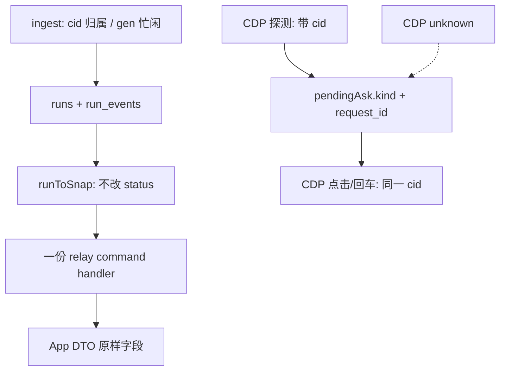

# Armada 架构债待办与长期收口

- 日期：2026-09-19
- 状态：**待办清单 / 长期方案**（未标实施基准。未授权前不改生产。CDP 写路径仍受 `armada-feasibility-before-solution` 约束。）
- 审查来源：HEAD `b49123f` 全仓只读审查（Hub / 扩展 / 中转+App / 中台 Web+桌面）
- 父文档：
  - [armada-durable-boundaries](../../../.cursor/rules/armada-durable-boundaries.mdc)
  - [armada-hub-app-parity](../../../.cursor/rules/armada-hub-app-parity.mdc)
  - [armada-os-invariants](../../../.cursor/rules/armada-os-invariants.mdc)
  - [armada-feasibility-before-solution](../../../.cursor/rules/armada-feasibility-before-solution.mdc)
  - [2026-09-12-armada-relay-mobile-design.md](./2026-09-12-armada-relay-mobile-design.md)
  - [2026-09-17-armada-idle-transcript-and-tool-fold-design.md](./2026-09-17-armada-idle-transcript-and-tool-fold-design.md)
  - [2026-09-18-cursor-sessionend-idle-design.md](./2026-09-18-cursor-sessionend-idle-design.md)
- 修订范围：把现网黑魔法、硬兼容、快照撒谎、安全与 parity 缺口收成**一份待办**；每条给出共享边界的长期修法与验收。**不包含**手机发图产品实施（那是另一份规格）。
- 触发：全仓审查确认停跑内核干净，脏在快照 / CDP 写入 / 双份命令表。

---

## 0. TL;DR

| 项 | 内容 |
| --- | --- |
| 问题 | 停跑三钥还在；显示启发式、手抄码表、双份 `onCommand` 被抬成状态权威。App 看到的完成态、Plan、错误码、未读可以和 hub 相反。 |
| 核心方案 | **一个所有者、一份表、一把钥匙。** status 只由 run 状态机写；Ask/Plan 只认 `request_id`/`kind`；中转命令只留一份 handler；CDP 写入与探测共用 cid。 |
| 关键约束 | 禁止 prompt/长度/位置当 stop、重建、presence 闸。禁止再给 `decideStop` 加出口码而不改决策表+规格+真形状测试。合法 OS 分叉（hooks / O_EXLOCK / Meta vs Ctrl）保留。 |
| 明确不做 | 不把 Windows stop 补丁抄成 Darwin `if`；不把 `chatView` 当忙闲权威；不把中转当 blob 权威；本文件不实施发图管道。 |

**优先级总序（P0 → P3）：安全闭合 → 快照不得改写 status → 命令表合一 → Ask/Plan 契约 → 资源记账 → 桌面 attach 可观测 → CDP 写入按 cid（真机闸）→ 性能指纹。**

---

## 1. 背景与需求

| # | 原始诉求 | 设计映射 |
| --- | --- | --- |
| R1 | 整理全部 code review 问题 | 本文件 §7 待办表，一 ID 一事 |
| R2 | 长期解决方案 | 每条「共享边界」+ 备选不选 + 验收 |
| R3 | 按优先级排列 | §6 阶段；§7 按 P0–P3 |
| R4 | 禁止黑魔法、硬兼容 | §3 原则；合法 OS 分叉列入 §3.2 白名单 |

审查结论（不变）：`decideArm` / `decideStop` / cid 外卡过滤是干净的。不要为救现场再往停跑内核加出口码。

---

## 2. 现状盘点

| 类别 | 可复用 | 需收口 |
| --- | --- | --- |
| 停跑 | `generationOwnership.ts` 纯函数 + 真形状测试 | `STOP_SESSION_GEN` 补决策表（代码可不动） |
| 快照 | `runToSnap` 是 App 权威面 | **禁止用 chatView 正文改 status**；缺 `title`/`conversationId`/`kind` 消费 |
| 中转命令 | 两边命令大体同形 | 抽 `createRelayCommandHandler`；Attach 补 Reload + 心跳 |
| Ask/Plan | hub `pendingAsk.kind`、`continueAllowed`、`request_id` | App DTO 丢掉 kind 后用 `id=="build"` 猜；点击不带 cid |
| 错误码 | hub `httpStatusForRunError` / `concurrency.ts` | relay + desktop-core + App 文案三份手抄 |
| 桌面 | `decideOccupancy` TS/Rust 对齐测试 | attach 静默、UI 不展示 decision |
| 性能 | App `runContentEquals`（identical 帧） | 中转无指纹广播；`markOpened` 每帧写 readAt |

---

## 3. 设计原则

1. **三钥不可替代。** 窗+仓管注入路由；`conversation_id` 管事件归属；`generation_id` 管忙闲。Prompt 只用于尚未 bind 的首次挂靠。
2. **显示层不得改写状态。** `chatView` / `eventsToChat` 只画气泡。`run.status` 只由 `runs.ts` 状态机产生。
3. **判定只实现一次。** Plan=`kind`；Ask 身份=`request_id`；HTTP 码=一份表；中转命令=一份 handler。下游只消费，禁止再猜。
4. **失败 ≠ 缺席。** CDP 连不上是 `unknown`，不是 `present:false`。
5. **有 cid 就用 cid。** 探测已能推导 composer cid 时，点击/回车不得退回 `endsWith(prompt)` 或全页第一个控件。
6. **硬兼容的修法是合并，不是再加一条 if。** `relayClient` 与 `relayAttach` 禁止继续各补分支。
7. **真形状测试先红。** 停跑/快照/Ask 每条先有失败测试再改生产。CDP 写路径先真机点通。

### 3.1 已否决

| 方案 | 为什么不选 |
| --- | --- |
| 快照空正文时把 status 改成 error（现网） | 把显示失败当成运行失败；`canRetry` 撒谎 |
| App 再加一层字符串匹配「补」Plan | 权威已在 `kind`；再猜是硬兼容 |
| 给 `decideStop` 加第 N 个码救 NO_ASSISTANT_BODY | 违反停跑规格；问题在快照边沿 |
| debounce 输入框代替中转指纹 | 治标；identical 以外的真变化仍打主线程 |
| Windows hook 轨「先留着备用」且继续参与 bind | `isGarbledHookPrompt` 仍会在 Mac 上跳过 prompt 校验 |

### 3.2 合法分叉（不是债）

| 分叉 | 原因 |
| --- | --- |
| Windows 不装 Armada hooks，hub 签发 gen | OS 不变量 |
| Darwin `O_EXLOCK` vs 其它 pidfile | 内核锁 API |
| 粘贴 Meta vs Ctrl | OS 修饰键，有测试 |
| `BIND_TIMEOUT` Mac 60s / Windows 180s | 规格对照表 |

---

## 4. 数据模型 / 契约（长期应长成这样）

### 4.1 `RunSnap`（权威，App 只读）

现网缺、长期必须有的字段（与看板同源函数计算）：

| 字段 | 所有者 | 约束 |
| --- | --- | --- |
| `status` | `runs` 行，**快照不得改写** | `completed` 即使 `finalText` 空也仍是 completed |
| `finalText` | cid jsonl 按 **seq/折** 切出，允许 null | 空 ≠ error |
| `bodyAvailable` | `finalText != null && length>0` | 展示位，不进状态机 |
| `canRetry` | 与 `runs.retry()` 准入**同一函数** | 不得用改写后的展示 status |
| `pendingAsk.kind` | `parsePendingAsk` | App 必解码 |
| `conversationId` | `runs.conversation_id` | 无则 App 不渲染续聊 |
| `title` | `runs.title` | 与看板 `runTitle()` 同一函数 |
| `updatedAt` | **内容变了才推进** 的活动时间 | 不得用 `started_at` 冒充活动 |

错误码：`NO_ASSISTANT_BODY` 若保留，只允许作为**展示/审计**，不得把 `completed` 打成 `error`。

### 4.2 中转命令

唯一入口：`createRelayCommandHandler({ hubFetch, snapOf })`。

必须包含现网全部 type：`dispatch` / `followup` / `retry` / `answer` / `cancel` / `archive` / `unarchive` / `promptSnippets*` / `cursorReload*`。未知 type **立即** `cmd.result { ok:false, error:"UNKNOWN_CMD" }`，禁止干等到 `HUB_TIMEOUT`。

`relayClient` 只负责 SSE 边沿推送；`relayAttach` 只负责轮询 `fpOf`。心跳 `ping` 两边都要。

### 4.3 错误码

| 层 | 职责 |
| --- | --- |
| hub `httpStatusForRunError` | **唯一** HTTP 映射 |
| relay | import 同一函数，禁止手抄 |
| desktop-core `relayHttpError.ts` | 删除副本或 re-export |
| App `operatorMessage` | 穷举 hub 可能产出的码；缺码测试失败 |

`/mobile/runs/:id/answer` 与 `/cancel` 必须走同一映射（含 `HUB_TIMEOUT`→502 而非 409）。

### 4.4 Ask inspect 三态

```ts
type AskCdpInspect =
  | { present: true; ... }
  | { present: false }
  | { unknown: true; reason: string };
```

仅 `present:false` 可发 `askQuestionResolved`。`unknown` 保持 pending。

---

## 5. 运行时链路（目标）



失败：重建不出正文 → App 显示完成+占位，不出现假重试。CDP 抖动 → Ask 卡仍在。命令表缺分支 → 立刻 `UNKNOWN_CMD`，不 15s 假超时。

降级：无 cid 的**首次**派发仍允许 prompt 全等 bind（现网合规）。有 cid 之后禁止 prompt 闩。

回滚：每条 P0/P1 改动必须有「旧夹具仍绿」+ 新红测转绿。快照 status 行为变更要改规格 §完成门禁，不能只改代码。

---

## 6. 实施路线图（优先级）

上线 gate：非 CDP 项 = 单测绿。CDP 新选择器仍要写路径点通。P2-a 同页双框 2026-09-20 **blocked**（Cursor 同窗替换）；cid 跨窗续聊已过。不准为「先绿」改生产选择器。

| 阶段 | 优先级 | 范围 | 验收 | 依赖 |
| --- | --- | --- | --- | --- |
| **P0-a** | 1 | K7 安全：blob MIME、query token 白名单、导出不把 token 放 URL | html 附件不以 `text/html` 执行；POST 不接受 `?token=` | 无 |
| **P0-b** | 2 | K1+B2+P1：快照不改 status；按 seq 切正文；终态 `run.event` 可重推 | `completed`+空/工具行正文 → snap.status 仍 completed；迟到 jsonl 后 App 能看到正文 | 改规格完成门禁 |
| **P0-c** | 3 | H1 命令表合一 + Reload + 心跳 + 未知 type 立即失败 | Attach 与 Client 同测集；Reload 不再 HUB_TIMEOUT | 无 |
| **P1-a** | 4 | K3 Ask inspect 三态 | 夹具：connect 失败 → 不发 resolved | CDP 读路径；写路径暂不改选择器 |
| **P1-b** | 5 | K4+H3+B7 Plan 只认 kind；K5 continueAllowed | App 不再 `id==build`；多问不渲染继续 | DTO |
| **P1-c** | 6 | K2 blob 引用派生重算 | 终态后续聊同一 sha 24h 后文件仍在 | 无 |
| **P1-d** | 7 | K6 错误码一份表 + App 文案穷举 | `ASK_INVALID_OPTION` 409 不是 502；`NO_ASSISTANT_BODY` 有中文 | P0-c 可并行 |
| **P1-e** | 8 | H10+P14 overlay attach 可观测 + hubUrl 校正 | attach 时 UI 明示非本应用 spawn；Cursor hubUrl 与看板一致 | 打包验收 |
| **P2-a** | 9 | B4+B5+P12 CDP 写入按 cid；Plan 卡内配对 | 跨窗 cid 续聊已过；同页双框/双 Plan **blocked**。inspect 卡内配对有夹具。**未冻新 click 选择器** | 真机台账 |
| **P2-b** | 10 | P4+P5+H11 中转指纹 + markOpened 有条件 + Android 同源 | identical 内容不广播；详情打开不每帧写 UserDefaults | P0-b 的活动时间可一并做 |
| **P3** | 11 | 其余 Important/Minor + §7.5 漏网项 | 见 §7.4–7.5 | 部分需拍板 |

v1 = P0 全部。v1.5 = P1。v2 = P2（含 CDP 真机）。P3 按拍板插入，不阻塞 v1。

---

## 7. 待办总表

状态列：`open`。做完改 `done` 并在修订记录记 commit。

### 7.1 P0

| ID | 优先级 | 类别 | 问题 | 长期方案 | 验收 |
| --- | --- | --- | --- | --- | --- |
| K7 | 1 | 安全 | `/api/blobs/:id` 以 `text/html` 同源回 html；`?token=` 对写方法生效；导出 URL 带 token | 非 png/jpeg → `octet-stream` + `Content-Disposition: attachment` + `nosniff`；query token 仅 GET SSE/events/export；导出改 blob 下载 | 夹具上传 html，GET 不执行脚本；POST `?token=` 401 |
| K1 | 2 | 黑魔法 | `runToSnap` 用重建正文把 `completed` 改成 `error`/`NO_ASSISTANT_BODY`；`canRetry` 用假 status | status 只读 DB；`canRetry` 与 `runs.retry()` 同源；规格删除「无正文即非 completed」或改为展示门禁 | 真形状：assistant 行带 `tool_use` 仍 `status=completed`；现网钉死旧行为的测试改期望 |
| B2 | 2 | 黑魔法 | `assistantBodyForPrompt` 按 prompt 全等选轮 | `assistantBodyAfterSeq(events, startSeq)`；bind 时记下起始 seq | 续聊后正文不是上一折；prompt 包装差异不串轮 |
| P1 | 2 | 架构 | 终态后 transcript 仍入库，但不触发 `pushRun`；`fpOf` 无 event seq | 终态 run 的 `run.event`（去抖）进入推送集；`fpOf` 含 last seq | hook 先 stop、jsonl 后到 → App 最终有正文 |
| H1 | 3 | 硬兼容 | `relayClient`/`relayAttach` 双表；Attach 无 Reload/心跳 | 见 §4.2 | 两测文件跑同一命令矩阵 |

### 7.2 P1

| ID | 优先级 | 类别 | 问题 | 长期方案 | 验收 |
| --- | --- | --- | --- | --- | --- |
| K3 | 4 | 黑魔法 | CDP 失败 → `{present:false}` → 误 resolve Ask | §4.4 三态 | 抛 connect 错 + 已有 pending → 无 `askQuestionResolved` |
| K4 | 5 | 黑魔法 | App 丢 `kind`，用 `id==build` 猜 Plan | DTO 解码 `kind`；`isPlanAsk` 只读 kind；删形状猜（含 Web 卡片若仍猜） | 单选项 id=build 的普通 Ask 不是黄卡；kind=plan 且 id 非 build 仍是 Build |
| K5 | 5 | 硬兼容 | 多问/多选仍画继续 | 共享 `askContinueAllowed` | 多问无继续按钮 |
| B7 | 5 | 黑魔法 | 扩展 `letter==="build"` 走 Plan 点击 | `run.answerAsk` 带 `kind` | 不依赖 option id |
| K2 | 6 | 丢数据 | 终态放引用、续聊 swap，sweep 删仍在用的图 | `recomputeRefs(runId)` 从行派生 | 终态→followup 同 sha，25h 模拟 sweep 文件仍在 |
| K6 | 7 | 硬兼容 | 码表手抄；answer/cancel 乱码 HTTP | §4.3 | ASK_* → 409；超时 → 502；App 中文 |
| H10 | 8 | 硬兼容 | 7380 被占静默 attach，overlay 假绿 | `restoreOwnedHub` 展示 decision；attach 必须可感知 | UI/toast 含「非本应用启动」 |
| P14 | 8 | 硬兼容 | attach/ensure 不写 Cursor hubUrl | 实际 hubUrl ≠ 目标则写；不要被 `attach_cursor=false` 挡住 | 退舰队再本地 spawn 后扩展指向本机 |

### 7.3 P2

| ID | 优先级 | 类别 | 问题 | 长期方案 | 验收 |
| --- | --- | --- | --- | --- | --- |
| B4 | 9 | 黑魔法 | 已知 cid 仍 `endsWith(prompt)` 回车 | submit/finisher 可选 `conversationId`，先按 composer id 过滤 | 真机续聊不打进旁路框 |
| B5 | 9 | 黑魔法 | Ask/Build 点全页第一个控件 | 点击 JS 接收 `expectedCid`，不匹配 `CID_MISMATCH` | 两 composer 在屏，只点对的 |
| P12 | 9 | 硬兼容 | Plan name 与 split-button 两次独立 querySelector | 从 filename 向上找卡，**卡内**找 Build；多卡取最后一张活按钮 | 夹具：卡1 Building、卡2 Build → inspect 卡2 |
| B6 | 9 | 硬兼容 | 最后一字母按钮当 Skip | 语义锚；单按钮仍产出一选项 | 单选项问卷能上报 |
| P4 | 10 | 性能 | applyRunSnap 无指纹广播 | 上提 `relayAttach.fpOf` 到 applyRunSnap；内容变才 `updated_at=now` | 相同 snap 第二次不 SSE |
| P3 | 10 | 契约 | `updatedAt` 用 started_at | 与 P4 同一指纹：内容变才推进 | 同一 running 卡第二个 Ask → 未读 |
| P5 | 10 | 性能 | `markOpened` 每帧写 readAt | `shouldStampReadAt(seen, activityTs)` | 内容未新则不 `@Published`、不写盘 |
| H11 | 10 | 硬兼容 | Android refresh 无 runContentEquals | `adoptFetchedLists` 无实质变化返回原实例 | Android 单测引用相等 |

### 7.4 P3（含拍板项）

| ID | 类别 | 问题 | 长期方案 | 拍板 |
| --- | --- | --- | --- | --- |
| B1 | 黑魔法 | `mergePendingAsk` prompt === | 只留 request_id；缺 id 在 hook 入口合成稳定 id | 是否存在无 request_id 的真形状 |
| B3 | 黑魔法 | Plan 合并比正文长度 | `detected_at` 单调 | 否，可直接做 |
| B8 | 黑魔法 | 重取消 prompt+5s | 登记期望的下一个 BSP gen | 与注入身份设计一起 |
| B9 | 黑魔法 | transcript 内容全等去重 | 扩展盖 `{path,offset}` | 扩展同轮 |
| B10 | 黑魔法 | ack 无关联键 | `ackFor` + id | **跨仓同批**，需拍板 |
| B11 | 硬兼容 | 协议轮英文 startsWith | 扩展打标 | 真形状未定时只集中常量+失配 warn |
| B12 | 黑魔法 | 子代理无 cid 按 task 文本挂 | 不挂 | 否 |
| B13 | 黑魔法 | fleetErrorCopy includes | 结构化码 | 否 |
| H2 | 硬兼容 | 注入窗口三套 | `resolveInjectWindow(run)` | 否 |
| H4 | 硬兼容 | 与 K6 合并 | — | — |
| H5 | 硬兼容 | 与 K1 canRetry 合并 | — | — |
| H6 | 硬兼容 | 状态集字面量 | 只从 concurrency 导出 | 否 |
| H7 | 硬兼容 | 两份剪贴板写 | 留 createOsClipboardWriter | 否 |
| H8 | 硬兼容 | 两份 planInspectToAsk | 生产调用测试过的函数 | 否 |
| H9 | 硬兼容 | 附件扩展名双份 | 中立模块 | 构建拓扑，可缓 |
| H12 | 硬兼容 | Windows hook 死代码仍参与 bind | 删 ps1/编译器/`isGarbledHookPrompt` | **需确认永不回 hook 轨** |
| P2 | parity | snap 无 title / conversationId | 补字段；无 cid 不渲染续聊 | 改名/关卡是否进 App |
| P6 | 性能 | SSE 首帧带全文 | 广播 `forList=true`，全文只详情 GET | 否 |
| P7 | parity | 丢弃 followup 200/201 | 显式 `outcome: queued\|injected` | 否 |
| P8 | 可重建 | subagentCids 仅内存 | 查 run_events subagentStart 或小表 | 否 |
| P9 | 流程 | `STOP_SESSION_GEN` 无规格行 | **只补决策表与审计码，不改代码** | 规格作者确认 |
| P10 | 审计 | sessionEnd 15s 重放刷屏 | 记住已重放 seq | 否 |
| P11 | 性能 | 看板每条 jsonl 打 4 REST | `*` 通道服务端白名单 + 250ms 合并 | 否 |
| P13 | 竞态 | Ask 轮询无重入锁 | 门闩或 timeout 链 | 否 |
| P15 | 安全 | Android token 明文降级 | fail closed | 否 |
| P16 | 安全 | blob 先读进内存再限流 | Content-Length 预检，inFlight 前移 | **done**（hub 已闸；中转 Rel-I9 同批） |
| P17 | 安全 | postMessage 不校验 origin；CSP `http://*:*` | 校验 currentBoardOrigin；CSP 收敛到 `:7380` | **done 2026-09-20** |
| P18 | 其他 | cid 唯一约束抛到 WS 无 catch | `onRunBound` 先 `getActiveByConversation` → BIND_AMBIGUOUS | 否 |
| P19 | parity | 关卡/改名/审计导出/标未读不对称 | 规格写明 App v1 不做或补 snap+路由 | **产品** |

### 7.5 覆盖核对（对合并审查 + 四层原文）

合并进聊天的 **K1–K7 / B1–B13 / H1–H12 / P1–P19 共 51 条：全部在 §7.1–7.4**。下面是四层原文里有、初稿压成 `m*` 或未单独成行的项。优先级默认 **P3**；标了「可并入」的跟对应主 ID 同批，不单独插队。

**有意不进本债（不是漏）：** 手机发图 / `cmd.blobPut` / snap `attachments`（另文 `2026-09-19-armada-mobile-image-send-design.md`）。P2 只收 `title`/`conversationId`。启发式清单里判定 ✅ 合规的条目（首次 bind 的 prompt 全等、jsonl `turn_ended` 停跑等）不是债。

#### 扩展 Minor（原文 Ext m1–m11）

| ID | 问题 | 长期方案 | 并入 |
| --- | --- | --- | --- |
| Ext-m1 | `DISPATCH_TIMEOUT_MS` 手抄；hub 从上次 progress 起算，扩展从 `dispatchedAt` 起算 | 照 `BIND_TIMEOUT_MS` 导出共享，或 `run.start` 带 `expires_at` | — |
| Ext-m2 | `shouldUnfollowOnHookStop` 恒 false，13 行清理永不执行 | 删死分支，注释留「绝不 unfollow」 | — |
| Ext-m3 | `shouldSynthesizeTranscriptStop` 恒 true | 删函数与守卫 | — |
| Ext-m4 | `normalizePrompt` 导入未使用 | 删 | — |
| Ext-m5 | Ask/Plan 题干用英文 UI 正则剥噪声 | 常量集中 + locale 注释；提取失败保留原文 | B11 |
| Ext-m6 | 文件 mention `[class*='menu-item']` + 子串命中首项 | 全等/endsWith 文件名；多命中 fail-closed | — |
| Ext-m7 | 8×400ms / 800+400+700 硬编码当完成闸 | 具名常量；超时 reason 带轮数 | — |
| Ext-m8 | Ask 控件 eval 畸形值也 `ok: true` | 确认 absent vs 读不到；后者重试到超时 | K3 |
| Ext-m9 | 复刻 Cursor `sanitizeFileName`，前缀可能命中另一份计划 | 多命中记日志；注释锁定验证过的 Cursor 版本 | — |
| Ext-m10 | 扩展 WS `?token=` 且未 encode | Authorization / subprotocol；至少编码 | K7 |
| Ext-m11 | hook stop 删 `askLastByRun` 不删 `askPlanTextByRun` | 两 map 同生命周期 | — |

启发式清单里未升格成 B 的三条：

| ID | 问题 | 长期方案 |
| --- | --- | --- |
| B14 | 注入残留认领：空白折叠后与 `lastSubmittedPrompt` 全等 → OWNED 整框替换（cid 已知仍用文本） | 叠加 cid 限定；无 cid 才允许文本认领 |
| B15 | `/^Build(\s\|$)/` 当 Plan presence+点击闸（英文按钮文案） | 有真机 fixture 暂留；长期用 `data-tone=plan` + cid，文案只展示 |
| B16 | 剪贴板 ack 在 stdout 找 `"OK"` / `"O\0K"`，无关联 id | 与 B10 同形：ack 带关联键；PS 异常走超时 |

#### 中转 / App Minor（原文 Rel M1–M9 + I9）

| ID | 问题 | 长期方案 | 并入 |
| --- | --- | --- | --- |
| Rel-M1 | `/answer` `/cancel` 跳过 fleet 归属与 `checkRate` | 与 followup/retry/archive 同一前置 | K6 |
| Rel-M2 | `UPDATE runs` 无 `AND fleet_id=?`，跨舰队可搬行（id 不可猜） | WHERE 加上 fleet；外舰队同 id 拒绝写入 | **done 2026-09-20** |
| Rel-M3 | hub secret 走 WS query | 改 header/subprotocol | K7 |
| Rel-M4 | relay 丢掉 hub 的 `canRetry` 再抄状态清单重算 | `canRetryStatus()` 同源；snap 带 boolean 则指纹用该值 | **done 2026-09-20**（未加 DB 列） |
| Rel-M5 | APNs `badge: 1` 写死 | 不带角标（未读数未进 snap） | **done 2026-09-20** |
| Rel-M6 | iOS 永远报 `environment: production`，sandbox token 登记成功永不投递 | Debug 报 sandbox；TestFlight / App Store 报 production（`sandboxReceipt` ≠ APNs sandbox） | **done 2026-09-20**（TF 误报 sandbox 已回退） |
| Rel-M7 | `queued` 状态词三份副本 | 与 H6 同一导出 | H6 |
| Rel-M8 | admin token 打 stdout | 只写一次文件，日志打指纹 | — |
| Rel-M9 | `sseClients` 无每舰队上限 | 每舰队连接上限 + 超限踢最旧 | P6 |
| Rel-I9 | 体积闸只看 Content-Length 且只装在 dispatch；followup/snippets 无闸 | 缺头/chunked 拒；dispatch/followup/snippets 共用 `rejectPayload` | **done 2026-09-20** |

#### Hub Minor（原文 Hub m2–m9；m1=H6，m8⊂K7）

| ID | 问题 | 长期方案 | 并入 |
| --- | --- | --- | --- |
| Hub-m2 | HTTP 层再实现一遍 followup 准入 | 删前置，全部交给 `runs.followup` + `httpStatusForRunError` | K6 |
| Hub-m3 | `extensionSupportsMultiRunPerWindow` 末句恒真 | 显式 `MIN_MULTI_RUN_EXT_VERSION` 或规格登记 | — |
| Hub-m4 | `register` 不校验 machineId/windowId/os | 形状校验失败 `close(4001)` | **done 2026-09-20** |
| Hub-m5 | 四处配置就地 `writeFileSync` | 共用 `writeFileAtomic` | — |
| Hub-m6 | stop 未知 status 静默 return，无审计 | `decideStop` 归一化/拒绝并给 audit 码 | P9 同批规格 |
| Hub-m7 | `POST /api/runs` 畸形 json → 500 | 解析失败 → 400 INVALID | **done 2026-09-20** |
| Hub-m9 | `claimOutbound` 按 prompt 全等认领（规格已选，有 120s 兜底） | **本轮不改**；真机出现卡跑再换成 gen/turn 键 | 明确推迟 |

#### Web / 桌面 Minor + 规格不一致 + 未编号 parity

| ID | 问题 | 长期方案 | 并入 |
| --- | --- | --- | --- |
| Web-M1 | Board 仅存两处 zinc class | 换成 shadcn token | — |
| Web-M3 | hub `import` web `boardState`；`chatView` 相对 import 扩展 | 版本常量/imageMarkers 放中立模块 | H9 |
| X2 | 规格写 finalText 仅终态；代码只在 `completed` 读 events，`aborted/error/cancelled` App 无正文 | 规格改口或代码放开终态集 | K1 同批 |
| X5b | Cursor Reload 整套无规格文件 | 补规格或标明「仅操作员命令、无设计文」 | H1 |
| Par-1 | App 无 `GET /api/runs/:id/events`，只有单轮 `finalText` | 规格写 App v1 不做完整线程，或补事件分页 | P19 |
| Par-2 | `extension_version` 在 snap.workspaces，App DTO 不解析 → 落后机 Ask 静默不可用 | DTO 解码 + 落后提示 | P19 |
| Par-3 | `queueMessageDefaultBehavior` 已解码无渲染 | 与 P7 同批给「队列 vs 打断」面 | P7 |
| Par-4 | `COLUMN_MAP` / `canRetry` / `isLive` / `queuedOutbound` 看板与 App 手工同步，无跨语言契约测 | 照 `decideOccupancy` TS/Rust 对齐测 | H5/H6 |

---

## 8. 安全与威胁（本债相关）

| 威胁 | 缓解（P0-a / P3） | 指标 |
| --- | --- | --- |
| 同源 html blob 偷 localStorage token | K7 MIME 闸 | 夹具脚本不执行 |
| query token CSRF / Referer 泄露 | 写方法禁用 query；导出不走 `<a href>` | POST `?token=` 失败 |
| 2GB 上传打满堆 | P16 预检 | 413 且内存不跟 body 线性涨 |
| 加入恶意舰队驱动桌面 API | P17 origin | 跨 origin postMessage 忽略 |
| Android 明文 token | P15 fail closed | Keystore 失败不落盘 |

边界外：被控机剪贴板仍被注入占用（现网接受）。

---

## 9. 风险与未决

| ID | 风险 | 影响 | 应对 | 状态 |
| --- | --- | --- | --- | --- |
| R1 | 改 K1 要改已绿测试与 09-12 规格「完成门禁」 | 文档与代码必须同批 | P0-b 含规格修订 | 未做 |
| R2 | B1 删 prompt 回退可能露出无 request_id 的真事件 | Ask 卡消失 | 先搜夹具/日志；有则入口合成 id | 阻塞确认 |
| R3 | P2-a 同页双控件没摆出来就改选择器 | 假绿 | 台账：[2026-09-20](./2026-09-20-armada-debt-real-device-verify.md) §2.3 blocked；不准改 `cdpInject` | **选择器仍禁写**；不是「Windows 没测」 |
| R4 | H12 误删后 Windows 若再装 hook | bind 行为变 | 拍板后再删 | 未决 |
| R5 | B10 扩展/hub 不同步 | ack 更乱 | 同批发布或不动 | 未决 |

阻塞实施（非阻塞本文）：R2、R4、R5、P19 产品范围。R3 = 同页双框 blocked，不是未测。P0-a/P0-c 无阻塞。0.4.32 overlay **后**打包功能验收仍开着（台账 §3）。

---

## 10. 评审检查清单

- [x] 固定章节：问题、映射、现状、原则、契约、链路、安全、阶段、风险、非目标
- [x] P0/P1/P2/P3 切分
- [x] 每条有验收；黑魔法/硬兼容有共享边界修法
- [x] 跨仓：ack/行偏移/kind 过线需扩展+hub 同批
- [x] 修订记录

---

## 11. 修订记录

| 日期 | 变更 |
| --- | --- |
| 2026-09-19 | 初稿。汇总 HEAD `b49123f` 四层审查；长期方案按共享边界收口；优先级 P0 安全与快照 → P1 契约 → P2 CDP/性能 → P3 拍板项。 |
| 2026-09-19 | 补 §7.5：四层原文 Minor / 规格 X2 / 未编号 parity。合并审查 51 条主 ID 已齐；原先 `m*` 一行改为可追踪子 ID。 |
| 2026-09-19 | **完成门禁方案 1 已采纳**（快照不改写 hub `status`；空 `finalText` 仍可 `completed`）。规格落点：[2026-09-12-armada-relay-mobile-design.md](./2026-09-12-armada-relay-mobile-design.md) §4.4、`protocolVersion: 2`。 |
| 2026-09-20 | 扩展 **0.4.29**、iOS TestFlight **20**、Android **0.1.7**。真机验收清单：[2026-09-20-armada-debt-real-device-verify.md](./2026-09-20-armada-debt-real-device-verify.md)。 |
| 2026-09-20 | 扩展 **0.4.30**、iOS **21**、Android **0.1.8**。Ask Skip 点 Skip 按钮；Other 为 D；hub 进程启动不把 leftover `online` 当掉线杀跑；`unknown` 快照带 `finalText`。 |
| 2026-09-20 | 扩展 **0.4.31**。Reload 跨进程闩；同号 0.4.30 会被 skipped-same-version 跳过。 |
| 2026-09-20 | 扩展 **0.4.32**。取消 leftover Plan 不再挂 pending / 不挂到下一条。App 无新按钮。 |
| 2026-09-20 | P3：Rel-M2 快照写入按 fleet 隔离；Rel-M4 `canRetryStatus`；Rel-M5 APNs 去掉写死 badge；Hub-m4 register 形状；Hub-m7 畸形 JSON 400。未改 CDP 选择器。 |
| 2026-09-20 | P16/P17/Rel-I9：hub blob 预检已在；中转 followup/snippets/dispatch 共用体积闸；桌面 CSP 从 `http://*:*` 收到 `http://*:7380`（加入局域网舰队仍要 7380）。未改 CDP。 |
| 2026-09-20 | 真机台账：Win/Intel/Arm **0.4.32 vsix** B1–B3 已过；同页双框/双 Plan **blocked**；cid 续聊不串台已过。**15:35 overlay 后打包功能验收未做。** 禁止再派「先装 vsix 再跑 W1–W6」。 |
