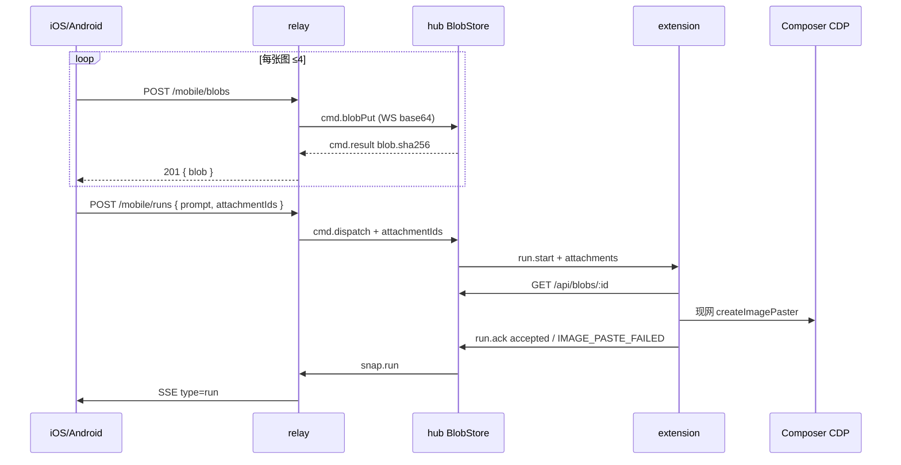

# Armada 手机图片发送（App → 中转 → hub blob → 现网 CDP 贴芯片）

- 日期：2026-09-19
- 状态：**待评审**（v1 方案冻结；**未标实施基准**。不写新 CDP 选择器；贴芯片沿用现网 `createImagePaster`。中转 blob 管道未落地前 App 不得画发送入口。）
- 父文档：
  - [2026-09-02-armada-composer-image-chip-design.md](./2026-09-02-armada-composer-image-chip-design.md)（中台图文派发 / blob / 芯片）
  - [2026-09-14-armada-workspace-file-attach-design.md](./2026-09-14-armada-workspace-file-attach-design.md)（非图文件 inbox；本规格 **不做** 手机 pdf/txt）
  - [2026-09-14-armada-running-followup-design.md](./2026-09-14-armada-running-followup-design.md)（running 续发 `OUTBOUND_TEXT_ONLY`）
  - [2026-09-12-armada-relay-mobile-design.md](./2026-09-12-armada-relay-mobile-design.md)（`cmd.dispatch` 已预留 `attachmentIds?`；v1 明确不做 blobs——本规格把它升级）
  - [armada-hub-app-parity](../../../.cursor/rules/armada-hub-app-parity.mdc)
- 修订范围：中转 `/mobile/blobs` + `cmd.blobPut` + `cmd.dispatch`/`cmd.followup` 传递 `attachmentIds`；`runToSnap` 带附件元数据；iOS/Android 派发/续聊选图。不改 `generation_id` / `decideStop` / ingest cid / 现网 CDP 贴图选择器。
- 触发：中台已能附图，App 只有纯文本；操作员在手机上无法把截图送进被控 Composer。

---

## 0. TL;DR

| 项 | 内容 |
| --- | --- |
| 问题 | 中台 `POST /api/blobs` + `attachmentIds` 已通；中转 `cmd.dispatch` **丢掉**附件；App 无上传。手机无法发图。 |
| 核心方案 | App 把 PNG/JPEG 传到中转 → 中转经 WS `cmd.blobPut` 写入 **hub BlobStore**（权威仍在被控机旁的 hub）→ 派发/终态续聊带 `attachmentIds` → 扩展走现网 `createImagePaster`。 |
| 关键约束 | 芯片语义零变化：成功 = 回车前芯片数 = N；失败不降级 `@路径`；不压缩已是 PNG/JPEG 的原件。running 续发仍纯文本。 |
| 明确不做 | 新 CDP；GIF/WebP/PDF；running 附图；中转当 blob 权威库；App WebView 套壳；绕过 IDE 打模型 API。 |

---

## 1. 背景与需求

| # | 原始诉求 | 设计映射 |
| --- | --- | --- |
| R1 | 手机能发图片 | iOS/Android 相册/相机/粘贴 → 最多 4 张 PNG/JPEG |
| R2 | 和中台同一闭环 | 同一 `BlobStore`、同一 `attachmentIds`、同一扩展贴芯片 |
| R3 | 像人手 | 被控 Composer 出图片芯片，不是工作区 `@文件` |
| R4 | 只附图也能派 | prompt 可空；碰撞键含附件指纹（现网已有） |
| R5 | 三端同形 | 中台已有选图；App 同一轮必须能做完（parity） |

对照：工作区 ≠ CDP。hub 派发看仓是否打开；图路径 CDP 失败 → `IMAGE_PASTE_FAILED`，禁止 `writeText`。

---

## 2. 现状盘点

| 类别 | 内容 |
| --- | --- |
| 可复用 | `hub/src/blobs.ts`（8 MiB / 4 张 / 24 MiB；只认 PNG/JPEG 魔数）；`POST /api/blobs`；`runs.create`/`followup` 的 `attachmentIds`；`extension/src/cdpInject.ts` `createImagePaster`；`osClipboard.ts`；错误码 `ATTACHMENT_*` / `IMAGE_PASTE_*`；中台 `api.uploadBlob` |
| 规格已写、代码未接 | 中转规格 §4.3 `cmd.dispatch` 的 `attachmentIds?`；单请求体 20 MiB |
| 需新建 | `POST /mobile/blobs`；hub `cmd.blobPut`（`relayClient.ts` **和** `relayAttach.ts` 各一处）；`runToSnap.attachments` 元数据；App 选图 UI |
| 不复用 / 有害 | 图塞 SQLite 当权威；App 直连 hub LAN；中转落盘永久 blob；把 HEIC 原件打进 hub（`detectBlobKind` 会 `ATTACHMENT_INVALID_MIME`） |
| 现网缺口 | `hub/src/relayClient.ts` `cmd.dispatch` 只 POST `{machineId, workspaceRoot, prompt}`；`runToSnap` 无 attachments；`relay/src/server.ts` `/mobile/runs` 不读 `attachmentIds`；iOS/Android DTO 无附件字段 |

**中转在公网、hub 在操作员电脑。** 云上中转不能回环 `POST http://127.0.0.1:7380/api/blobs`。字节必须走 **已有的出站 hub WS**。

---

## 3. 设计原则

1. **Hub 仍是 blob 权威。** 扩展继续 `GET /api/blobs/:sha256`。中转只管道 + 短 TTL 缓冲。
2. **不新发明贴图。** 注入顺序、芯片计数、`armada.imagePaste`、失败码全部沿用 2026-09-02 规格。
3. **纯文本零变化。** 无 `attachmentIds` 的 dispatch/followup 与现网字节级一致。
4. **running 不附图。** 409 `OUTBOUND_TEXT_ONLY` 保持。手机入口在 `run.isLive` 时隐藏相册。
5. **格式在手机收口。** 相册 HEIC → 设备上转 JPEG（原像素，质量 ≥ 0.92）再上传。禁止把 HEIC 交给 hub。已是 PNG/JPEG 的禁止再压。
6. **相等才发布。** App 列表不因附件元数据抖动整树刷新（沿用本轮 `runContentEquals`）。

### 3.1 已否决方案

| 方案 | 为什么不选 |
| --- | --- |
| App 直传 hub `/api/blobs` | 手机到不了局域网 7380；破坏中转鉴权边界 |
| 中转 SQLite 当权威、扩展改拉中转 | 扩展只认 hub；双权威；refcount/sweep 会分叉 |
| WS JSON 里塞 data URL 到 `run.start` | 8–24 MiB 打爆现网 run 帧；规格已否 |
| 工作区 inbox + `@` | 不是芯片；且 09-14 规格禁止图路径降级 |
| 新 CDP 选择器 / 点回形针 | 现网贴芯片已通；可行性闸不允许未点通就写新写路径 |
| running 附图 | 现网 409；要新 CDP 证明才能开 |

### 3.2 范围切分

| 阶段 | 做 | 验收 | Gate |
| --- | --- | --- | --- |
| **v1** | PNG/JPEG；派发 + **终态**续聊；HEIC 客户端转 JPEG；snap 带附件元数据；三端能看见 `[图片]` | 见 §8 | 中转测试绿；Mac 现网贴芯片回归（不新写 CDP） |
| **v1.5** | 详情缩略图；失败后 App 明确 `IMAGE_PASTE_FAILED` 文案 + 重试（不改注入） | 中台已能看失败码 | 不阻塞 v1 |
| **v2** | running 附图 | 真机芯片数 = N | **未过闸禁止写生产** |

---

## 4. 数据模型 / 接口契约

### 4.1 Hub blob（不改上限）

| 字段 / 常量 | 值 | 代码 |
| --- | --- | --- |
| 单件 | ≤ 8 MiB | `hub/src/blobs.ts` `MAX_BLOB_BYTES` |
| 件数 | ≤ 4 | `MAX_ATTACHMENTS` |
| 合计 | ≤ 24 MiB | `MAX_TOTAL_BYTES` |
| 魔数 | PNG `89 50 4E 47` / JPEG `FF D8 FF` | `detectImageMime` |
| id | sha256 hex | `BlobMeta.id` |

### 4.2 `cmd.blobPut`（新，hub WS）

中转 → hub：

```json
{
  "type": "cmd.blobPut",
  "requestId": "r…",
  "name": "IMG_0001.jpg",
  "mime": "image/jpeg",
  "bytesBase64": "<standard base64>"
}
```

约束：

| 项 | 值 |
| --- | --- |
| 解码后体积 | ≤ 8 MiB；超 → `ATTACHMENT_TOO_LARGE` |
| 单帧 | 中转已有 HTTP 体 20 MiB；base64 膨胀 ≈ 4/3，8 MiB 原件 ≈ 10.7 MiB，落在 20 MiB 内 |
| 并发 | 沿用 hub `BlobStore` inFlight=2、60s 内 10 次 |
| 成功 | `{ ok: true, blob: { id, sha256, mime, name, size } }`，`id === sha256` |
| 失败 | `{ ok: false, error }` 原样码：`ATTACHMENT_INVALID_MIME` / `ATTACHMENT_TOO_LARGE` / `RATE_LIMIT` |

**备选不选分块流：** v1 单张 ≤8 MiB，一次 put 更简单。v1.5 若运营商掐 WS 大帧再开 chunk。

Hub 落地：`blobs.put(Buffer.from(bytesBase64,'base64'), mime, name)`，与 `POST /api/blobs` **同一函数**。`relayClient.ts` 与 `relayAttach.ts` **都必须**实现，禁止只改一处。

### 4.3 `POST /mobile/blobs`

- 鉴权：`Authorization: Bearer {operatorToken}`（与其它 `/mobile/*` 同）
- `multipart/form-data` 字段 `file`（单文件）。`Content-Length` 或实测字节 > 8 MiB → 413 `ATTACHMENT_TOO_LARGE`（不要等到 20 MiB 的 `PAYLOAD_TOO_LARGE`）
- 中转 **不** `detectImageMime` 当权威（避免两套魔数）；只做体积闸，转 `cmd.blobPut`
- 超时：沿用 `DISPATCH_TIMEOUT_MS` 15s；超时 `HUB_TIMEOUT`
- 成功：`201 { blob: { id, sha256, mime, name, size } }`
- 限流：与派发分开，同一 token **20 次 blob / 5min** → 429 `RATE_LIMIT`

中转内存缓冲：只在等待 `cmd.result` 期间持有 Buffer；成功/失败后丢弃。禁止写入中转 SQLite。

### 4.4 派发 / 续聊

`POST /mobile/runs`：

```json
{ "workspaceId": "…", "prompt": "", "attachmentIds": ["<sha256>", "…"] }
```

| 规则 | 行为 |
| --- | --- |
| `attachmentIds` 缺省 / `[]` | 现网纯文本 |
| 元素非 64 hex | 400 `INVALID` |
| `prompt` 空且 ids 空 | 透传 hub `EMPTY_PROMPT` |
| ids>4 | 透传 `ATTACHMENT_COUNT` |
| 未知 id | 透传 hub `ATTACHMENT_MISSING`（若现网码名不同，**跟 hub 不新发明**） |

中转 `sendHub({ type: "cmd.dispatch", requestId, workspaceId, prompt, attachmentIds })`。

Hub `cmd.dispatch`：`POST /api/runs` body **必须**含 `attachmentIds`（今日缺口）。

`POST /mobile/runs/:id/followup` 同样带 `attachmentIds`。若该 run `status===running` 且 ids 非空：不要发 hub，直接 409 `OUTBOUND_TEXT_ONLY`（与 `runs.followupWhileRunning` 对齐，避免中转空等）。

成功码：派发 201；终态续聊 200；running 纯文本续发 201——**不因有图改码**。

### 4.5 `RunSnap` 附件元数据

今日 `runToSnap`（`hub/src/relayClient.ts`）无 attachments，App 无法显示「带了图」。

v1 增加：

```ts
attachments?: { id: string; mime: string; name: string; size: number }[]
```

- 只 meta，不带 bytes
- 来源：`runs.attachments` JSON ids + `blobs.metas`
- 中转 `runs` 表加列 `attachments TEXT`（JSON 数组）；`runToJson` 输出同形
- iOS `RunDTO` / Android `RunDto` 加 `attachments`；`runContentEquals` **计入**该字段（真带图才刷新，不是 `updatedAt`）

展示：沿用 `displayUserText` / 中台 `[图片]`；App 气泡与列表标题在 prompt 空时用 `[N 张图片]`。

### 4.6 错误码（App 文案必须有）

| 码 | HTTP | App 文案 |
| --- | --- | --- |
| `ATTACHMENT_TOO_LARGE` | 413 | 单张不能超过 8 MB |
| `ATTACHMENT_INVALID_MIME` | 400 | 只支持 PNG / JPEG |
| `ATTACHMENT_COUNT` | 400 | 最多 4 张图 |
| `ATTACHMENT_MISSING` | 400 | 图片还没传到中台，请重试 |
| `EMPTY_PROMPT` | 400 | 写点字或加一张图 |
| `OUTBOUND_TEXT_ONLY` | 409 | 运行中只能发文字 |
| `IMAGE_PASTE_DISABLED` | 终态 error | 被控机关了贴图 |
| `IMAGE_PASTE_FAILED` | 终态 error | 图片没贴进 Cursor，请重试 |
| `HUB_TIMEOUT` | 502 | 中台处理超时，请再发一次 |
| `RATE_LIMIT` | 429 | 发太频繁，稍后再试 |

码名以 hub `httpStatusForRunError` 为准；上表若与现网字符串不一致，**改文案映射不改码**。

---

## 5. 运行时链路



| 层 | 缓存 | 失效 | 降级 |
| --- | --- | --- | --- |
| App 本地预览 | 仅内存 / 系统 picker 句柄 | 关闭 sheet 丢弃 | 无 |
| 中转 Buffer | 单次 put 在途 | `cmd.result` 后丢 | 超时丢，App 重传 |
| Hub BlobStore | sha256 去重 + refcount | run 终态 `applyRefDelta` 现网 sweep | 无第二副本 |
| SSE | 现网 `/mobile/stream` | 内容变才刷新（本轮 `runContentEquals`） | 不因 `updatedAt` 刷输入框 |

失败：任一张 put 失败 → 该张不进 `attachmentIds`；已成功的 blob 无 ref（refcount=0）走现网 sweep，不另开 GC。派发失败（碰撞等）同理。

回滚：App 不传 `attachmentIds`、不调 `/mobile/blobs` → 全链路与今日纯文本相同。中转若未升级：`cmd.blobPut` hub 不认 → `HUB_ERROR`；App 隐藏入口直到 `GET /mobile/workspaces` 或显式 `protocol` 能力位。

**能力探测（v1）：** 不另开版本门。App 首次 `POST /mobile/blobs` 若 404 `NO_ROUTE` / 未实现 → 隐藏相册，只保留文字。中转实现该路由即打开。禁止静默当纯文本发出去（会丢图）。

---

## 6. 安全与威胁模型

| 威胁 | 缓解 | 指标 |
| --- | --- | --- |
| 匿名传图打满磁盘 | Bearer operatorToken；体积/件数/次数闸；hub quota 512 MiB（现网） | 未授权 401；超限 413/429 |
| 非图文件冒充 jpeg | hub `detectImageMime` 魔数；声明 mime 与魔数不一致拒 | `ATTACHMENT_INVALID_MIME` |
| base64 炸弹 | 先看 Content-Length / 解码后 length，超过 8 MiB 不 `put` | p99 put < 15s |
| 跨 fleet 引用 sha256 | `runs.create` 只认本 hub BlobStore；他 fleet 的 id → missing | 不能读别人图 |
| WS 日志打印 base64 | audit 只记 sha256 + size，禁止字节 | 审计无 payload |
| 相册权限 | iOS Photo Library 受限选图；不做后台上传 | 系统权限框 |

边界外：被控机剪贴板仍被注入占用（现网已接受）；不恢复用户剪贴板。

---

## 7. App 交互（iOS / Android 同形）

- 入口：现网 `ComposerBar` 左侧 mic 右侧发送；**mic 与输入框之间**加 32pt 相册按钮（与 mic 同密度）。
- 选图：系统 `PhotosPicker` / `PickVisualMedia`；可多选，第 5 张 UI 拒收不发请求。
- 预览：输入框上方一排缩略图，可删单张。不提供裁剪。
- 发送：`prompt.trim()` 或 `attachmentIds.length≥1`。
- live run 续聊：相册按钮 `disabled`，点了 toast「运行中只能发文字」。
- HEIC：选中后本机转 JPEG，失败则该张红字「无法转换这张图」，不上传。
- 粘贴：若系统剪贴板是 PNG/JPEG，允许贴进预览条（iOS `UIPasteboard.image`；Android clipboard URI）。非图忽略。

**备选不选** 把相册塞进 Form Section：会再触发本轮修过的整页刷新。预览条挂在 `ComposerBar` 同一隔离层。

---

## 8. 实施路线图

| 阶段 | 范围 | 验收 | 上线 gate |
| --- | --- | --- | --- |
| P0 契约测试 | 夹具：假 hub 收 `cmd.blobPut` + `cmd.dispatch.attachmentIds`；中转测 201 blob、派发带 ids、running+ids → 409 | 测不红不准写生产路由 | `relay/test/server.test.ts` |
| P1 hub 管道 | `relayClient` + `relayAttach` 都实现 `blobPut` 与 dispatch ids；`runToSnap.attachments` | `hub/test/relayClient.test.ts` + `relayAttach.test.ts` | 只改一处 = 不合格 |
| P2 App | iOS/Android DTO、上传、相册、文案；parity | Android core 单测 HEIC 不在 scope（转换在 app 层）；错误码映射测 | 无 XCTest 则 iOS 编译 + 对照 Android 测 |
| P3 真机 | 本机 Mac：中台附图回归仍出芯片；手机一张 JPEG 派发后被控 Composer 芯片=1 | **不新写 CDP**；沿用现网 paster | overlay 中台 + TestFlight/扫包 App |
| P4 Windows | 现网 osClipboard 回归，不阻塞 P3 | 同一 `createImagePaster` | 延期可，规格写明 |

发布顺序：hub（含两个 relay 适配）→ 中转 → App。旧 App + 新中转：不点相册则纯文本。新 App + 旧中转：blobs 404 → 隐藏相册。

---

## 9. 风险与未决

| ID | 风险 | 影响 | 应对 | 状态 |
| --- | --- | --- | --- | --- |
| R1 | 8 MiB base64 挤占 hub WS 与心跳 | 掉线、派发超时 | 单张串行 put；15s 超时；v1.5 再 chunk | 未测 |
| R2 | HEIC 转 JPEG 体积/画质 | 用户觉得「压了图」 | 规格写明：只转格式，原像素，q≥0.92；PNG/JPEG 不转 | 需产品知悉 |
| R3 | `relayClient` / `relayAttach` 双份 | 只改一处则打包壳或源码 hub 丢图 | P1 两处测试都红 | 已知债 |
| R4 | 现网 `runToSnap` 无附件导致列表标题仍是 prompt | App 空 prompt 只附图时标题空白 | v1 必须带 meta | 本规格收口 |
| R5 | 重连 SSE dump 100 run | 输入卡顿（本轮已在 App 侧闸） | 不在本功能再改中转 broadcast | 已缓解 |

阻塞项：无 CDP 新闸。P3 是回归不是新可行性。

未决（不阻塞 v1）：是否在 snap 里带 thumbnail base64（不选，体积）。

---

## 10. 评审检查清单

- [x] 固定章节骨架（问题、映射、现状、原则、契约、链路、安全、阶段、风险、非目标）
- [x] MVP/v1/v1.5/v2 切分
- [x] 非目标、风险、阻塞、验收
- [x] 跨仓发布顺序：hub 双适配 → 中转 → App；旧客户端兼容
- [x] 修订记录

---

## 11. 修订记录

| 日期 | 变更 |
| --- | --- |
| 2026-09-19 | 初稿。手机图走现网 hub blob + CDP 贴芯片；中转只管道；running 不附图。 |
